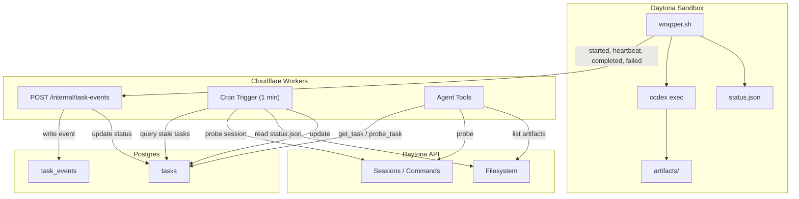

***

name: ""
overview: ""
todos: \[]
isProject: false
----------------

***

## name: ""

overview: ""
todos: ]
isProject: false

***

## name: ""

overview: ""
todos: ]
isProject: false

***

## name: ""

overview: ""
todos: ]
isProject: false

***

## name: ""

overview: ""
todos: ]
isProject: false

***

## name: ""

overview: ""
todos: ]
isProject: false

***

## name: ""

overview: ""
todos: ]
isProject: false

***

## name: ""

overview: ""
todos: ]
isProject: false

***

## name: ""

overview: ""
todos: ]
isProject: false

***

## name: ""

overview: ""
todos: ]
isProject: false

***

## name: ""

overview: ""
todos: ]
isProject: false

***

## name: ""

overview: ""
todos: ]
isProject: false

***

## name: ""

overview: ""
todos: ]
isProject: false

***

## name: ""

overview: ""
todos: ]
isProject: false

***

## name: ""

overview: ""
todos: ]
isProject: false

***

## name: ""

overview: ""
todos: ]
isProject: false

***

## name: ""

overview: ""
todos: ]
isProject: false

***

## name: ""

overview: ""
todos: ]
isProject: false

***

## name: ""

overview: ""
todos: ]
isProject: false

***

## name: ""

overview: ""
todos: ]
isProject: false

***

## name: ""

overview: ""
todos: ]
isProject: false

***

## name: ""

overview: ""
todos: ]
isProject: false

***

## name: ""

overview: ""
todos: ]
isProject: false

***

## name: ""

overview: ""
todos: ]
isProject: false

***

## name: ""

overview: ""
todos: ]
isProject: false

***

## name: ""

overview: ""
todos: ]
isProject: false

***

## name: ""

overview: ""
todos: ]
isProject: false

***

## name: ""

overview: ""
todos: ]
isProject: false

***

## name: ""

overview: ""
todos: ]
isProject: false

***

## name: ""

overview: ""
todos: ]
isProject: false

***

## name: ""

overview: ""
todos: ]
isProject: false

***

## name: ""

overview: ""
todos: ]
isProject: false

***

## name: ""

overview: ""
todos: ]
isProject: false

***

## name: ""

overview: ""
todos: ]
isProject: false

***

## name: ""

overview: ""
todos: ]
isProject: false

***

## name: ""

overview: ""
todos: ]
isProject: false

***

## name: ""

overview: ""
todos: ]
isProject: false

***

## name: ""

overview: ""
todos: ]
isProject: false

***

## name: ""

overview: ""
todos: ]
isProject: false

***

## name: ""

overview: ""
todos: ]
isProject: false

***

## name: ""

overview: ""
todos: ]
isProject: false

***

## name: ""

overview: ""
todos: ]
isProject: false

***

## name: ""

overview: ""
todos: ]
isProject: false

***

## name: ""

overview: ""
todos: ]
isProject: false

***

## name: ""

overview: ""
todos: ]
isProject: false

***

## name: ""

overview: ""
todos: ]
isProject: false

***

## name: ""

overview: ""
todos: ]
isProject: false

***

## name: ""

overview: ""
todos: ]
isProject: false

***

## name: ""

overview: ""
todos: ]
isProject: false

***

## name: ""

overview: ""
todos: ]
isProject: false

***

## name: ""

overview: ""
todos: ]
isProject: false

***

## name: ""

overview: ""
todos: ]
isProject: false

***

## name: ""

overview: ""
todos: ]
isProject: false

***

## name: ""

overview: ""
todos: ]
isProject: false

***

## name: ""

overview: ""
todos: ]
isProject: false

***

## name: ""

overview: ""
todos: ]
isProject: false

***

## name: ""

overview: ""
todos: ]
isProject: false

***

## name: ""

overview: ""
todos: ]
isProject: false

***

## name: ""

overview: ""
todos: ]
isProject: false

***

## name: ""

overview: ""
todos: ]
isProject: false

***

## name: ""

overview: ""
todos: ]
isProject: false

***

## name: ""

overview: ""
todos: ]
isProject: false

***

## name: ""

overview: ""
todos: ]
isProject: false

***

## name: ""

overview: ""
todos: ]
isProject: false

***

## name: ""

overview: ""
todos: ]
isProject: false

***

## name: ""

overview: ""
todos: ]
isProject: false

***

## name: ""

overview: ""
todos: ]
isProject: false

***

## name: ""

overview: ""
todos: ]
isProject: false

***

## name: ""

overview: ""
todos: ]
isProject: false

***

## name: ""

overview: ""
todos: ]
isProject: false

***

## name: ""

overview: ""
todos: ]
isProject: false

***

## name: ""

overview: ""
todos: ]
isProject: false

***

## name: ""

overview: ""
todos: ]
isProject: false

***

## name: ""

overview: ""
todos: ]
isProject: false

***

## name: ""

overview: ""
todos: ]
isProject: false

***

## name: ""

overview: ""
todos: ]
isProject: false

***

## name: ""

overview: ""
todos: ]
isProject: false

***

## name: ""

overview: ""
todos: ]
isProject: false

***

## name: ""

overview: ""
todos: ]
isProject: false

***

## name: ""

overview: ""
todos: ]
isProject: false

***

## name: ""

overview: ""
todos: ]
isProject: false

***

## name: ""

overview: ""
todos: ]
isProject: false

***

## name: ""

overview: ""
todos: ]
isProject: false

***

## name: ""

overview: ""
todos: ]
isProject: false

***

## name: ""

overview: ""
todos: ]
isProject: false

***

## name: ""

overview: ""
todos: ]
isProject: false

***

## name: ""

overview: ""
todos: ]
isProject: false

***

## name: ""

overview: ""
todos: ]
isProject: false

***

## name: ""

overview: ""
todos: ]
isProject: false

***

## name: ""

overview: ""
todos: ]
isProject: false

***

## name: ""

overview: ""
todos: ]
isProject: false

***

## name: ""

overview: ""
todos: ]
isProject: false

***

## name: ""

overview: ""
todos: ]
isProject: false

***

## name: ""

overview: ""
todos: ]
isProject: false

***

## name: ""

overview: ""
todos: ]
isProject: false

***

## name: ""

overview: ""
todos: ]
isProject: false

***

## name: ""

overview: ""
todos: ]
isProject: false

***

## name: ""

overview: ""
todos: ]
isProject: false

***

## name: ""

overview: ""
todos: ]
isProject: false

***

## name: ""

overview: ""
todos: ]
isProject: false

***

## name: ""

overview: ""
todos: ]
isProject: false

***

## name: ""

overview: ""
todos: ]
isProject: false

***

## name: ""

overview: ""
todos: ]
isProject: false

***

## name: ""

overview: ""
todos: ]
isProject: false

***

## name: ""

overview: ""
todos: ]
isProject: false

***

## name: ""

overview: ""
todos: ]
isProject: false

***

## name: ""

overview: ""
todos: ]
isProject: false

***

## name: ""

overview: ""
todos: ]
isProject: false

***

## name: ""

overview: ""
todos: ]
isProject: false

***

## name: ""

overview: ""
todos: ]
isProject: false

***

## name: ""

overview: ""
todos: ]
isProject: false

***

## name: ""

overview: ""
todos: ]
isProject: false

***

## name: ""

overview: ""
todos: ]
isProject: false

***

## name: ""

overview: ""
todos: ]
isProject: false

***

## name: ""

overview: ""
todos: ]
isProject: false

***

## name: ""

overview: ""
todos: ]
isProject: false

***

## name: ""

overview: ""
todos: ]
isProject: false

***

## name: ""

overview: ""
todos: ]
isProject: false

***

## name: ""

overview: ""
todos: ]
isProject: false

***

## name: ""

overview: ""
todos: ]
isProject: false

***

## name: ""

overview: ""
todos: ]
isProject: false

***

## name: ""

overview: ""
todos: ]
isProject: false

***

## name: ""

overview: ""
todos: ]
isProject: false

***

## name: ""

overview: ""
todos: ]
isProject: false

***

## name: ""

overview: ""
todos: ]
isProject: false

***

## name: ""

overview: ""
todos: ]
isProject: false

***

## name: ""

overview: ""
todos: ]
isProject: false

***

## name: ""

overview: ""
todos: ]
isProject: false

***

## name: ""

overview: ""
todos: ]
isProject: false

***

## name: ""

overview: ""
todos: ]
isProject: false

***

## name: ""

overview: ""
todos: ]
isProject: false

***

## name: ""

overview: ""
todos: ]
isProject: false

***

## name: ""

overview: ""
todos: ]
isProject: false

***

## name: ""

overview: ""
todos: ]
isProject: false

***

## name: ""

overview: ""
todos: ]
isProject: false

***

## name: ""

overview: ""
todos: ]
isProject: false

***

## name: ""

overview: ""
todos: ]
isProject: false

***

## name: ""

overview: ""
todos: ]
isProject: false

***

## name: ""

overview: ""
todos: ]
isProject: false

***

## name: ""

overview: ""
todos: ]
isProject: false

***

## name: ""

overview: ""
todos: ]
isProject: false

***

## name: ""

overview: ""
todos: ]
isProject: false

***

## name: ""

overview: ""
todos: ]
isProject: false

***

## name: ""

overview: ""
todos: ]
isProject: false

***

## name: ""

overview: ""
todos: ]
isProject: false

***

## name: ""

overview: ""
todos: ]
isProject: false

***

## name: ""

overview: ""
todos: ]
isProject: false

***

## name: ""

overview: ""
todos: ]
isProject: false

***

## name: ""

overview: ""
todos: ]
isProject: false

***

## name: ""

overview: ""
todos: ]
isProject: false

***

## name: ""

overview: ""
todos: ]
isProject: false

***

## name: ""

overview: ""
todos: ]
isProject: false

***

## name: ""

overview: ""
todos: ]
isProject: false

***

## name: ""

overview: ""
todos: ]
isProject: false

***

## name: ""

overview: ""
todos: ]
isProject: false

***

## name: ""

overview: ""
todos: ]
isProject: false

***

## name: ""

overview: ""
todos: ]
isProject: false

***

## name: ""

overview: ""
todos: ]
isProject: false

***

## name: ""

overview: ""
todos: ]
isProject: false

***

## name: ""

overview: ""
todos: ]
isProject: false

***

## name: ""

overview: ""
todos: ]
isProject: false

***

## name: ""

overview: ""
todos: ]
isProject: false

***

## name: ""

overview: ""
todos: ]
isProject: false

***

## name: ""

overview: ""
todos: ]
isProject: false

***

## name: ""

overview: ""
todos: ]
isProject: false

***

## name: ""

overview: ""
todos: ]
isProject: false

***

## name: ""

overview: ""
todos: ]
isProject: false

***

## name: ""

overview: ""
todos: ]
isProject: false

***

## name: ""

overview: ""
todos: ]
isProject: false

***

## name: ""

overview: ""
todos: ]
isProject: false

***

## name: ""

overview: ""
todos: ]
isProject: false

***

## name: ""

overview: ""
todos: ]
isProject: false

***

## name: ""

overview: ""
todos: ]
isProject: false

***

## name: ""

overview: ""
todos: ]
isProject: false

***

## name: ""

overview: ""
todos: ]
isProject: false

***

## name: ""

overview: ""
todos: ]
isProject: false

***

## name: ""

overview: ""
todos: ]
isProject: false

***

## name: ""

overview: ""
todos: ]
isProject: false

***

## name: ""

overview: ""
todos: ]
isProject: false

***

## name: ""

overview: ""
todos: ]
isProject: false

***

## name: ""

overview: ""
todos: ]
isProject: false

***

## name: ""

overview: ""
todos: ]
isProject: false

***

## name: ""

overview: ""
todos: ]
isProject: false

***

## name: ""

overview: ""
todos: ]
isProject: false

***

## name: ""

overview: ""
todos: ]
isProject: false

***

## name: ""

overview: ""
todos: ]
isProject: false

***

## name: ""

overview: ""
todos: ]
isProject: false

***

## name: ""

overview: ""
todos: ]
isProject: false

***

## name: ""

overview: ""
todos: ]
isProject: false

***

## name: ""

overview: ""
todos: ]
isProject: false

***

## name: ""

overview: ""
todos: ]
isProject: false

***

## name: ""

overview: ""
todos: ]
isProject: false

***

## name: ""

overview: ""
todos: ]
isProject: false

***

## name: ""

overview: ""
todos: ]
isProject: false

***

## name: ""

overview: ""
todos: ]
isProject: false

***

## name: ""

overview: ""
todos: ]
isProject: false

***

## name: ""

overview: ""
todos: ]
isProject: false

***

## name: ""

overview: ""
todos: ]
isProject: false

***

## name: ""

overview: ""
todos: ]
isProject: false

***

## name: ""

overview: ""
todos: ]
isProject: false

***

## name: ""

overview: ""
todos: ]
isProject: false

***

## name: ""

overview: ""
todos: ]
isProject: false

***

## name: ""

overview: ""
todos: ]
isProject: false

***

## name: ""

overview: ""
todos: ]
isProject: false

***

## name: ""

overview: ""
todos: ]
isProject: false

***

## name: ""

overview: ""
todos: ]
isProject: false

***

## name: ""

overview: ""
todos: ]
isProject: false

***

## name: ""

overview: ""
todos: ]
isProject: false

***

## name: ""

overview: ""
todos: ]
isProject: false

***

## name: ""

overview: ""
todos: ]
isProject: false

***

## name: ""

overview: ""
todos: ]
isProject: false

***

## name: ""

overview: ""
todos: ]
isProject: false

***

## name: ""

overview: ""
todos: ]
isProject: false

***

## name: ""

overview: ""
todos: ]
isProject: false

***

## name: ""

overview: ""
todos: ]
isProject: false

***

## name: ""

overview: ""
todos: ]
isProject: false

***

## name: ""

overview: ""
todos: ]
isProject: false

***

## name: ""

overview: ""
todos: ]
isProject: false

***

## name: ""

overview: ""
todos: ]
isProject: false

***

## name: ""

overview: ""
todos: ]
isProject: false

***

## name: ""

overview: ""
todos: ]
isProject: false

***

## name: ""

overview: ""
todos: ]
isProject: false

***

## name: ""

overview: ""
todos: ]
isProject: false

***

## name: ""

overview: ""
todos: ]
isProject: false

***

## name: ""

overview: ""
todos: ]
isProject: false

***

## name: ""

overview: ""
todos: ]
isProject: false

***

## name: ""

overview: ""
todos: ]
isProject: false

***

## name: ""

overview: ""
todos: ]
isProject: false

***

## name: ""

overview: ""
todos: ]
isProject: false

***

## name: ""

overview: ""
todos: ]
isProject: false

***

## name: ""

overview: ""
todos: ]
isProject: false

***

## name: ""

overview: ""
todos: ]
isProject: false

***

## name: ""

overview: ""
todos: ]
isProject: false

***

## name: ""

overview: ""
todos: ]
isProject: false

***

## name: ""

overview: ""
todos: ]
isProject: false

***

## name: ""

overview: ""
todos: ]
isProject: false

***

## name: ""

overview: ""
todos: ]
isProject: false

***

## name: ""

overview: ""
todos: ]
isProject: false

***

## name: ""

overview: ""
todos: ]
isProject: false

***

## name: ""

overview: ""
todos: ]
isProject: false

***

## name: ""

overview: ""
todos: ]
isProject: false

***

## name: ""

overview: ""
todos: ]
isProject: false

***

## name: ""

overview: ""
todos: ]
isProject: false

***

## name: ""

overview: ""
todos: ]
isProject: false

***

## name: ""

overview: ""
todos: ]
isProject: false

***

## name: ""

overview: ""
todos: ]
isProject: false

***

## name: ""

overview: ""
todos: ]
isProject: false

***

## name: ""

overview: ""
todos: ]
isProject: false

***

## name: ""

overview: ""
todos: ]
isProject: false

***

## name: ""

overview: ""
todos: ]
isProject: false

***

## name: ""

overview: ""
todos: ]
isProject: false

***

## name: ""

overview: ""
todos: ]
isProject: false

***

## name: ""

overview: ""
todos: ]
isProject: false

***

## name: ""

overview: ""
todos: ]
isProject: false

***

## name: ""

overview: ""
todos: ]
isProject: false

***

## name: ""

overview: ""
todos: ]
isProject: false

***

## name: ""

overview: ""
todos: ]
isProject: false

***

## name: ""

overview: ""
todos: ]
isProject: false

***

## name: ""

overview: ""
todos: ]
isProject: false

***

## name: ""

overview: ""
todos: ]
isProject: false

***

## name: ""

overview: ""
todos: ]
isProject: false

***

## name: ""

overview: ""
todos: ]
isProject: false

***

## name: ""

overview: ""
todos: ]
isProject: false

***

## name: ""

overview: ""
todos: ]
isProject: false

***

## name: ""

overview: ""
todos: ]
isProject: false

***

## name: ""

overview: ""
todos: ]
isProject: false

***

## name: ""

overview: ""
todos: ]
isProject: false

***

## name: ""

overview: ""
todos: ]
isProject: false

***

## name: ""

overview: ""
todos: ]
isProject: false

***

## name: ""

overview: ""
todos: ]
isProject: false

***

## name: ""

overview: ""
todos: ]
isProject: false

***

## name: ""

overview: ""
todos: ]
isProject: false

***

## name: ""

overview: ""
todos: ]
isProject: false

***

## name: ""

overview: ""
todos: ]
isProject: false

***

## name: ""

overview: ""
todos: ]
isProject: false

***

## name: ""

overview: ""
todos: ]
isProject: false

***

## name: ""

overview: ""
todos: ]
isProject: false

***

## name: ""

overview: ""
todos: ]
isProject: false

***

## name: ""

overview: ""
todos: ]
isProject: false

***

## name: ""

overview: ""
todos: ]
isProject: false

***

## name: ""

overview: ""
todos: ]
isProject: false

***

## name: ""

overview: ""
todos: ]
isProject: false

***

## name: ""

overview: ""
todos: ]
isProject: false

***

## name: ""

overview: ""
todos: ]
isProject: false

***

## name: ""

overview: ""
todos: ]
isProject: false

***

## name: ""

overview: ""
todos: ]
isProject: false

***

## name: ""

overview: ""
todos: ]
isProject: false

***

## name: ""

overview: ""
todos: ]
isProject: false

***

## name: ""

overview: ""
todos: ]
isProject: false

***

## name: ""

overview: ""
todos: ]
isProject: false

***

## name: ""

overview: ""
todos: ]
isProject: false

***

## name: ""

overview: ""
todos: ]
isProject: false

***

## name: ""

overview: ""
todos: ]
isProject: false

***

## name: ""

overview: ""
todos: ]
isProject: false

***

## name: ""

overview: ""
todos: ]
isProject: false

***

## name: ""

overview: ""
todos: ]
isProject: false

***

## name: ""

overview: ""
todos: ]
isProject: false

***

## name: ""

overview: ""
todos: ]
isProject: false

***

## name: ""

overview: ""
todos: ]
isProject: false

***

## name: ""

overview: ""
todos: ]
isProject: false

***

## name: ""

overview: ""
todos: ]
isProject: false

***

## name: ""

overview: ""
todos: ]
isProject: false

***

## name: ""

overview: ""
todos: ]
isProject: false

***

## name: ""

overview: ""
todos: ]
isProject: false

***

## name: ""

overview: ""
todos: ]
isProject: false

***

## name: ""

overview: ""
todos: ]
isProject: false

***

## name: ""

overview: ""
todos: ]
isProject: false

***

## name: ""

overview: ""
todos: ]
isProject: false

***

## name: ""

overview: ""
todos: ]
isProject: false

***

## name: ""

overview: ""
todos: ]
isProject: false

***

## name: ""

overview: ""
todos: ]
isProject: false

***

## name: ""

overview: ""
todos: ]
isProject: false

***

## name: ""

overview: ""
todos: ]
isProject: false

***

## name: ""

overview: ""
todos: ]
isProject: false

***

## name: ""

overview: ""
todos: ]
isProject: false

***

## name: ""

overview: ""
todos: ]
isProject: false

***

## name: ""

overview: ""
todos: ]
isProject: false

***

## name: ""

overview: ""
todos: ]
isProject: false

***

## name: ""

overview: ""
todos: ]
isProject: false

***

## name: ""

overview: ""
todos: ]
isProject: false

***

## name: ""

overview: ""
todos: ]
isProject: false

***

## name: ""

overview: ""
todos: ]
isProject: false

***

## name: ""

overview: ""
todos: ]
isProject: false

***

## name: ""

overview: ""
todos: ]
isProject: false

***

## name: ""

overview: ""
todos: ]
isProject: false

***

## name: ""

overview: ""
todos: ]
isProject: false

***

## name: ""

overview: ""
todos: ]
isProject: false

***

## name: ""

overview: ""
todos: ]
isProject: false

***

## name: ""

overview: ""
todos: ]
isProject: false

***

## name: ""

overview: ""
todos: ]
isProject: false

***

## name: ""

overview: ""
todos: ]
isProject: false

***

## name: ""

overview: ""
todos: ]
isProject: false

***

## name: ""

overview: ""
todos: ]
isProject: false

***

## name: ""

overview: ""
todos: ]
isProject: false

***

## name: ""

overview: ""
todos: ]
isProject: false

***

## name: ""

overview: ""
todos: ]
isProject: false

***

## name: ""

overview: ""
todos: ]
isProject: false

***

## name: ""

overview: ""
todos: ]
isProject: false

***

## name: ""

overview: ""
todos: ]
isProject: false

***

## name: ""

overview: ""
todos: ]
isProject: false

***

## name: ""

overview: ""
todos: ]
isProject: false

***

## name: ""

overview: ""
todos: ]
isProject: false

***

## name: ""

overview: ""
todos: ]
isProject: false

***

## name: ""

overview: ""
todos: ]
isProject: false

***

## name: ""

overview: ""
todos: ]
isProject: false

***

## name: ""

overview: ""
todos: ]
isProject: false

***

## name: ""

overview: ""
todos: ]
isProject: false

***

## name: ""

overview: ""
todos: ]
isProject: false

***

## name: ""

overview: ""
todos: ]
isProject: false

***

## name: ""

overview: ""
todos: ]
isProject: false

***

## name: ""

overview: ""
todos: ]
isProject: false

***

## name: ""

overview: ""
todos: ]
isProject: false

***

## name: ""

overview: ""
todos: ]
isProject: false

***

## name: ""

overview: ""
todos: ]
isProject: false

***

## name: ""

overview: ""
todos: ]
isProject: false

***

## name: ""

overview: ""
todos: ]
isProject: false

***

## name: ""

overview: ""
todos: ]
isProject: false

***

## name: ""

overview: ""
todos: ]
isProject: false

***

## name: ""

overview: ""
todos: ]
isProject: false

***

## name: ""

overview: ""
todos: ]
isProject: false

***

## name: ""

overview: ""
todos: ]
isProject: false

***

## name: ""

overview: ""
todos: ]
isProject: false

***

## name: ""

overview: ""
todos: ]
isProject: false

***

## name: ""

overview: ""
todos: ]
isProject: false

***

## name: ""

overview: ""
todos: ]
isProject: false

***

## name: ""

overview: ""
todos: ]
isProject: false

***

## name: ""

overview: ""
todos: ]
isProject: false

***

## name: ""

overview: ""
todos: ]
isProject: false

***

## name: ""

overview: ""
todos: ]
isProject: false

***

## name: ""

overview: ""
todos: ]
isProject: false

***

## name: ""

overview: ""
todos: ]
isProject: false

***

## name: ""

overview: ""
todos: ]
isProject: false

***

## name: ""

overview: ""
todos: ]
isProject: false

***

## name: ""

overview: ""
todos: ]
isProject: false

***

## name: ""

overview: ""
todos: ]
isProject: false

***

## name: ""

overview: ""
todos: ]
isProject: false

***

## name: ""

overview: ""
todos: ]
isProject: false

***

## name: ""

overview: ""
todos: ]
isProject: false

***

## name: ""

overview: ""
todos: ]
isProject: false

***

## name: ""

overview: ""
todos: ]
isProject: false

***

## name: ""

overview: ""
todos: ]
isProject: false

***

## name: ""

overview: ""
todos: ]
isProject: false

***

## name: ""

overview: ""
todos: ]
isProject: false

***

## name: ""

overview: ""
todos: ]
isProject: false

***

## name: ""

overview: ""
todos: ]
isProject: false

***

## name: ""

overview: ""
todos: ]
isProject: false

***

## name: ""

overview: ""
todos: ]
isProject: false

***

## name: ""

overview: ""
todos: ]
isProject: false

***

## name: ""

overview: ""
todos: ]
isProject: false

***

## name: ""

overview: ""
todos: ]
isProject: false

***

## name: ""

overview: ""
todos: ]
isProject: false

***

## name: ""

overview: ""
todos: ]
isProject: false

***

## name: ""

overview: ""
todos: ]
isProject: false

***

## name: ""

overview: ""
todos: ]
isProject: false

***

## name: ""

overview: ""
todos: ]
isProject: false

***

## name: ""

overview: ""
todos: ]
isProject: false

***

## name: ""

overview: ""
todos: ]
isProject: false

***

## name: ""

overview: ""
todos: ]
isProject: false

***

## name: ""

overview: ""
todos: ]
isProject: false

***

## name: ""

overview: ""
todos: ]
isProject: false

***

## name: ""

overview: ""
todos: ]
isProject: false

***

## name: ""

overview: ""
todos: ]
isProject: false

***

## name: ""

overview: ""
todos: ]
isProject: false

***

## name: ""

overview: ""
todos: ]
isProject: false

***

## name: ""

overview: ""
todos: ]
isProject: false

***

## name: ""

overview: ""
todos: ]
isProject: false

***

## name: ""

overview: ""
todos: ]
isProject: false

***

## name: ""

overview: ""
todos: ]
isProject: false

***

## name: ""

overview: ""
todos: ]
isProject: false

***

## name: ""

overview: ""
todos: ]
isProject: false

***

## name: ""

overview: ""
todos: ]
isProject: false

***

## name: ""

overview: ""
todos: ]
isProject: false

***

## name: ""

overview: ""
todos: ]
isProject: false

***

## name: ""

overview: ""
todos: ]
isProject: false

***

## name: ""

overview: ""
todos: ]
isProject: false

***

## name: ""

overview: ""
todos: ]
isProject: false

***

## name: ""

overview: ""
todos: ]
isProject: false

***

## name: ""

overview: ""
todos: ]
isProject: false

***

## name: ""

overview: ""
todos: ]
isProject: false

***

## name: ""

overview: ""
todos: ]
isProject: false

***

## name: ""

overview: ""
todos: ]
isProject: false

***

## name: ""

overview: ""
todos: ]
isProject: false

***

## name: ""

overview: ""
todos: ]
isProject: false

***

## name: ""

overview: ""
todos: ]
isProject: false

***

## name: ""

overview: ""
todos: ]
isProject: false

***

## name: ""

overview: ""
todos: ]
isProject: false

***

## name: ""

overview: ""
todos: ]
isProject: false

***

## name: ""

overview: ""
todos: ]
isProject: false

***

## name: ""

overview: ""
todos: ]
isProject: false

***

## name: ""

overview: ""
todos: ]
isProject: false

***

## name: ""

overview: ""
todos: ]
isProject: false

***

## name: ""

overview: ""
todos: ]
isProject: false

***

## name: ""

overview: ""
todos: ]
isProject: false

***

## name: ""

overview: ""
todos: ]
isProject: false

***

## name: ""

overview: ""
todos: ]
isProject: false

***

## name: ""

overview: ""
todos: ]
isProject: false

***

## name: ""

overview: ""
todos: ]
isProject: false

***

## name: ""

overview: ""
todos: ]
isProject: false

***

## name: ""

overview: ""
todos: ]
isProject: false

***

## name: ""

overview: ""
todos: ]
isProject: false

***

## name: ""

overview: ""
todos: ]
isProject: false

***

## name: ""

overview: ""
todos: ]
isProject: false

***

## name: ""

overview: ""
todos: ]
isProject: false

***

## name: ""

overview: ""
todos: ]
isProject: false

***

## name: ""

overview: ""
todos: ]
isProject: false

***

## name: ""

overview: ""
todos: ]
isProject: false

***

## name: ""

overview: ""
todos: ]
isProject: false

***

## name: ""

overview: ""
todos: ]
isProject: false

***

## name: ""

overview: ""
todos: ]
isProject: false

***

## name: ""

overview: ""
todos: ]
isProject: false

***

## name: ""

overview: ""
todos: ]
isProject: false

***

## name: ""

overview: ""
todos: ]
isProject: false

***

## name: ""

overview: ""
todos: ]
isProject: false

***

## name: ""

overview: ""
todos: ]
isProject: false

***

## name: ""

overview: ""
todos: ]
isProject: false

***

## name: ""

overview: ""
todos: ]
isProject: false

***

## name: ""

overview: ""
todos: ]
isProject: false

***

## name: ""

overview: ""
todos: ]
isProject: false

***

## name: ""

overview: ""
todos: ]
isProject: false

***

## name: ""

overview: ""
todos: ]
isProject: false

***

## name: ""

overview: ""
todos: ]
isProject: false

***

## name: ""

overview: ""
todos: ]
isProject: false

***

## name: ""

overview: ""
todos: ]
isProject: false

***

## name: ""

overview: ""
todos: ]
isProject: false

***

## name: ""

overview: ""
todos: ]
isProject: false

***

## name: ""

overview: ""
todos: ]
isProject: false

***

## name: ""

overview: ""
todos: ]
isProject: false

***

## name: ""

overview: ""
todos: ]
isProject: false

***

## name: ""

overview: ""
todos: ]
isProject: false

***

## name: ""

overview: ""
todos: ]
isProject: false

***

## name: ""

overview: ""
todos: ]
isProject: false

***

## name: ""

overview: ""
todos: ]
isProject: false

***

## name: ""

overview: ""
todos: ]
isProject: false

***

## name: ""

overview: ""
todos: ]
isProject: false

***

## name: ""

overview: ""
todos: ]
isProject: false

***

## name: ""

overview: ""
todos: ]
isProject: false

***

## name: ""

overview: ""
todos: ]
isProject: false

***

## name: ""

overview: ""
todos: ]
isProject: false

***

## name: ""

overview: ""
todos: ]
isProject: false

***

## name: ""

overview: ""
todos: ]
isProject: false

***

## name: ""

overview: ""
todos: ]
isProject: false

***

## name: ""

overview: ""
todos: ]
isProject: false

***

## name: ""

overview: ""
todos: ]
isProject: false

***

## name: ""

overview: ""
todos: ]
isProject: false

***

## name: ""

overview: ""
todos: ]
isProject: false

***

## name: ""

overview: ""
todos: ]
isProject: false

***

## name: ""

overview: ""
todos: ]
isProject: false

***

## name: ""

overview: ""
todos: ]
isProject: false

***

## name: ""

overview: ""
todos: ]
isProject: false

***

## name: ""

overview: ""
todos: ]
isProject: false

***

## name: ""

overview: ""
todos: ]
isProject: false

***

## name: ""

overview: ""
todos: ]
isProject: false

***

## name: ""

overview: ""
todos: ]
isProject: false

***

## name: ""

overview: ""
todos: ]
isProject: false

***

## name: ""

overview: ""
todos: ]
isProject: false

***

## name: ""

overview: ""
todos: ]
isProject: false

***

## name: ""

overview: ""
todos: ]
isProject: false

***

## name: ""

overview: ""
todos: ]
isProject: false

***

## name: ""

overview: ""
todos: ]
isProject: false

***

## name: ""

overview: ""
todos: ]
isProject: false

***

## name: ""

overview: ""
todos: ]
isProject: false

***

## name: ""

overview: ""
todos: ]
isProject: false

***

## name: ""

overview: ""
todos: ]
isProject: false

***

## name: ""

overview: ""
todos: ]
isProject: false

***

## name: ""

overview: ""
todos: ]
isProject: false

***

## name: ""

overview: ""
todos: ]
isProject: false

***

## name: ""

overview: ""
todos: ]
isProject: false

***

## name: ""

overview: ""
todos: ]
isProject: false

***

## name: ""

overview: ""
todos: ]
isProject: false

***

## name: ""

overview: ""
todos: ]
isProject: false

***

## name: ""

overview: ""
todos: ]
isProject: false

***

## name: ""

overview: ""
todos: ]
isProject: false

***

## name: ""

overview: ""
todos: ]
isProject: false

***

## name: ""

overview: ""
todos: ]
isProject: false

***

## name: ""

overview: ""
todos: ]
isProject: false

***

## name: ""

overview: ""
todos: ]
isProject: false

***

## name: ""

overview: ""
todos: ]
isProject: false

***

## name: ""

overview: ""
todos: ]
isProject: false

***

## name: ""

overview: ""
todos: ]
isProject: false

***

## name: ""

overview: ""
todos: ]
isProject: false

***

## name: ""

overview: ""
todos: ]
isProject: false

***

## name: ""

overview: ""
todos: ]
isProject: false

***

## name: ""

overview: ""
todos: ]
isProject: false

***

## name: ""

overview: ""
todos: ]
isProject: false

***

## name: ""

overview: ""
todos: ]
isProject: false

***

## name: ""

overview: ""
todos: ]
isProject: false

***

## name: ""

overview: ""
todos: ]
isProject: false

***

## name: ""

overview: ""
todos: ]
isProject: false

***

## name: ""

overview: ""
todos: ]
isProject: false

***

## name: ""

overview: ""
todos: ]
isProject: false

***

## name: ""

overview: ""
todos: ]
isProject: false

***

## name: ""

overview: ""
todos: ]
isProject: false

***

## name: ""

overview: ""
todos: ]
isProject: false

***

## name: ""

overview: ""
todos: ]
isProject: false

***

## name: ""

overview: ""
todos: ]
isProject: false

***

## name: ""

overview: ""
todos: ]
isProject: false

***

## name: ""

overview: ""
todos: ]
isProject: false

***

## name: ""

overview: ""
todos: ]
isProject: false

***

## name: ""

overview: ""
todos: ]
isProject: false

***

## name: ""

overview: ""
todos: ]
isProject: false

***

## name: ""

overview: ""
todos: ]
isProject: false

***

## name: ""

overview: ""
todos: ]
isProject: false

***

## name: ""

overview: ""
todos: ]
isProject: false

***

## name: ""

overview: ""
todos: ]
isProject: false

***

## name: ""

overview: ""
todos: ]
isProject: false

***

## name: ""

overview: ""
todos: ]
isProject: false

***

## name: ""

overview: ""
todos: ]
isProject: false

***

## name: ""

overview: ""
todos: ]
isProject: false

***

## name: ""

overview: ""
todos: ]
isProject: false

***

## name: ""

overview: ""
todos: ]
isProject: false

***

## name: ""

overview: ""
todos: ]
isProject: false

***

## name: ""

overview: ""
todos: ]
isProject: false

***

## name: ""

overview: ""
todos: ]
isProject: false

***

## name: ""

overview: ""
todos: ]
isProject: false

***

## name: ""

overview: ""
todos: ]
isProject: false

***

## name: ""

overview: ""
todos: ]
isProject: false

***

## name: ""

overview: ""
todos: ]
isProject: false

***

## name: ""

overview: ""
todos: ]
isProject: false

***

## name: ""

overview: ""
todos: ]
isProject: false

***

## name: ""

overview: ""
todos: ]
isProject: false

***

## name: ""

overview: ""
todos: ]
isProject: false

***

## name: ""

overview: ""
todos: ]
isProject: false

***

## name: ""

overview: ""
todos: ]
isProject: false

***

## name: ""

overview: ""
todos: ]
isProject: false

***

## name: ""

overview: ""
todos: ]
isProject: false

***

## name: ""

overview: ""
todos: ]
isProject: false

***

## name: ""

overview: ""
todos: ]
isProject: false

***

## name: ""

overview: ""
todos: ]
isProject: false

***

## name: ""

overview: ""
todos: ]
isProject: false

***

## name: ""

overview: ""
todos: ]
isProject: false

***

## name: ""

overview: ""
todos: ]
isProject: false

***

## name: ""

overview: ""
todos: ]
isProject: false

***

## name: ""

overview: ""
todos: ]
isProject: false

***

## name: ""

overview: ""
todos: ]
isProject: false

***

## name: ""

overview: ""
todos: ]
isProject: false

***

## name: ""

overview: ""
todos: ]
isProject: false

***

## name: ""

overview: ""
todos: ]
isProject: false

***

## name: ""

overview: ""
todos: ]
isProject: false

***

## name: ""

overview: ""
todos: ]
isProject: false

***

## name: ""

overview: ""
todos: ]
isProject: false

***

## name: ""

overview: ""
todos: ]
isProject: false

***

## name: ""

overview: ""
todos: ]
isProject: false

***

## name: ""

overview: ""
todos: ]
isProject: false

***

## name: ""

overview: ""
todos: ]
isProject: false

***

## name: ""

overview: ""
todos: ]
isProject: false

***

## name: ""

overview: ""
todos: ]
isProject: false

***

## name: ""

overview: ""
todos: ]
isProject: false

***

## name: ""

overview: ""
todos: ]
isProject: false

***

## name: ""

overview: ""
todos: ]
isProject: false

***

## name: ""

overview: ""
todos: ]
isProject: false

***

## name: ""

overview: ""
todos: ]
isProject: false

***

## name: ""

overview: ""
todos: ]
isProject: false

***

## name: ""

overview: ""
todos: ]
isProject: false

***

## name: ""

overview: ""
todos: ]
isProject: false

***

## name: ""

overview: ""
todos: ]
isProject: false

***

## name: ""

overview: ""
todos: ]
isProject: false

***

## name: ""

overview: ""
todos: ]
isProject: false

***

## name: ""

overview: ""
todos: ]
isProject: false

***

## name: ""

overview: ""
todos: ]
isProject: false

***

## name: ""

overview: ""
todos: ]
isProject: false

***

## name: ""

overview: ""
todos: ]
isProject: false

***

## name: ""

overview: ""
todos: ]
isProject: false

***

## name: ""

overview: ""
todos: ]
isProject: false

***

## name: ""

overview: ""
todos: ]
isProject: false

***

## name: ""

overview: ""
todos: ]
isProject: false

***

## name: ""

overview: ""
todos: ]
isProject: false

***

## name: ""

overview: ""
todos: ]
isProject: false

***

## name: ""

overview: ""
todos: ]
isProject: false

***

## name: ""

overview: ""
todos: ]
isProject: false

***

## name: ""

overview: ""
todos: ]
isProject: false

***

## name: ""

overview: ""
todos: ]
isProject: false

***

## name: ""

overview: ""
todos: ]
isProject: false

***

## name: ""

overview: ""
todos: ]
isProject: false

***

## name: ""

overview: ""
todos: ]
isProject: false

***

## name: ""

overview: ""
todos: ]
isProject: false

***

## name: ""

overview: ""
todos: ]
isProject: false

***

## name: ""

overview: ""
todos: ]
isProject: false

***

## name: ""

overview: ""
todos: ]
isProject: false

***

## name: ""

overview: ""
todos: ]
isProject: false

***

## name: ""

overview: ""
todos: ]
isProject: false

***

## name: ""

overview: ""
todos: ]
isProject: false

***

## name: ""

overview: ""
todos: ]
isProject: false

***

## name: ""

overview: ""
todos: ]
isProject: false

***

## name: ""

overview: ""
todos: ]
isProject: false

***

## name: ""

overview: ""
todos: ]
isProject: false

***

## name: ""

overview: ""
todos: ]
isProject: false

***

## name: ""

overview: ""
todos: ]
isProject: false

***

## name: ""

overview: ""
todos: ]
isProject: false

***

## name: ""

overview: ""
todos: ]
isProject: false

***

## name: ""

overview: ""
todos: ]
isProject: false

***

## name: ""

overview: ""
todos: ]
isProject: false

***

## name: ""

overview: ""
todos: ]
isProject: false

***

## name: ""

overview: ""
todos: ]
isProject: false

***

## name: ""

overview: ""
todos: ]
isProject: false

***

## name: ""

overview: ""
todos: ]
isProject: false

***

## name: ""

overview: ""
todos: ]
isProject: false

***

## name: ""

overview: ""
todos: ]
isProject: false

***

## name: ""

overview: ""
todos: ]
isProject: false

***

## name: ""

overview: ""
todos: ]
isProject: false

***

## name: ""

overview: ""
todos: ]
isProject: false

***

## name: ""

overview: ""
todos: ]
isProject: false

***

## name: ""

overview: ""
todos: ]
isProject: false

***

## name: ""

overview: ""
todos: ]
isProject: false

***

## name: ""

overview: ""
todos: ]
isProject: false

***

## name: ""

overview: ""
todos: ]
isProject: false

***

## name: ""

overview: ""
todos: ]
isProject: false

***

## name: ""

overview: ""
todos: ]
isProject: false

***

## name: ""

overview: ""
todos: ]
isProject: false

***

## name: ""

overview: ""
todos: ]
isProject: false

***

## name: ""

overview: ""
todos: ]
isProject: false

***

## name: ""

overview: ""
todos: ]
isProject: false

***

## name: ""

overview: ""
todos: ]
isProject: false

***

## name: ""

overview: ""
todos: ]
isProject: false

***

## name: ""

overview: ""
todos: ]
isProject: false

***

## name: ""

overview: ""
todos: ]
isProject: false

***

## name: ""

overview: ""
todos: ]
isProject: false

***

## name: ""

overview: ""
todos: ]
isProject: false

***

## name: ""

overview: ""
todos: ]
isProject: false

***

## name: ""

overview: ""
todos: ]
isProject: false

***

## name: ""

overview: ""
todos: ]
isProject: false

***

## name: ""

overview: ""
todos: ]
isProject: false

***

## name: ""

overview: ""
todos: ]
isProject: false

***

## name: ""

overview: ""
todos: ]
isProject: false

***

## name: ""

overview: ""
todos: ]
isProject: false

***

## name: ""

overview: ""
todos: ]
isProject: false

***

## name: ""

overview: ""
todos: ]
isProject: false

***

name: Task Runtime Control Plane
overview: Implement a task runtime control plane with sandbox-to-server signed callbacks, append-only event logging, server-side reconciliation, and enhanced agent tools -- replacing the current fire-and-forget delegation model.
todos:

* id: phase1-schema
  content: "Phase 1a: Add callback columns to tasks schema + create taskevents table + export"
  status: pending
* id: phase1-callback-utils
  content: "Phase 1b: Create callback.ts -- secret minting (mintCallbackSecret, hashCallbackSecret) and HMAC verification (verifyCallbackSignature)"
  status: pending
* id: phase1-endpoint
  content: "Phase 1c: Create task-events handler + add POST /internal/task-events route to worker.ts"
  status: pending
* id: phase2-wrapper
  content: "Phase 2a: Create wrapper-script.ts -- buildWrapperScript() generating the enhanced shell script with callbacks, heartbeats, and status.json"
  status: pending
* id: phase2-provider
  content: "Phase 2b: Extend TaskConfig with callback params, modify CodexProvider to inject callback env and use enhanced wrapper"
  status: pending
* id: phase2-supervisor-start
  content: "Phase 2c: Modify TaskSupervisor.startTask to mint callback secret, store hash, pass to provider"
  status: pending
* id: phase3-reconciliation
  content: "Phase 3a: Create reconciliation.ts -- reconcileStaleTasks logic (Daytona probe, status.json read, refreshActivity)"
  status: pending
* id: phase3-cron
  content: "Phase 3b: Add cron trigger to wrangler.toml + scheduled handler in worker.ts + reconciliation handler"
  status: pending
* id: phase4-tools
  content: "Phase 4a: Add probetask and gettaskartifacts agent tools + TaskSupervisor methods"
  status: pending
* id: phase4-simplify
  content: "Phase 4b: Simplify TaskSupervisor heartbeat loop -- skip Daytona poll for tasks with active callbacks, rely on cron for refreshActivity"
  status: pending
  isProject: false

***

# Task Runtime Control Plane

## Problem and Current Limitations

The current task delegation system (`delegate_task` / `get_task`) is fire-and-forget with server-initiated polling as the only status mechanism. Deep analysis of the codebase reveals seven specific architectural issues:

**1. In-memory state is ephemeral (max 5-minute lifetime).** `TaskSupervisor` tracks active tasks in a `Map<string, ActiveTask>` ([supervisor.ts](packages/computer/src/harness/supervisor.ts) L44-52). This map exists only within the `agent-loop` workflow step, which has a hard 5-minute timeout ([agent-execution.ts](apps/api/src/workflows/agent-execution.ts) L88). The runtime is created at step start (`makeAgentRuntimeForConsumer`) and disposed in its `finally` block (L175-178). Tasks running longer than the workflow step are orphaned -- the `activeTasks` map becomes unreachable and is garbage-collected. The only recovery path is a future `get_task` call triggering a one-off live session check (L806-854), but this is reactive and only happens if the user/agent explicitly asks.

**2. Heartbeat gets at most 5 ticks, then dies.** The 60s `setInterval` heartbeat ([supervisor.ts](packages/computer/src/harness/supervisor.ts) L311-351) runs inside `TaskSupervisorLive`, scoped to the managed runtime. With a 5-minute step timeout and 60s interval, the heartbeat fires at most 5 times. When the workflow completes and `runtime.dispose()` runs, `Effect.addFinalizer` (L437) calls `clearInterval(heartbeatInterval)`. After that, no background process watches running tasks. Critically, `refreshActivity()` -- which prevents Daytona's 15-minute auto-stop -- also stops being called. A task that outlives its workflow by >15 minutes will have its sandbox auto-stopped by Daytona while still marked `running` in the DB.

**3. No inbound channel from sandbox.** All communication is server-initiated via Daytona SDK (`sandbox.process.getSessionCommand`, `sandbox.fs.downloadFile`). The sandbox has outbound internet access (it installs npm packages), so it can POST to `api.hiamby.com`, but no callback mechanism exists.

**4. No event history.** Task status changes overwrite the `status` column in place. There is no append-only audit trail. When debugging "why did this task fail?", the only forensic data is the final state. Intermediate progress, heartbeat history, and state transitions are lost.

**5. Result collection is best-effort and racy.** `finalizeTask` ([supervisor.ts](packages/computer/src/harness/supervisor.ts) L353-376) wraps `provider.collectResult` in a try/catch that silently swallows failures with `// Best effort only`. If the Worker dies between `collectResult` and the DB update, the task is left in `running` state with collected results lost. Even when it succeeds, the summary is truncated to 2000 chars with no way to retrieve the full output later.

**6. Recovery is imperfect and has a permanent-orphan failure mode.** `recoverRunning` ([supervisor.ts](packages/computer/src/harness/supervisor.ts) L393-431) runs on layer creation via fire-and-forget (`recoverRunning().catch(...)` at L435). It calls `Effect.runPromise(sandboxService.ensure(task.userId))` outside the Effect pipeline -- if the sandbox is stopped/archived, the task is marked `lost` even if it actually completed. **Worst case: if no user message ever triggers another agent execution, tasks left as `running` when the runtime was disposed remain stuck in that state indefinitely.** There is no periodic process to clean them up.

**7. Wrapper script is a bare exec with no observability.** The current `run.sh` ([codex-provider.ts](packages/computer/src/harness/codex-provider.ts) L56-66) is `exec codex ... 2>stderr.log` -- no status reporting, no heartbeats, no local state files, no callbacks. There is no way to distinguish "task is running and making progress" from "task hung 30 seconds after starting."

**8. Concurrent supervisors create conflicting state.** Multiple workflow instances each create their own `TaskSupervisorLive` with independent `activeTasks` maps. If Workflow A starts a task and Workflow B later calls `get_task`, B's supervisor detects the task is `running` in DB but not in its own map, then tries to "adopt" it ([supervisor.ts](packages/computer/src/harness/supervisor.ts) L806-854). This cross-supervisor adoption works but is fragile -- both supervisors may try to finalize the same task concurrently, and the heartbeat may run from both simultaneously.

***

## Architecture



**The rule:** The sandbox is a reporter, not an authority. The server accepts events for fast-path updates, then reconciles against Daytona and artifacts when something looks stale.

***

## Existing Infrastructure to Leverage

Before detailing the phases, here is what already exists and how each piece maps to the target:

* `**tasks` table ([tasks.ts](packages/db/src/schema/tasks.ts)) -- already has `id`, `userId`, `provider`, `status`, `sandboxId`, `sessionId`, `commandId`, `artifactRoot`, `outputSummary`, `error`, `exitCode`, `heartbeatAt`, `startedAt`, `completedAt`, `metadata`. Needs 4 new columns for callback plumbing. No new table for tasks.
* `**TaskSupervisor` ([supervisor.ts](packages/computer/src/harness/supervisor.ts)) -- `startTask` creates DB row + Daytona session + runs command. `getTask` reads DB with optional short-poll. Heartbeat loop polls Daytona. Keep the interface, change the internals.
* `**CodexProvider` ([codex-provider.ts](packages/computer/src/harness/codex-provider.ts)) -- `prepareAndBuildCommand` writes `run.sh`, `.env`, `AGENTS.md`, `prompt.txt`. `collectResult` reads `result.md` + `stderr.log`. The wrapper script is the only part that changes.
* `**delegate_task` / `get_task` ([delegation.ts](packages/agent/src/tools/delegation.ts)) -- thin wrappers around TaskSupervisor. Add two new tools alongside these.
* **Composio webhook handler** ([worker.ts](apps/api/src/worker.ts) L130-188) -- existing pattern for POST webhook verification with headers + timestamp + payload. Template for the callback endpoint.
* **Cloudflare Workflows** ([sandbox-provision.ts](apps/api/src/workflows/sandbox-provision.ts)) -- `withRuntime()` pattern for short-lived DB + Daytona access in workflow steps. Reusable for reconciliation.
* **Sandbox image** ([sandbox-image.ts](packages/computer/src/sandbox/sandbox-image.ts), [Dockerfile](docker/computer/Dockerfile)) -- Ubuntu 24.04 with `curl`, `jq`, and `openssl` (system package). Does **not** have `xxd` (requires `vim-common`). Wrapper script must use `openssl dgst` directly for HMAC.

***

## Sandbox Environment Constraints

Verified from the image definition and Dockerfile:

| Tool      | Available    | Notes                                                                                  |
| --------- | ------------ | -------------------------------------------------------------------------------------- |
| `curl`    | Yes          | Explicit install                                                                       |
| `jq`      | Yes          | Explicit install -- use for JSON construction                                          |
| `openssl` | Yes (system) | Via `ca-certificates`/Ubuntu base -- `openssl dgst -sha256 -hmac` outputs hex directly |
| `xxd`     | **No**       | Not installed; do NOT use in wrapper script                                            |
| `python3` | Yes          | Fallback for HMAC if `openssl dgst` is unreliable                                      |
| Node.js   | Yes          | `bun@1.3`, `ts-node`                                                                   |

The wrapper script will use `jq` for JSON construction and `openssl dgst -sha256 -hmac "$SECRET" | awk '{print $2}'` for HMAC computation. No `xxd` dependency.

***

## Phase 1: Schema + Callback Endpoint (Foundation)

### 1a. Schema changes

**Add callback columns to existing `tasks` table** in [packages/db/src/schema/tasks.ts](packages/db/src/schema/tasks.ts):

```typescript
callbackTokenHash: text("callback_token_hash"),
callbackTokenExpiresAt: timestamp("callback_token_expires_at", { withTimezone: true }),
lastEventSeq: integer("last_event_seq").notNull().default(0),
lastProbeAt: timestamp("last_probe_at", { withTimezone: true }),
```

These 4 columns are the only changes to the existing table. The existing `heartbeatAt`, `status`, `exitCode`, `outputSummary`, `error`, `completedAt` columns are all reused as-is.

**Create `task_events` table** in a new [packages/db/src/schema/task-events.ts](packages/db/src/schema/task-events.ts):

```typescript
import { index, integer, jsonb, pgTable, text, timestamp, uniqueIndex, uuid } from "drizzle-orm/pg-core"
import { tasks } from "./tasks"

export type TaskEventType =
  | "task.started"
  | "task.heartbeat"
  | "task.progress"
  | "task.completed"
  | "task.failed"

export const taskEvents = pgTable("task_events", {
  id: uuid("id").primaryKey().defaultRandom(),
  taskId: uuid("task_id").notNull().references(() => tasks.id, { onDelete: "cascade" }),
  seq: integer("seq").notNull(),
  eventType: text("event_type").$type<TaskEventType>().notNull(),
  status: text("status"),
  message: text("message"),
  exitCode: integer("exit_code"),
  payload: jsonb("payload").$type<Record<string, unknown>>(),
  receivedAt: timestamp("received_at", { withTimezone: true }).notNull().defaultNow(),
}, (t) => [
  uniqueIndex("task_events_task_seq_idx").on(t.taskId, t.seq),
  index("task_events_task_id_idx").on(t.taskId),
])
```

Export from [packages/db/src/schema/index.ts](packages/db/src/schema/index.ts) and add `TaskEventType` to [packages/db/src/index.ts](packages/db/src/index.ts) exports.

Schema changes require a migration to be generated but **not run** per project rules.

### 1b. Callback secret utilities

Create [packages/computer/src/harness/callback.ts](packages/computer/src/harness/callback.ts):

```typescript
const CALLBACK_TIMESTAMP_TOLERANCE_MS = 5 * 60 * 1000

export async function mintCallbackSecret(): Promise<{ raw: string; hash: string }> {
  const bytes = crypto.getRandomValues(new Uint8Array(32))
  const raw = bufToHex(bytes)
  const hash = await hashSecret(raw)
  return { raw, hash }
}

export async function hashSecret(raw: string): Promise<string> {
  const encoded = new TextEncoder().encode(raw)
  const digest = await crypto.subtle.digest("SHA-256", encoded)
  return bufToHex(new Uint8Array(digest))
}

export async function verifyHmac(
  rawBody: string, secret: string, signature: string
): Promise<boolean> {
  const key = await crypto.subtle.importKey(
    "raw", new TextEncoder().encode(secret),
    { name: "HMAC", hash: "SHA-256" }, false, ["sign"]
  )
  const sig = await crypto.subtle.sign("HMAC", key, new TextEncoder().encode(rawBody))
  return `sha256=${bufToHex(new Uint8Array(sig))}` === signature
}

export function isTimestampValid(timestampMs: number): boolean {
  return Math.abs(Date.now() - timestampMs) <= CALLBACK_TIMESTAMP_TOLERANCE_MS
}
```

All using WebCrypto API -- native in Cloudflare Workers, Node 20+, and Bun. No `node:crypto` import needed.

### 1c. Callback endpoint

Add `POST /internal/task-events` route to [apps/api/src/worker.ts](apps/api/src/worker.ts), delegating to a handler.

Create [apps/api/src/handlers/task-events.ts](apps/api/src/handlers/task-events.ts):

**Verification pipeline** (modeled on the existing Composio webhook handler pattern):

1. Extract headers: `X-Amby-Task-Id`, `X-Amby-Timestamp`, `X-Amby-Seq`, `X-Amby-Signature`, `Authorization: Bearer <secret>`
2. Validate all required headers present -- 401 if missing
3. Look up task by `taskId` -- 404 if not found
4. Reject if task is already terminal (status in `TERMINAL_STATUSES`) -- 409
5. Reject if `callbackTokenExpiresAt` is in the past -- 401
6. Hash the bearer secret via `hashSecret()` and compare with `callback_token_hash` -- 401 if mismatch
7. Verify HMAC: `verifyHmac(rawBody, bearerSecret, signatureHeader)` -- 401 if invalid
8. Check timestamp skew via `isTimestampValid(timestampMs)` -- 401 if stale
9. Check seq ordering: reject if `seq <= lastEventSeq` -- 200 (idempotent, already processed)

**Processing pipeline:**

1. Parse body as JSON
2. Insert into `task_events` with `ON CONFLICT (task_id, seq) DO NOTHING`
3. Update `tasks` row: `lastEventSeq = seq`, `heartbeatAt = now()`, `updatedAt = now()`
4. If `eventType` is `task.completed` or `task.failed`: also set `status`, `exitCode`, `completedAt`, `callbackTokenExpiresAt = now()`
5. If `eventType` is `task.progress`: update `status` if a `message` field is present
6. Return 200 `{ ok: true }`

The handler uses `makeRuntimeForConsumer` (lightweight runtime -- no TaskSupervisor needed, just DB access).

***

## Phase 2: Wrapper Script + Provider Integration

### 2a. Wrapper script template

Create [packages/computer/src/harness/wrapper-script.ts](packages/computer/src/harness/wrapper-script.ts) with a `buildWrapperScript(config)` function that generates a shell script.

The script uses `jq` (confirmed available) for JSON construction and `openssl dgst -sha256 -hmac` (confirmed available, outputs hex directly) for HMAC. No `xxd` dependency (not installed in sandbox image).

```bash
#!/bin/sh
set -a; . ../.env; set +a
SEQ="${AMBY_EVENT_SEQ_START:-1}"
ARTIFACTS="../artifacts"

send_event() {
  [ -z "$AMBY_CALLBACK_URL" ] && return 0
  _type="$1"; _status="$2"; _msg="$3"; _exit="$4"
  _ts=$(date +%s)000
  BODY=$(jq -n \
    --arg et "$_type" --arg tid "$AMBY_TASK_ID" --arg st "$_status" \
    --arg msg "$_msg" --arg seq "$SEQ" --arg ts "$_ts" \
    --arg exit "$_exit" \
    '{eventType:$et, taskId:$tid, status:$st, message:$msg,
      seq:($seq|tonumber), exitCode:(if $exit=="" then null else ($exit|tonumber) end),
      sentAt:(now|todate)}')
  HMAC=$(printf '%s' "$BODY" | openssl dgst -sha256 -hmac "$AMBY_CALLBACK_SECRET" | awk '{print $NF}')
  curl -sf -X POST "$AMBY_CALLBACK_URL" \
    -H "Content-Type: application/json" \
    -H "Authorization: Bearer $AMBY_CALLBACK_SECRET" \
    -H "X-Amby-Task-Id: $AMBY_TASK_ID" \
    -H "X-Amby-Timestamp: $_ts" \
    -H "X-Amby-Seq: $SEQ" \
    -H "X-Amby-Signature: sha256=$HMAC" \
    -d "$BODY" 2>/dev/null || true
  SEQ=$((SEQ + 1))
}

write_status() {
  jq -n --arg tid "$AMBY_TASK_ID" --arg st "$1" --arg exit "$2" \
    --arg seq "$SEQ" --arg msg "$3" \
    '{taskId:$tid, status:$st, seq:($seq|tonumber),
      exitCode:(if $exit=="" then null else ($exit|tonumber) end),
      message:$msg, updatedAt:(now|todate)}' > "$ARTIFACTS/status.json"
}

write_status "running" "" "preparing"
send_event "task.started" "running" "Task started" ""

cd workspace
prompt=$(cat prompt.txt)
codex exec --full-auto --output-last-message -o ../artifacts/result.md "$prompt" \
  2>../artifacts/stderr.log &
CODEX_PID=$!

while kill -0 $CODEX_PID 2>/dev/null; do
  sleep 30
  write_status "running" "" "heartbeat"
  send_event "task.heartbeat" "running" "still running" ""
done

wait $CODEX_PID
EXIT_CODE=$?

if [ "$EXIT_CODE" -eq 0 ]; then
  write_status "succeeded" "$EXIT_CODE" "Task completed"
  send_event "task.completed" "succeeded" "Task completed" "$EXIT_CODE"
else
  write_status "failed" "$EXIT_CODE" "Task failed"
  send_event "task.failed" "failed" "Task failed" "$EXIT_CODE"
fi
```

**Key design choices:**

* `send_event` is entirely best-effort (`|| true`) -- callback failures never kill the task
* `write_status` writes `artifacts/status.json` at every stage -- second signal if callbacks fail
* Heartbeat every 30s vs the current 60s server-side poll
* `[ -z "$AMBY_CALLBACK_URL" ] && return 0` -- graceful no-op when callbacks aren't configured (dev mode, fallback)
* `jq` for all JSON -- no string interpolation, no shell injection, proper types
* `openssl dgst -sha256 -hmac "$SECRET" | awk '{print $NF}'` -- outputs hex hash directly, no `xxd`

### 2b. CodexProvider changes

Modify [packages/computer/src/harness/codex-provider.ts](packages/computer/src/harness/codex-provider.ts):

**Extend `TaskConfig`** in [provider.ts](packages/computer/src/harness/provider.ts) with optional callback fields:

```typescript
export interface TaskConfig {
  // ... existing fields ...
  callbackUrl?: string
  callbackSecret?: string
}
```

**In `prepareAndBuildCommand`**, add callback env vars to the `.env` file when present:

```
CODEX_HOME=/home/agent/.codex
AMBY_TASK_ID={taskId}
AMBY_CALLBACK_URL={callbackUrl}       # omitted if not set
AMBY_CALLBACK_SECRET={callbackSecret} # omitted if not set
AMBY_EVENT_SEQ_START=1
```

**Replace `run.sh`** with the output of `buildWrapperScript()`. If `callbackUrl` is not set (local dev, missing APIURL), `send_event` is a no-op but `write_status` still writes `status.json` -- the reconciliation cron can still probe.

### 2c. TaskSupervisor.startTask changes

In [supervisor.ts](packages/computer/src/harness/supervisor.ts), modify the `startTask` method. The changes are surgical -- 4 additions to the existing flow:

1. **After inserting the task row**, call `mintCallbackSecret()` and update the row with `callbackTokenHash`
2. **Read `API_URL`** from `EnvService` to construct the callback URL: `${apiUrl}/internal/task-events`
3. **Pass `callbackUrl` and `callbackSecret`** to `provider.prepareAndBuildCommand` via the existing `TaskConfig`
4. **Keep adding to `activeTasks`** as before -- the in-memory heartbeat remains a fallback for the lifecycle of the current supervisor instance

The `EnvService` is already a dependency of `TaskSupervisorLive` (via the layer stack). `API_URL` defaults to `https://api.hiamby.com` ([workers.ts](packages/env/src/workers.ts) L62).

***

## Phase 3: Reconciliation Loop

This phase solves the critical gap: **what happens between user interactions.** Today, nothing watches tasks after the agent workflow completes. The reconciliation cron provides continuous, lifecycle-independent monitoring.

### 3a. Reconciliation logic

Create [packages/computer/src/harness/reconciliation.ts](packages/computer/src/harness/reconciliation.ts):

```typescript
export async function reconcileTasks(db: Database, daytona: Daytona, isDev: boolean): Promise<void> {
  // --- Step 1: Keep all running sandboxes alive ---
  // Query ALL tasks with status IN ('running', 'preparing')
  // Group by userId, get sandbox for each user, call refreshActivity()
  // This replaces the in-memory heartbeat's sandbox keep-alive role
  // and prevents Daytona's 15-minute auto-stop from killing active tasks.

  // --- Step 2: Reconcile stale tasks ---
  // Query tasks: status IN ('running', 'preparing')
  //   AND (heartbeatAt IS NULL OR heartbeatAt < now() - STALE_HEARTBEAT_MS)
  // For each stale task:
  //   a. Get sandbox: daytona.get(sandboxName(userId, isDev))
  //      - If DaytonaNotFoundError → mark task 'lost', write terminal event, continue
  //      - If sandbox.state !== 'started' → mark task 'lost', continue
  //   b. Probe session: sandbox.process.getSessionCommand(sessionId, commandId)
  //      - If session/command not found → read status.json as fallback
  //      - If cmd.exitCode != null → finalize (succeeded/failed based on exitCode)
  //      - If still running → update heartbeatAt, lastProbeAt
  //   c. Read artifacts/status.json via sandbox.fs.downloadFile(artifactRoot + "/status.json")
  //      - Parse JSON, cross-reference with session state
  //      - If status.json says succeeded/failed but session still shows running → trust status.json
  //   d. Update tasks table + insert reconciliation event into task_events
  //   e. If finalizing: call collectResult() for outputSummary, revoke callback token

  // --- Step 3: Handle rate limits ---
  // Daytona SDK exports DaytonaRateLimitError
  // On rate limit: log, skip remaining tasks, rely on next cron tick
}
```

**Key detail:** Step 1 (sandbox keep-alive) runs for ALL running tasks, not just stale ones. This is critical because the wrapper script's heartbeat callbacks update `heartbeatAt` (making the task "not stale"), but nothing calls `refreshActivity()` on the Daytona API. Without the cron doing this, Daytona will auto-stop sandboxes after 15 minutes even for tasks that are actively sending callbacks.

### 3b. Cron trigger

Add to [apps/api/wrangler.toml](apps/api/wrangler.toml):

```toml
[triggers]
crons = ["*/1 * * * *"]
```

Add `scheduled` handler to the worker export in [apps/api/src/worker.ts](apps/api/src/worker.ts):

```typescript
const worker: ExportedHandler<WorkerBindings, TelegramQueueMessage> = {
  fetch: app.fetch,
  async queue(batch, env) { ... },
  async scheduled(event, env, ctx) {
    ctx.waitUntil(handleReconciliation(env))
  },
}
```

Create [apps/api/src/handlers/reconciliation.ts](apps/api/src/handlers/reconciliation.ts):

```typescript
export async function handleReconciliation(env: WorkerBindings): Promise<void> {
  // 1. Check if Daytona is configured (DAYTONA_API_KEY present)
  //    If not, skip entirely (dev without sandbox)
  // 2. Create Daytona client (same pattern as sandbox-provision.ts withRuntime())
  // 3. Create lightweight DB runtime (makeRuntimeForConsumer pattern)
  // 4. Call reconcileTasks(db, daytona, isDev)
  // 5. Dispose runtime
  // Wrap in try/catch with Sentry.captureException
}
```

This follows the same `withRuntime()` / `makeRuntimeForConsumer` pattern used by [sandbox-provision.ts](apps/api/src/workflows/sandbox-provision.ts) for short-lived DB + Daytona access. No TaskSupervisor needed.

### 3c. Stale detection thresholds

Add to [packages/computer/src/config.ts](packages/computer/src/config.ts):

```typescript
export const STALE_HEARTBEAT_MS = 3 * 60 * 1000    // 3 min -- task considered stale if no heartbeat
export const CALLBACK_HEARTBEAT_INTERVAL_S = 30     // wrapper script heartbeat interval
```

**Why 3 minutes for stale detection:** The wrapper sends heartbeats every 30s. If 6 consecutive heartbeats fail to arrive (callback failures or sandbox issues), 3 minutes have elapsed. This gives enough margin for transient network issues while catching genuinely stuck tasks promptly.

***

## Phase 4: Agent Tools + TaskSupervisor Evolution

### 4a. New agent tools

Add to [packages/agent/src/tools/delegation.ts](packages/agent/src/tools/delegation.ts):

`**probe_task` -- forces immediate reconciliation for a single task:

* Input: `{ taskId }`
* Calls `TaskSupervisor.probeTask(taskId, userId)` (new method)
* Probes Daytona session via `getSessionCommand(sessionId, commandId)` + reads `status.json` + reads `result.md`
* Updates DB with fresh state and returns it
* More expensive than `get_task` (requires Daytona API calls) but guarantees current state
* The agent system prompt should guide the LLM: use `get_task` for cheap checks, `probe_task` when the task seems stuck or the user explicitly asks "what's happening"

`**get_task_artifacts` -- lists artifact files in the sandbox:

* Input: `{ taskId }`
* Calls `TaskSupervisor.getTaskArtifacts(taskId, userId)` (new method)
* Lists files in `{artifactRoot}/` via `sandbox.process.executeCommand("ls -la {artifactRoot}")`
* Returns file names + sizes
* Optionally includes `result.md` content (first 2000 chars) if the task is terminal

### 4b. Enhanced `get_task`

Modify the existing `get_task` tool return in [delegation.ts](packages/agent/src/tools/delegation.ts) to include callback-sourced data:

```typescript
return {
  taskId: task.id,
  status: task.status,
  outputSummary: task.outputSummary,
  error: task.error,
  exitCode: task.exitCode,
  startedAt: task.startedAt?.toISOString(),
  completedAt: task.completedAt?.toISOString(),
  lastHeartbeat: task.heartbeatAt?.toISOString(),  // new: when was this task last heard from
  lastEventSeq: task.lastEventSeq,                  // new: callback event count
}
```

### 4c. TaskSupervisor evolution

The in-memory heartbeat loop becomes a **short-lived fallback**, not the primary mechanism. Changes to [supervisor.ts](packages/computer/src/harness/supervisor.ts):

**1. Heartbeat scope reduction.** The `setInterval` heartbeat still runs for the lifetime of the supervisor instance, but only polls Daytona for tasks where `lastEventSeq === 0` (no callbacks received -- wrapper script failed to start or sandbox can't reach the server). For tasks with active callbacks, the heartbeat only calls `refreshActivity()` (sandbox keep-alive) and skips the `getSessionCommand` poll.

**2. `refreshActivity()` is now dual-sourced.** The in-memory heartbeat handles it during the workflow step. The reconciliation cron handles it between workflow executions. Both are idempotent.

**3. `recoverRunning` is simplified.** Instead of trying to re-register tasks in memory and probe Daytona sessions, it does a lightweight DB consistency check:

* Mark `preparing` tasks older than 5 minutes as `failed` (stuck in setup)
* Skip `running` tasks -- the cron handles these regardless of in-memory state
* Remove: the current `Effect.runPromise(sandboxService.ensure(task.userId))` fire-and-forget call

**4. New methods:**

* `probeTask(taskId, userId)`: single-task reconciliation using the same logic as the cron but synchronous
* `getTaskArtifacts(taskId, userId)`: list files in artifact root via sandbox exec
* Both require `SandboxService.ensure(userId)` to get a sandbox instance

**5. `finalizeTask` improvement.** When the callback endpoint receives a terminal event (Phase 1), it sets `status` + `exitCode` + `completedAt` directly. The supervisor's `finalizeTask` still handles the `collectResult()` call for `outputSummary`, but it now checks if the task was already finalized by a callback before redundantly updating. This eliminates the race between callback finalization and heartbeat finalization.

### 4d. System prompt update

Update the `delegate_task` / `get_task` section in [packages/agent/src/prompts/system.ts](packages/agent/src/prompts/system.ts) to mention the new tools:

```
- delegate_task: start a background task (returns taskId)
- get_task: check task status (cheap DB read)
- probe_task: force-refresh task status from sandbox (use when task seems stuck)
- get_task_artifacts: list output files from a completed task
```

***

## File Change Summary

| File                                              | Change                                                                                                |
| ------------------------------------------------- | ----------------------------------------------------------------------------------------------------- |
| `packages/db/src/schema/tasks.ts`                 | Add 4 columns: `callbackTokenHash`, `callbackTokenExpiresAt`, `lastEventSeq`, `lastProbeAt`           |
| `packages/db/src/schema/task-events.ts`           | **New** -- `task_events` append-only event table with `(task_id, seq)` unique constraint              |
| `packages/db/src/schema/index.ts`                 | Export `task-events`                                                                                  |
| `packages/db/src/index.ts`                        | Export `TaskEventType`                                                                                |
| `packages/computer/src/harness/callback.ts`       | **New** -- `mintCallbackSecret`, `hashSecret`, `verifyHmac`, `isTimestampValid` using WebCrypto       |
| `packages/computer/src/harness/wrapper-script.ts` | **New** -- `buildWrapperScript()` generating shell script with `jq` + `openssl dgst` (no `xxd`)       |
| `packages/computer/src/harness/reconciliation.ts` | **New** -- `reconcileTasks()` with sandbox keep-alive + stale task probing                            |
| `packages/computer/src/harness/provider.ts`       | Add `callbackUrl?: string`, `callbackSecret?: string` to `TaskConfig`                                 |
| `packages/computer/src/harness/codex-provider.ts` | Inject callback env vars into `.env`, use enhanced wrapper from `buildWrapperScript()`                |
| `packages/computer/src/harness/supervisor.ts`     | Mint secret in `startTask`, add `probeTask`/`getTaskArtifacts`, scope heartbeat to non-callback tasks |
| `packages/computer/src/config.ts`                 | Add `STALE_HEARTBEAT_MS`, `CALLBACK_HEARTBEAT_INTERVAL_S`                                             |
| `packages/computer/src/index.ts`                  | Export `reconcileTasks`, callback utilities                                                           |
| `packages/agent/src/tools/delegation.ts`          | Add `probe_task`, `get_task_artifacts` tools                                                          |
| `packages/agent/src/prompts/system.ts`            | Document new tools in system prompt                                                                   |
| `apps/api/src/handlers/task-events.ts`            | **New** -- callback endpoint handler with HMAC + bearer verification                                  |
| `apps/api/src/handlers/reconciliation.ts`         | **New** -- cron handler: Daytona client + `reconcileTasks()`                                          |
| `apps/api/src/worker.ts`                          | Add `POST /internal/task-events` route + `scheduled` handler                                          |
| `apps/api/wrangler.toml`                          | Add `[triggers] crons = ["*/1 * * * *"]`                                                              |

***

## Key Design Decisions

* **HMAC + Bearer token dual verification.** Bearer identifies the task (hashed for lookup). HMAC ensures body integrity. Both use the same per-task secret. The Composio webhook handler in [worker.ts](apps/api/src/worker.ts) provides the verification pattern template.
* **Cron Trigger over DO alarm for reconciliation.** Simpler. Runs regardless of traffic. 1-minute granularity is sufficient (stale threshold is 3 minutes). No state management. The `scheduled` handler is 3 lines of glue code.
* **Cron also handles sandbox keep-alive.** `refreshActivity()` must be called for ALL running tasks (not just stale ones) to prevent Daytona's 15-minute auto-stop. The cron does this unconditionally. The in-memory heartbeat does it too when alive, but the cron is the reliable path.
* `**jq` for JSON in the wrapper script. Available in the sandbox image. Eliminates string interpolation bugs and ensures proper JSON types (numbers, nulls). Safer than heredoc/printf approaches.
* `**openssl dgst` for HMAC, no `xxd`. `xxd` is not in the sandbox image. `openssl dgst -sha256 -hmac "$SECRET" | awk '{print $NF}'` outputs hex directly. Verified available on Ubuntu 24.04.
* **Daytona rate limit handling.** The SDK exports `DaytonaRateLimitError`. The reconciliation cron catches this and skips remaining tasks, relying on the next tick. No exponential backoff needed at 1-minute intervals.
* **Backward-compatible wrapper.** If `AMBY_CALLBACK_URL` is empty (local dev), `send_event` is a no-op. `write_status` still writes `status.json`. The reconciliation cron still works via Daytona probing. No functionality loss in dev mode.
* **No WebSockets, no queues from sandbox.** Polling + callbacks + reconciliation is sufficient. The proposal explicitly rules out WebSockets and queue-based approaches for v1.

## Dev Mode Consideration

In local development, the sandbox can't reach `localhost:8787`:

* Callbacks are a no-op when `AMBY_CALLBACK_URL` is empty (wrapper script guards this)
* `status.json` is still written -- manual inspection or tunnel-based probing works
* The existing `bun run tunnel` script can expose the local API for testing callbacks
* The reconciliation cron still works via Daytona probing (Daytona API is always reachable)
* The in-memory heartbeat continues to work as today for the lifetime of the supervisor
