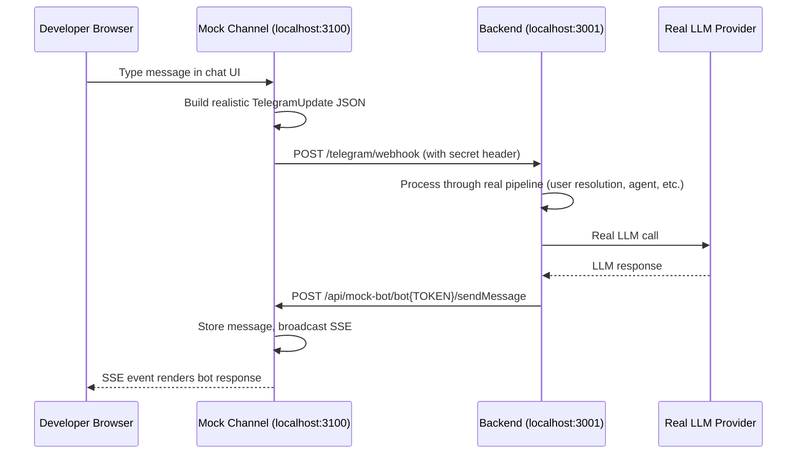

# Mock Channel — Telegram Emulator for Local Dev

A dev-only Next.js app that emulates the Telegram channel boundary, letting you test the full Amby agent pipeline locally without a real Telegram account or ngrok tunnel.

## Architecture

The mock channel sits between the developer and the real backend, emulating both sides of the Telegram API:



## What Is Real vs Mocked

| Component | Status |
|---|---|
| Agent runtime | **Real** |
| LLM calls | **Real** |
| Database (Postgres) | **Real** |
| User/conversation resolution | **Real** |
| Webhook processing path | **Real** |
| Telegram Bot API (outbound) | **Mocked** — captured by mock server |
| Telegram identity (inbound) | **Mocked** — constructed by webhook builder |
| Message delivery | **Mocked** — SSE instead of Telegram push |

## Setup

### Prerequisites
- Backend running locally (`doppler run -- bun run api:dev`)
- Postgres running (`docker compose up -d`)
- Backend configured with mock channel URL

### 1. Configure Backend

Add to your backend environment (Doppler or `.dev.vars`):

```env
TELEGRAM_API_BASE_URL=http://localhost:3100/api/mock-bot
```

This redirects all outbound Telegram Bot API calls to the mock server.

### 2. Start Mock Channel

```bash
# From repo root
bun run mock-channel

# Or directly
cd apps/mock-channel && bun run dev
```

Opens at [http://localhost:3100](http://localhost:3100).

### 3. Configure Mock Identity

The default mock user works out of the box. Click the gear icon to customize:
- **User ID** — Telegram user ID (default: 99001)
- **Chat ID** — Telegram chat ID (default: 99001)
- **First Name** — User's display name
- **Backend URL** — Where the backend runs (default: http://localhost:3001)
- **Webhook Secret** — Must match backend's `TELEGRAM_WEBHOOK_SECRET`

Settings persist in localStorage.

## Environment Variables

| Variable | Default | Description |
|---|---|---|
| `BACKEND_URL` | `http://localhost:3001` | Backend API URL |
| `TELEGRAM_WEBHOOK_SECRET` | `dev-secret` | Must match backend's webhook secret |
| `TELEGRAM_BOT_TOKEN` | `dev-mock-token` | Token used in Bot API path matching |

## How It Works

### Inbound Flow (User → Backend)
1. You type a message in the chat UI
2. The mock app constructs a realistic `TelegramUpdate` JSON payload
3. The mock app's server-side proxy POSTs it to the backend's `/telegram/webhook`
4. The backend processes it through its real pipeline

### Outbound Flow (Backend → UI)
1. The backend tries to send a Telegram message via `sendMessage`, `editMessageText`, etc.
2. Because `TELEGRAM_API_BASE_URL` points to the mock server, these calls hit `http://localhost:3100/api/mock-bot/bot{TOKEN}/{method}`
3. The mock server parses the request, stores the message, and broadcasts an SSE event
4. The browser receives the SSE event and renders the bot's response

### Supported Bot API Methods
- `sendMessage` — Posts new message
- `editMessageText` — Edits existing message in-place
- `deleteMessage` — Removes a message
- `sendChatAction` — Shows typing indicator
- `setMyCommands` — No-op (accepted silently)
- `getMe` — Returns mock bot identity

## Debug Panel

The right sidebar shows a chronological log of all requests:
- **→ WEBHOOK** (green) — Your message sent to the backend
- **← BOT API** (blue) — Backend's outbound Telegram API calls

Click any entry to expand the full request/response JSON.

## Adding Another Channel

The mock channel is designed for Telegram first but can be extended:

1. Create a new webhook builder for the channel's inbound format
2. Create a new mock API server for the channel's outbound API
3. Add the channel to the setup UI
4. Configure the backend to redirect that channel's outbound calls to the mock server

## Troubleshooting

### "Failed to reach backend: fetch failed"
- Ensure the backend is running on the configured URL
- Check that `BACKEND_URL` matches the backend's actual port

### Messages send but no response appears
- Check that the backend has `TELEGRAM_API_BASE_URL=http://localhost:3100/api/mock-bot`
- Check the debug panel for outbound Bot API calls
- Check backend logs for errors

### Webhook rejected (401/403)
- Ensure `TELEGRAM_WEBHOOK_SECRET` matches between mock channel and backend
