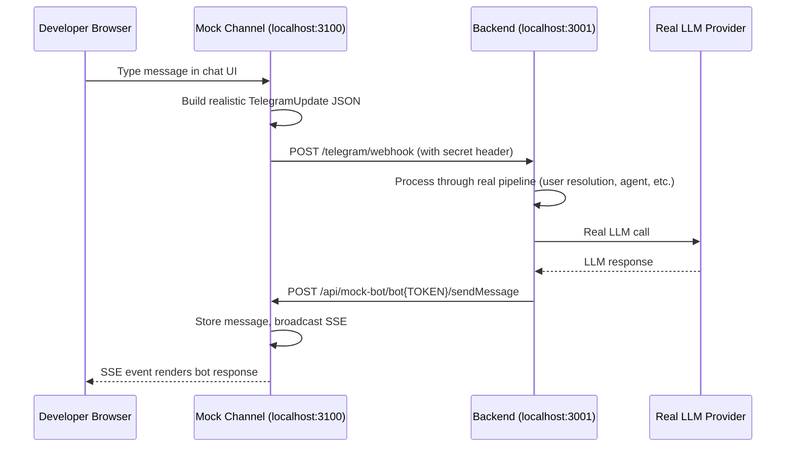

# Mock Channel — Telegram Emulator for Local Dev

A dev-only Next.js app that emulates the Telegram channel boundary, letting you test the full Amby agent pipeline locally without a real Telegram account or ngrok tunnel.

## Architecture



## What Is Real vs Mocked

| Component | Status |
|---|---|
| Agent runtime | **Real** |
| LLM calls | **Real** |
| Database (Postgres) | **Real** |
| User/conversation resolution | **Real** |
| Webhook processing path | **Real** |
| Telegram Bot API (outbound) | **Mocked** — captured by mock server |
| Telegram identity (inbound) | **Mocked** — constructed by webhook builder |
| Message delivery | **Mocked** — SSE instead of Telegram push |

## Setup

### 1. Configure Backend

Add to your backend environment (Doppler or `.dev.vars`):

```env
TELEGRAM_API_BASE_URL=http://localhost:3100/api/mock-bot
```

### 2. Start Mock Channel

```bash
bun run mock-channel
```

Opens at [http://localhost:3100](http://localhost:3100).

### 3. Configure Mock Identity

Click the gear icon to customize user ID, chat ID, backend URL, and webhook secret. Settings persist in localStorage.

## Environment Variables

| Variable | Default | Description |
|---|---|---|
| `BACKEND_URL` | `http://localhost:3001` | Backend API URL |
| `TELEGRAM_WEBHOOK_SECRET` | `dev-secret` | Must match backend's webhook secret |
| `TELEGRAM_BOT_TOKEN` | `dev-mock-token` | Token used in Bot API path matching |

## Supported Bot API Methods

`sendMessage`, `editMessageText`, `deleteMessage`, `sendChatAction`, `setMyCommands`, `getMe`

## Troubleshooting

- **"Failed to reach backend"** — Ensure backend is running on configured URL
- **No response appears** — Check `TELEGRAM_API_BASE_URL` is set on backend
- **Webhook rejected** — Ensure `TELEGRAM_WEBHOOK_SECRET` matches between mock channel and backend
