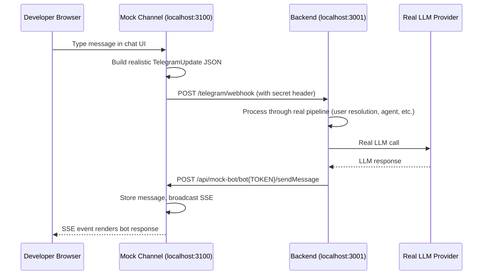

# Mock Channel and Telegram Auth Surface

A dev-only Next.js app that does two jobs:

- emulates the Telegram channel boundary so you can test the full agent pipeline locally without Telegram or ngrok
- provides a browser auth panel that exercises the first-party Better Auth Telegram plugin against the API origin

## Architecture



## What Is Real vs Mocked

| Component | Status |
|---|---|
| Agent runtime | **Real** |
| LLM calls | **Real** |
| Database (Postgres) | **Real** |
| User/conversation resolution | **Real** |
| Webhook processing path | **Real** |
| Better Auth `/api/auth/*` routes | **Real** |
| Telegram Bot API (outbound) | **Mocked** — captured by mock server |
| Telegram identity (inbound) | **Mocked** — constructed by webhook builder |
| Telegram widget / Mini App payloads | **Mocked but signed** — generated locally with the real bot token |
| Message delivery | **Mocked** — SSE instead of Telegram push |

## Setup

### 1. Configure Backend

Add to your backend environment (Doppler or `.dev.vars`):

```env
TELEGRAM_API_BASE_URL=http://localhost:3100/api/mock-bot
BETTER_AUTH_URL=http://localhost:3001
TELEGRAM_BOT_TOKEN=...
TELEGRAM_BOT_USERNAME=...
TELEGRAM_LOGIN_WIDGET_ENABLED=true
TELEGRAM_MINI_APP_ENABLED=true
```

OIDC is optional. If you want to verify the redirect bootstrap in the panel, also set `TELEGRAM_OIDC_CLIENT_ID` and `TELEGRAM_OIDC_CLIENT_SECRET`.

### 2. Start Mock Channel

```bash
bun run mock
```

Opens at [http://localhost:3100](http://localhost:3100).

### 3. Configure Mock Identity

Click the gear icon to customize user ID, chat ID, backend URL, and webhook secret. Settings persist in localStorage.

### 4. Use the Telegram Auth panel

The auth panel can:

- sign in with a mock Login Widget payload
- link Telegram to an existing Better Auth session
- validate or sign in with mock Mini App `initData`
- unlink Telegram
- fetch the current Better Auth session
- start the Telegram OIDC flow with redirect disabled

The panel posts to `apps/mock/app/api/telegram-auth/route.ts`, which signs mock widget and Mini App payloads with `TELEGRAM_BOT_TOKEN` before calling the real API.

## Environment Variables

| Variable | Default | Description |
|---|---|---|
| `BACKEND_URL` | `http://localhost:3001` | Backend API URL |
| `TELEGRAM_WEBHOOK_SECRET` | `dev-secret` | Must match backend's webhook secret |
| `TELEGRAM_BOT_TOKEN` | `dev-mock-token` | Token used in Bot API path matching |
| `NEXT_PUBLIC_TELEGRAM_BOT_USERNAME` | unset | Optional convenience default for widget testing UI |

## Supported Bot API Methods

`sendMessage`, `editMessageText`, `deleteMessage`, `sendChatAction`, `setMyCommands`, `getMe`

## Auth-related routes

| Route | Purpose |
|---|---|
| `/api/telegram-auth` | Signs mock Login Widget payloads and Mini App `initData` |
| `/api/clear` | Clears mock chat state |
| `/api/mock-bot/*` | Captures outbound Telegram Bot API calls from the backend |

## Troubleshooting

- **"Failed to reach backend"** — Ensure backend is running on configured URL
- **No response appears** — Check `TELEGRAM_API_BASE_URL` is set on backend
- **Webhook rejected** — Ensure `TELEGRAM_WEBHOOK_SECRET` matches between mock channel and backend
- **Auth panel says Telegram auth is not configured** — Ensure `BETTER_AUTH_URL`, `TELEGRAM_BOT_TOKEN`, and `TELEGRAM_BOT_USERNAME` are set on the backend
- **Mini App actions fail** — Enable `TELEGRAM_MINI_APP_ENABLED` on the backend
