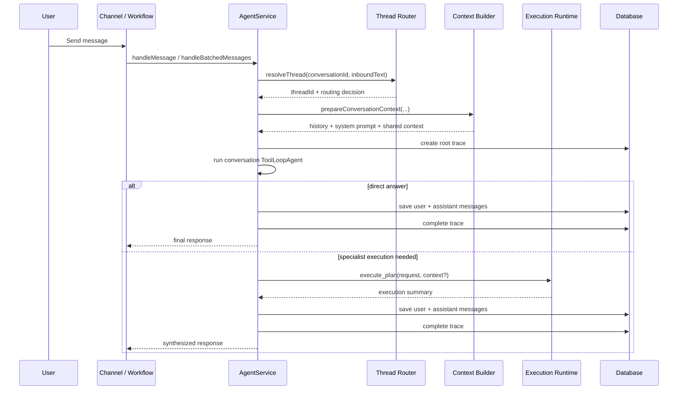
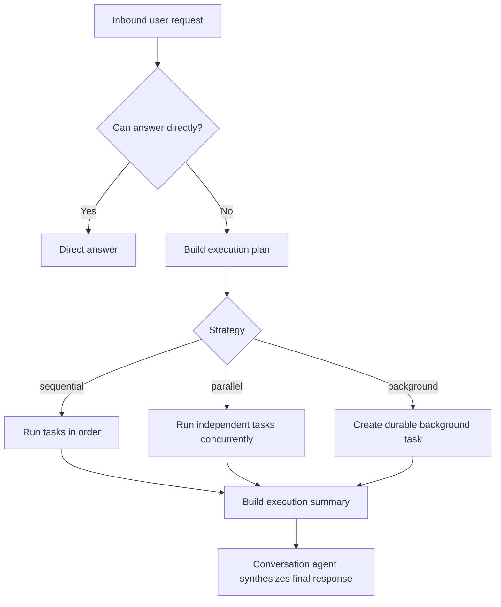

# Agent

Amby's agent is a conversation-first coordinator with a separate execution runtime.

That distinction matters.

The user talks to one assistant. Internally, the system does **not** stuff all work into one flat tool loop anymore. It:
1. resolves the active thread,
2. builds thread-aware context,
3. runs the conversation loop,
4. optionally plans specialist execution,
5. persists both the visible response and the hidden execution record.

## Core responsibilities

The conversation agent owns:
- thread resolution,
- context assembly,
- direct answering,
- deciding when specialist execution is needed,
- synthesis of final user-facing text,
- linking transcript rows to execution traces.

The execution runtime owns:
- specialist planning,
- task dependency ordering,
- lock-aware batching,
- background handoff,
- validation when required,
- durable task persistence.

## Current mental model

The cleanest way to document the current design is this:

> The top-level agent is a conversation orchestrator. When work exceeds a direct answer, it calls the internal execution runtime, which plans and runs specialist tasks.

That is more accurate than describing the system as a loose bag of exposed subagent delegation tools.

## Request lifecycle

## Current direct tools

Document these as the actual direct tools of the conversation loop:

| Tool | Purpose |
|---|---|
| `search_memories` | Read user memory before or during response generation |
| `send_message` | Emit short progress updates in runtimes that support incremental replies |
| `execute_plan` | Hand work to the internal execution runtime |
| `query_execution` | Inspect durable execution state for work that is running or recently completed |

That is the authoritative surface in the current code.

## Agent configuration policy

The current runtime policy is intentionally constrained:

- direct answers are allowed,
- background tasks are allowed only when sandbox execution is enabled,
- memory writes are allowed,
- external writes are allowed,
- write confirmation is required,
- max specialist depth is currently **1**,
- max conversation steps is **8**,
- max parallel agents is **3**,
- max tool calls per run is **32**.

Those settings are important because they define the actual operational envelope.

## Thread-aware context model

The agent is not replaying one giant flat transcript.

The context builder currently composes:
- active thread history,
- user timezone,
- formatted current time,
- deduplicated user memory profile,
- summaries of other threads,
- resumed-thread synopsis when coming back to a dormant thread,
- artifact recap for recent thread execution outputs.

That means the effective context window is already thread-aware and execution-aware.

## Thread routing model

The resolver has four conceptual stages:
1. ensure a default thread exists,
2. archive stale threads,
3. resolve native platform thread identity when available,
4. otherwise use derived routing with heuristics first and a model fallback second.

### Current derived routing rules

These are real, not aspirational:
- continue the last active thread when the gap is under 2 minutes,
- switch when a thread label matches clearly,
- switch when at least 2 stored keywords match,
- otherwise ask a model to choose `continue`, `switch`, or `new`.

### Current lifecycle thresholds

- dormant thread threshold: **1 hour**
- stale archive threshold: **24 hours**
- recent tail budget: **20 messages**

## Internal execution runtime

The execution runtime is the actual backbone for specialist work.

It has four core parts:

### 1. Planner
The planner decides whether the request should be:
- `direct`
- `sequential`
- `parallel`
- `background`

It uses heuristics first and falls back to model planning only when warranted.

### 2. Specialist registry
The current specialist set is:
- `conversation`
- `planner`
- `research`
- `builder`
- `integration`
- `computer`
- `browser`
- `memory`
- `settings`
- `validator`

Each specialist has:
- a runner kind,
- a model policy,
- a max step budget,
- allowed tool groups,
- input and result schema.

### 3. Coordinator
The coordinator:
- materializes task IDs and dependency IDs,
- computes ready batches,
- honors dependency failures,
- executes tasks inline or in parallel when safe,
- persists traces and durable tasks,
- runs validator work when required.

### 4. Reducer / summary synthesis
Execution returns a structured summary that the conversation agent turns into the final user-facing answer.

## Specialist tool groups

The current group model is the right abstraction to document:

| Group | Meaning |
|---|---|
| `memory-read` | Search/retrieve memory |
| `memory-write` | Save memory |
| `sandbox-read` | Read files / inspect sandbox state |
| `sandbox-write` | Modify files / sandbox state |
| `settings` | Scheduling, timezone, Codex auth, related settings actions |
| `cua` | Desktop-computer tools |
| `integration` | Connected-app tools |

This is cleaner and more future-proof than documenting per-subagent tool names as the main architecture.

## Execution modes

## Persistence contract

The agent now writes to three different categories of state:

### Transcript state
- `messages`

### Execution trace state
- `traces`
- `trace_events`

### Durable work state
- `tasks`
- `task_events`

This split should be documented explicitly. It is one of the biggest improvements in the current system.

## Clear statements to include

- `messages` contains only user-visible transcript.
- Tool calls and tool results are not flattened into `messages`.
- Orchestrator execution is represented by a root trace.
- Specialist execution is represented by child traces and, when durable, task rows.
- Background handoff is a first-class execution mode, not a hack around synchronous chat.

## Near-future direction

The current abstractions already support the next step cleanly:
- deeper specialist nesting,
- better validation passes,
- richer execution retry/resume,
- better surfaced progress updates,
- more structured user-visible approvals before write actions.

## Open questions

1. Should `execute_plan` remain a single execution boundary tool, or should the conversation loop eventually expose narrower internal tools for planning vs execution vs validation?
2. Should the validator become mandatory for all mutating specialist plans, or remain conditional?
3. Should thread routing move to a dedicated service boundary once more channels with native threading are live?
