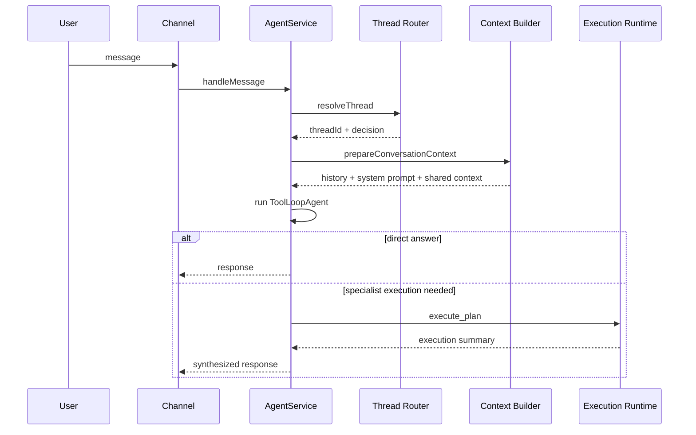
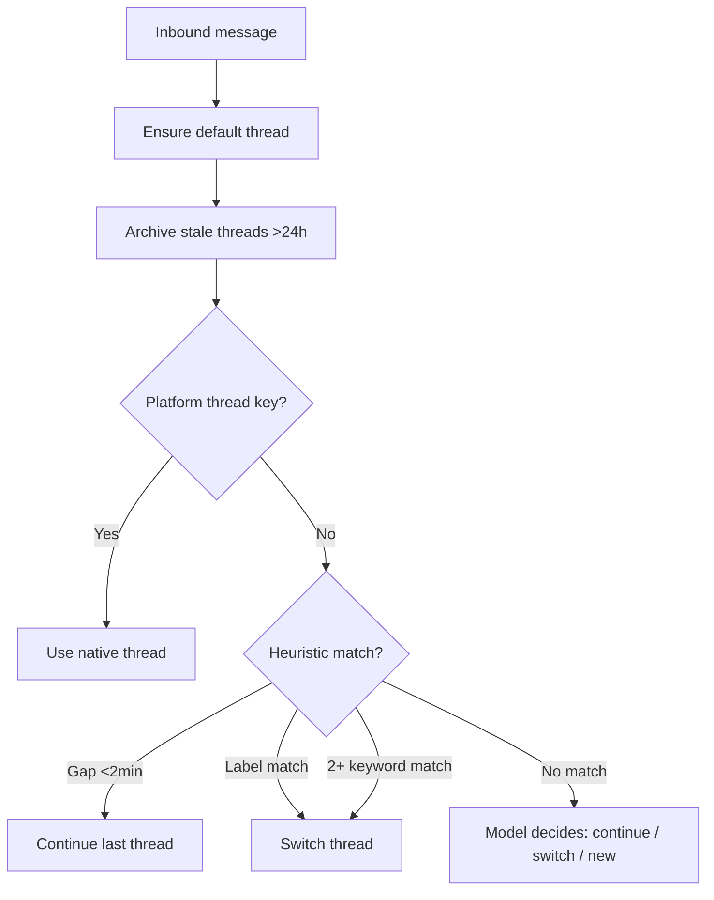
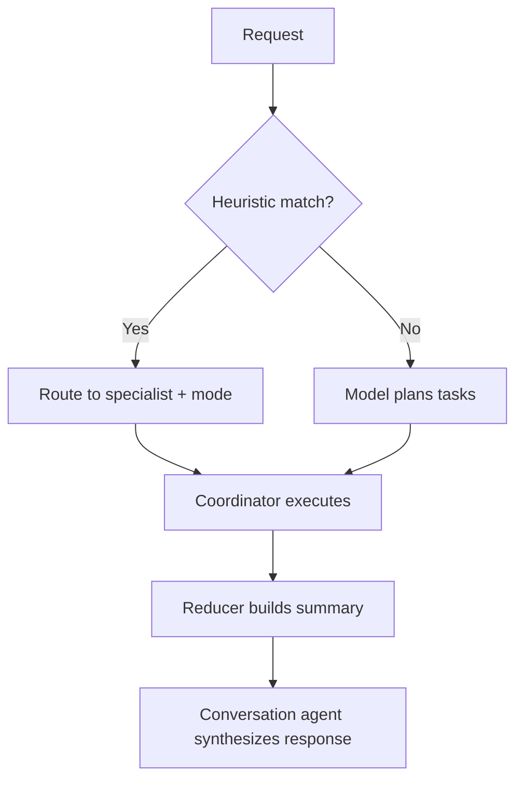

# Agent

The agent is a conversation-first coordinator with a separate execution runtime. The user talks to one assistant; internally the system resolves threads, builds context, runs a conversation tool loop, and optionally delegates to specialist execution.

## Composition

`AgentService` (`packages/agent/src/agent.ts`) wires together:

- **DbService** — persistence
- **ModelService** — LLM access
- **SandboxService** — code execution sandbox
- **BrowserService** — headless browser
- **TaskSupervisor** — durable background tasks
- **EnvService** — environment config
- **PluginRegistry** — all plugins (memory, integrations, automations, browser-tools, computer-tools, skills) are registered here; they contribute tools, context, and task runners

It exposes `handleMessage`, `handleBatchedMessages`, and `streamMessage` as entry points.

## Request lifecycle

## Thread routing

Four-stage resolution in `packages/agent/src/router.ts`:

### Thresholds

| Parameter | Value |
|---|---|
| Continue gap | 2 min |
| Dormant threshold | 1 hour |
| Stale archive threshold | 24 hours |
| Open thread cap | 10 |
| Message tail budget | 20 |

## Context assembly

`packages/agent/src/context/builder.ts` composes the prompt in this order:

1. **Conversation prompt** — base system instructions with current time and timezone
2. **User memory** — deduplicated static + dynamic memories
3. **Other thread summaries** — synopsis of sibling open threads
4. **Resumed-thread synopsis** — included when returning to a dormant thread
5. **Artifact recap** — recent execution outputs for the thread
6. **Thread history** — 20-message tail from the active thread

## Tool loop

Uses Vercel AI SDK `ToolLoopAgent` with these limits:

| Limit | Value |
|---|---|
| Max conversation steps | 8 |
| Max tool calls per run | 32 |
| Max parallel agents | 3 |
| Max specialist depth | 1 |

After `execute_plan` or `query_execution` is called, all tools are deactivated for the remaining steps (the agent synthesizes the final response).

## Direct tools

These are always available in the conversation loop:

| Tool | Purpose |
|---|---|
| `search_memories` | Read user memory before or during response |
| `send_message` | Emit progress updates (no-op if runtime lacks incremental replies) |
| `execute_plan` | Delegate work to the execution runtime |
| `query_execution` | Inspect running or recently completed durable executions |

## Execution planner

`packages/agent/src/execution/planner.ts` routes requests using heuristic pattern matching, falling back to model planning.

### Modes

| Mode | When used |
|---|---|
| `direct` | Simple answer, no specialist needed |
| `sequential` | Multi-step work with dependencies |
| `parallel` | Independent tasks that can run concurrently |
| `background` | Long-running work via durable task handoff |

## Specialist types

Defined in `packages/agent/src/execution/registry.ts`:

| Specialist | Runner | Tool groups | Max steps |
|---|---|---|---|
| `conversation` | toolloop | (none) | 8 |
| `planner` | toolloop | (none) | 3 |
| `research` | toolloop | memory-read, sandbox-read | 8 |
| `builder` | toolloop | memory-read, sandbox-read, sandbox-write | 10 |
| `integration` | toolloop | integration | 10 |
| `computer` | toolloop | cua | 16 |
| `browser` | browser_service | (none, uses BrowserService) | 24 |
| `memory` | toolloop | memory-read, memory-write | 5 |
| `settings` | toolloop | settings | 6 |
| `validator` | toolloop | (none) | 4 |

## Tool groups

| Group | Contents |
|---|---|
| `memory-read` | `search_memories` |
| `memory-write` | `save_memory` |
| `sandbox-read` | File read / sandbox inspection |
| `sandbox-write` | File modification / sandbox mutation |
| `settings` | Scheduling, timezone, Codex auth |
| `cua` | Desktop computer-use tools |
| `integration` | Connected third-party app tools |

## Persistence

| Category | Tables | What it stores |
|---|---|---|
| Transcript | `messages` | User-visible conversation only |
| Execution trace | `traces`, `trace_events` | OTel-style execution recording |
| Durable work | `tasks`, `task_events` | Background task state |

Tool calls and results are recorded in traces, not flattened into `messages`.

## Related docs

- [ARCHITECTURE.md](./ARCHITECTURE.md) — full system map
- [BROWSER_AND_COMPUTER.md](./BROWSER_AND_COMPUTER.md) — browser and sandbox execution
- [MEMORY.md](./MEMORY.md) — memory system
- [channels/telegram.md](./channels/telegram.md) — Telegram integration
- [PLUGINS_AND_SKILLS.md](./PLUGINS_AND_SKILLS.md) — plugin and skill system
- [RUNTIME.md](./RUNTIME.md) — runtime flows and workflows

## Key source files

- `packages/agent/src/agent.ts` — AgentService composition
- `packages/agent/src/router.ts` — thread routing
- `packages/agent/src/context/builder.ts` — context assembly
- `packages/agent/src/execution/planner.ts` — execution planning
- `packages/agent/src/execution/registry.ts` — specialist registry
- `packages/agent/src/execution/coordinator.ts` — task coordination
- `packages/agent/src/execution/reducer.ts` — result synthesis
