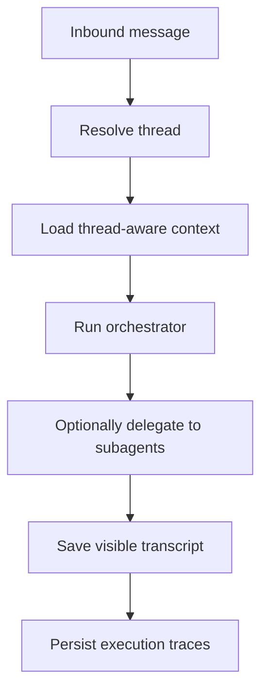
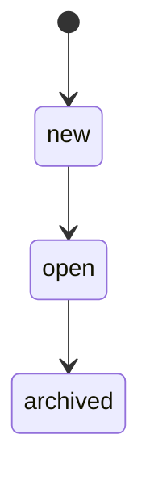

# Agent Architecture

Amby uses one orchestrator agent plus a small set of specialized subagents. The orchestrator owns the user experience. Subagents do scoped work and return concise summaries.

The user never sees the delegation layer. They interact with one assistant.

## High-Level Flow



## Orchestrator, Direct Tools, and Subagents

All delegated agents are AI SDK v6 `ToolLoopAgent` instances. The orchestrator keeps coordination tools plus a small set of direct capabilities. Heavy work is delegated.

| Agent | Tool groups | Role |
|---|---|---|
| `research` | `memory-read`, `computer-read` | Read files, inspect state, gather information |
| `builder` | `memory-read`, `computer-read`, `computer-write` | Create or change files, run code |
| `planner` | none | Pure reasoning and decomposition |
| `integration` | `integration` | Connected-app work via Composio tools |
| `computer` | `cua` | GUI automation when CUA is enabled |
| `memory_manager` | `memory-read`, `memory-write` | Save and organize memories |

Subagents are exposed to the orchestrator as tools such as `delegate_research` and `delegate_builder`.

The orchestrator also gets a few direct tools that are not subagents:

- `delegate_task` for unified browser/computer/sandbox delegation
- `get_task` and related sandbox task inspection tools for background Codex tasks
- reply/job/memory tools

## Request Lifecycle

1. `resolveThread()` chooses the active thread for the inbound message.
2. `prepareContext()` loads:
   - the active thread tail
   - other open-thread summaries
   - recent thread artifact summaries
   - a resumed-thread synopsis when needed
   - user memory and formatted current time
3. The orchestrator runs with direct access to:
   - `search_memories`
   - `delegate_task` when at least one delegated execution target is enabled
   - job tools
   - reply tools
   - Codex auth tools when sandbox support is available
   - background task tools when sandbox support is available
   - delegated subagent tools
4. A delegated subagent returns `{ summary, toolsUsed? }`.
5. The orchestrator synthesizes the final user-facing response.
6. User and assistant messages are saved on `messages` with the resolved `threadId`.
7. Execution is persisted as a trace tree rooted at the orchestrator run.

## Thread Routing

Threading is internal. A single platform conversation can contain multiple derived topic threads.

### Resolution order

1. Ensure the conversation has a default thread.
2. Archive stale open threads older than 24 hours.
3. If a channel provides a native thread key, resolve through that.
4. Otherwise use the derived router:
   - continue when the last message was under 2 minutes ago
   - switch when a thread label matches by word boundary
   - switch when at least 2 stored keywords match
   - fall back to a structured `generateObject()` routing call for `continue`, `switch`, or `new`

Current CLI and Telegram flows use the derived path. The resolver API already supports native thread keys, but callers do not pass them yet.

### Thread lifecycle



Synopsis generation happens when:

- the agent switches away from a thread that has been idle for more than 1 hour
- a thread is archived after more than 24 hours of inactivity
- the active thread would overflow the 20-message replay tail

The default thread includes legacy rows with `NULL thread_id`, so pre-threading history is still visible.

## Context Replay

The prompt is thread-aware, not conversation-wide.

`loadThreadTail()` loads the recent message tail for the active thread. For the last 4 assistant messages, the loader appends lightweight annotations built from recent `tool_result` trace events:

```
[Tools used: delegate_builder: Created auth middleware]
```

`loadThreadArtifacts()` separately turns recent trace summaries into a compact `Thread context` block for the system prompt. This gives the model artifact awareness without replaying full raw tool payloads.

## Trace Model

Visible transcript and execution state are stored separately.

### `messages`

`messages` stores only the user-visible transcript:

- `conversationId`
- `threadId`
- `role`
- `content`
- `metadata`

### `traces`

`traces` stores the execution tree:

- one root trace for the orchestrator
- child traces for delegated subagents
- `conversationId`, `threadId`, `messageId`
- `parentTraceId`, `rootTraceId`
- `agentName`, `status`, timing, metadata

### `trace_events`

`trace_events` stores ordered execution events per trace. The current persistence path writes `tool_call` and `tool_result` events with a monotonic `seq`.

This split keeps prompt replay cheap while preserving full execution fidelity for debugging and follow-up context.

## Tool Grouping

Subagent tool access is defined by named groups in `packages/agent/src/subagents/tool-groups.ts`.

| Group | Tools |
|---|---|
| `memory-read` | `search_memories` |
| `memory-write` | `save_memory` |
| `computer-read` | `execute_command`, `read_file` |
| `computer-write` | `write_file` |
| `integration` | connector management + user-scoped connector session tools |
| `cua` | desktop automation tools |

The research agent uses the same `execute_command` tool as the builder, but its prompt constrains it to read-only operations.

## Routing Rules

The orchestrator chooses among three execution paths:

- Connected apps like Gmail, Calendar, Notion, Slack, and Drive go to `delegate_integration`.
- Ordinary same-tab website work goes to `delegate_task` with `target="browser"` when browser support is enabled.
- If direct browser delegation is unavailable in the runtime, website work can fall back to `delegate_task` with `target="sandbox"` and `needsBrowser: true`.
- Real desktop tasks go to `delegate_task` with `target="computer"` when the flow needs a screen, native dialogs, file pickers, uploads/downloads, CAPTCHA/MFA, popups/new tabs, or other non-browser UI.
- Long-running autonomous background Codex work goes to `delegate_task` with `target="sandbox"`.

## Design Choices

- Orchestrator-only delegation keeps control flow simple.
- Memory writes are isolated behind `delegate_memory_manager`.
- Shared prompt context is assembled once and passed into subagents at spawn time.
- Trace metadata is intentionally low-PII. Memories and formatted timestamps stay in prompts, not in telemetry metadata.

## Key Files

| File | Purpose |
|---|---|
| `packages/agent/src/agent.ts` | Main request flow, context assembly, persistence |
| `packages/agent/src/router.ts` | Thread resolution, archival, synopsis generation |
| `packages/agent/src/context.ts` | Thread-tail loading, artifact recap, replay annotations |
| `packages/agent/src/synopsis.ts` | Dormancy and overflow synopsis updates |
| `packages/agent/src/traces.ts` | Trace persistence and tool annotation formatting |
| `packages/agent/src/subagents/spawner.ts` | `delegate_*` tool creation |
| `packages/agent/src/subagents/tool-groups.ts` | Tool-group definitions and resolution |
