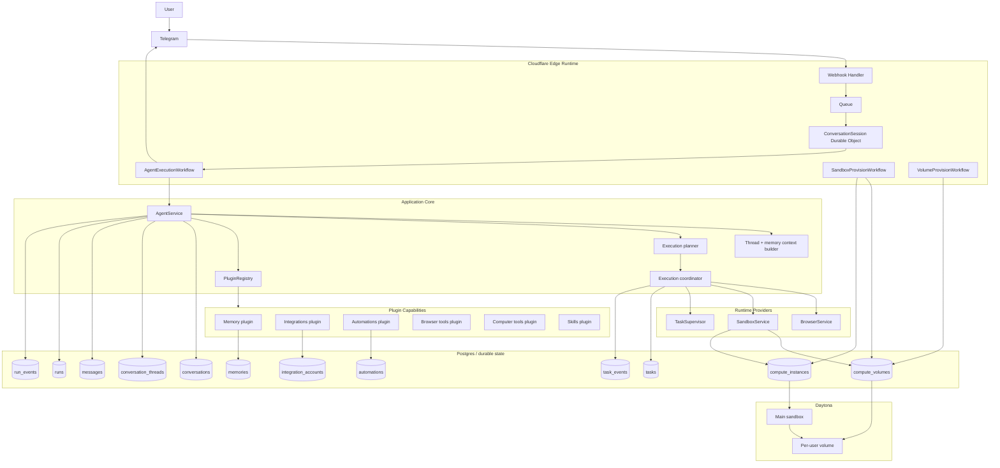

# Amby Architecture

Amby is a cloud-native assistant runtime, not a thin chat wrapper.

The system has four stable layers:
1. **Transport** receives user input and delivers output (Telegram webhook, queue, Durable Objects).
2. **Agent runtime** resolves context, plans work, and synthesizes responses via plugin-provided tools.
3. **Execution runtime** runs specialist work across browser, sandbox, and integration surfaces.
4. **Persistence** stores transcript, execution traces, durable tasks, compute state, automations, and memory.

The architecture is built around one core principle:

> The user interacts with one assistant, while the system internally separates conversation, execution, and infrastructure state.

## System model

Amby currently operates as a Telegram-first cloud runtime.

The deployed flow is:
- Telegram webhook enters a Cloudflare Worker.
- A queue decouples inbound delivery from processing.
- A Durable Object buffers and debounces per-chat input.
- A Workflow runs the agent durably.
- The agent may answer directly or execute a specialist plan.
- Specialist execution may be inline, parallel, or background.
- Persistent state is written to Postgres throughout the flow.

## Architectural boundaries

### 1. Transport is transport, not intelligence
Transport does not own reasoning, planning, or memory. It only moves messages in and out.

### 2. The agent owns user-facing coherence
The agent decides how to respond, what context matters, when to plan specialist work, and how results are presented back to the user. The agent depends only on `@amby/core` abstractions — never on concrete provider packages.

### 3. Plugins provide all capabilities
Memory, integrations, automations, browser tools, computer tools, and skills are all delivered through the plugin registry. The agent resolves tools per turn from the registry.

### 4. Execution is separate from transcript
Visible conversation history is stored separately from tool and task execution.

### 5. Compute is volume-first
A user's persistent computer state lives on a Daytona volume. Sandboxes are disposable runtimes mounted onto that volume.

### 6. Long-running work is durable
Background work is represented as durable tasks with event logs and trace links. It is not hidden inside one transient LLM call.

## Canonical component diagram



## Package map

```mermaid
graph BT
    core[@amby/core]
    env[@amby/env]
    db[@amby/db] --> env
    memory[@amby/memory] --> core
    memory --> db
    browser[@amby/browser] --> core
    browser --> env
    computer[@amby/computer] --> core
    computer --> db
    computer --> env
    plugins[@amby/plugins] --> core
    plugins --> db
    plugins --> env
    skills[@amby/skills] --> core
    agent[@amby/agent] --> core
    agent --> db
    agent --> env
    auth[@amby/auth] --> db
    auth --> env
    api[apps/api] --> agent
    api --> memory
    api --> browser
    api --> computer
    api --> plugins
    api --> skills
    api --> auth
```

**10 packages:** auth, env, db, core, memory, agent, browser, computer, plugins, skills

**Dependency inversion:** Agent depends only on `@amby/core` + `@amby/db` + `@amby/env`. Browser, computer, memory, plugins, and skills are injected via Effect Context.Tags defined in core. The composition root (`apps/api`) provides concrete Layer implementations.

## Runtime tool resolution

```
Composition root (apps/api)
  → resolve Effect services (MemoryService, DbService, BrowserService, SandboxService, EnvService, TaskSupervisor)
  → create port adapters (MemoryService→MemoryRepository, BrowserService→BrowserProvider, etc.)
  → instantiate plugins:
      1. createMemoryPlugin(memoryService)          — from @amby/memory
      2. createIntegrationsPlugin(config)            — from @amby/plugins/integrations
      3. createAutomationsPlugin(config)             — from @amby/plugins/automations
      4. createBrowserToolsPlugin(config)            — from @amby/plugins/browser-tools
      5. createComputerToolsPlugin(config)           — from @amby/plugins/computer-tools
      6. createSkillsPlugin(skillService)            — from @amby/skills
  → register all in PluginRegistry
  → provide Layer implementations for core Effect tags
  → agent yields tags from @amby/core — never imports concrete provider packages
  → engine resolves tools per turn from registry
```

## Runtime shape

There are three execution modes:

### Direct response
The conversation agent responds without specialist execution.

### Planned specialist execution
The conversation agent uses `execute_plan`, which builds a task plan and executes specialist work inline when appropriate.

### Durable background execution
The execution runtime hands work off to background task infrastructure, persists task state, and allows later inspection via `query_execution` and task tooling.

## What is actually true in the current code

- The top-level conversation loop exposes **`search_memories`**, **`send_message`**, **`execute_plan`**, and **`query_execution`** as direct tools.
- All tools are resolved from the **PluginRegistry** per turn — no hardcoded tool imports in the agent.
- Specialist execution is mediated by a planner/coordinator/registry model.
- Execution state is persisted across **`runs`**, **`run_events`**, **`tasks`**, and **`task_events`**.
- Sandboxes are not the persistence boundary; **volumes** are.
- Telegram processing is durable and message-batched via Queue + Durable Object + Workflow.
