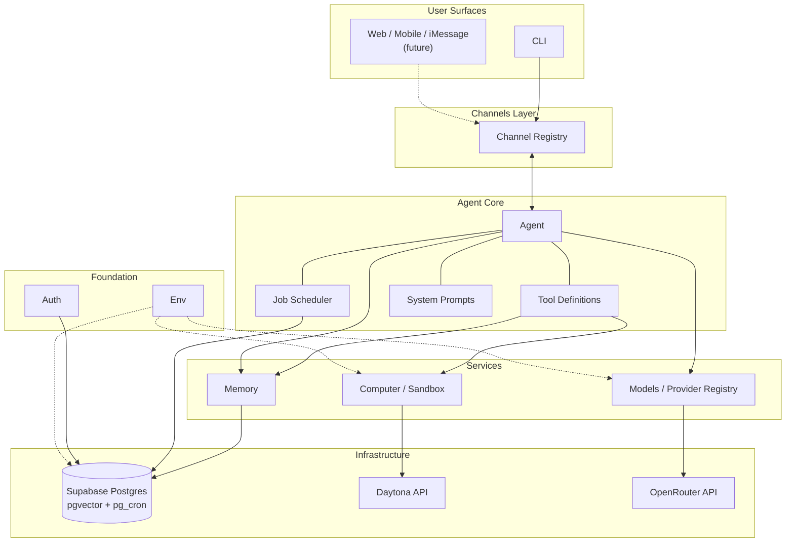
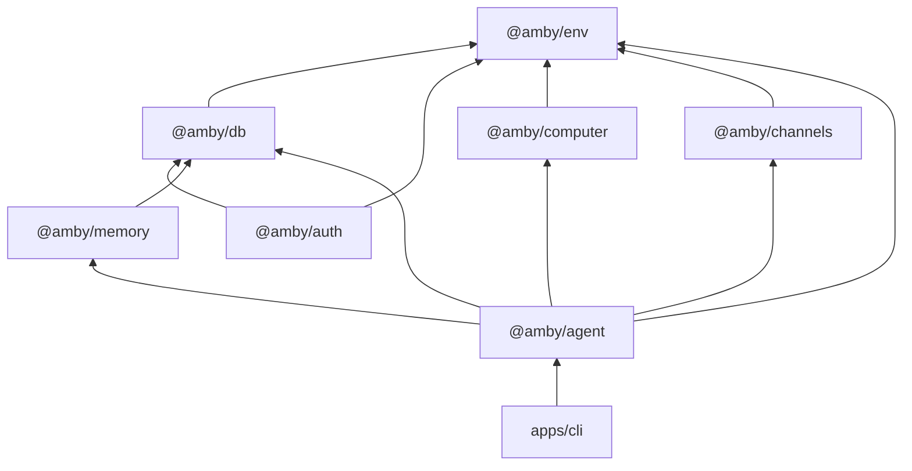
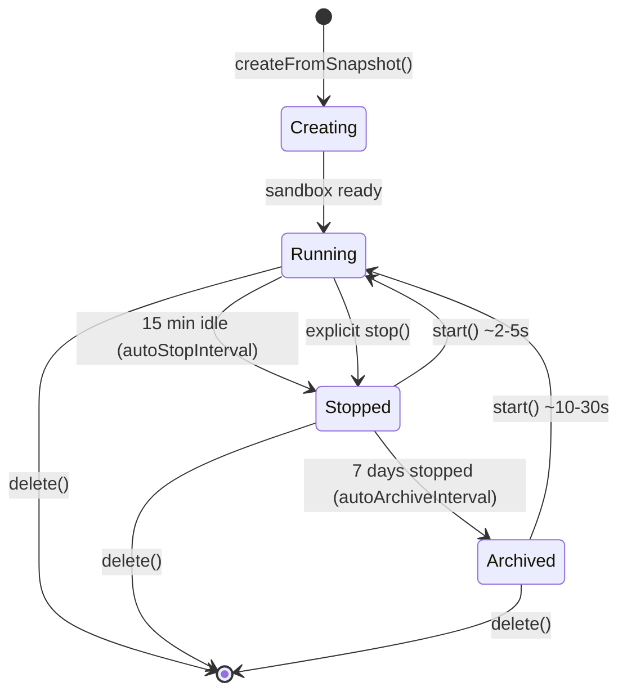
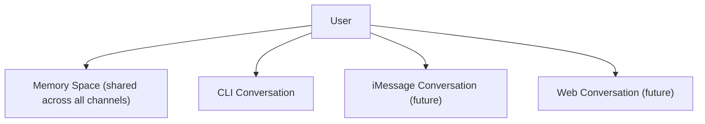
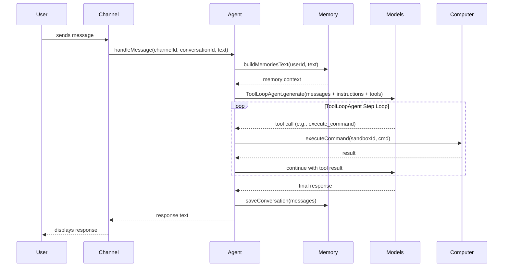
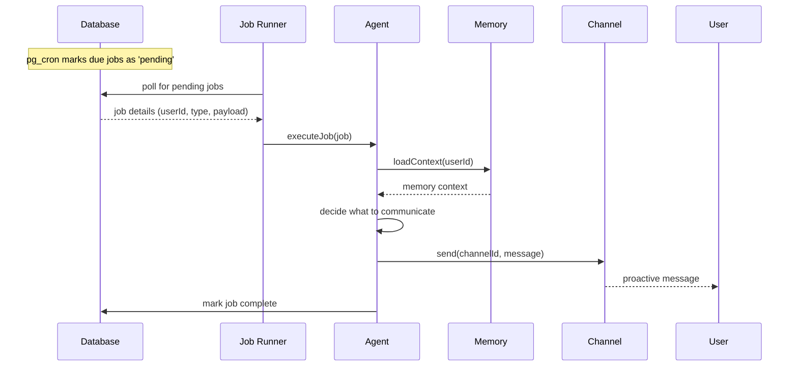
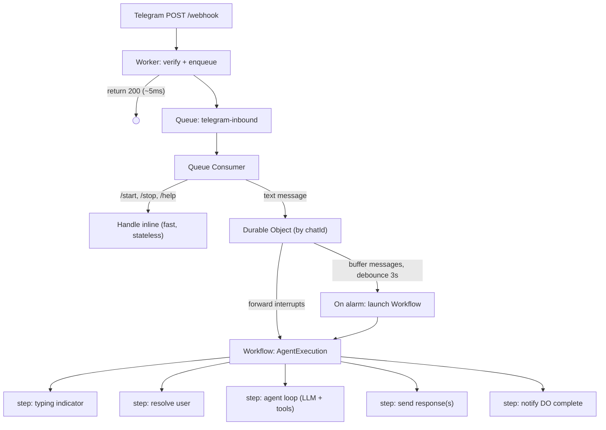
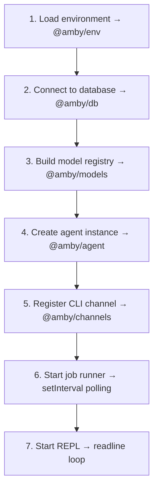

# Amby Architecture
Amby is a cloud-native ambient assistant computer. It runs as a persistent, long-lived process — the user reaches it
from anywhere (CLI today, phone/web/messaging later). This document describes the technical architecture for the MVP.

The MVP is a **text-only CLI runner** that validates the core loop: receive input, think with memory, act with tools,
respond — or proactively reach out. Voice, web, and mobile channels come later.

---

## Design Principles
**Modular packages, clear boundaries.** Each package owns one concern. Dependencies flow one direction. No package
reaches into another's internals.

**Interfaces over implementations.** Repository patterns, provider interfaces, and channel abstractions let us swap
backends without rewriting consumers.

**Vercel AI SDK as the backbone.** All model interactions — chat, tool use, agent loops — go through the AI SDK. No
raw HTTP calls to model APIs.

**Channels as first-class I/O.** The agent doesn't know or care whether it's talking to a CLI, iMessage, or a web
socket. Channels are ports, not features.

**Sandbox as disposable compute.** The Daytona sandbox is a tool the agent uses, not the agent itself. Sandboxes
hibernate when idle, wake on demand, and can be destroyed without data loss.

**Memory as persistent intelligence.** The agent forgets nothing (unless told to). Memory is what makes Amby an
assistant, not a chatbot.

---

## System Overview


---

## Package Map

### Dependency Graph


### Package Summary
| Package          | Purpose                                           | Key Dependencies                       |
|------------------|---------------------------------------------------|----------------------------------------|
| `@amby/env`      | Type-safe environment variables via T3 Env        | `@t3-oss/env-core`, `zod`              |
| `@amby/db`       | Drizzle ORM, schemas, migrations, Supabase client | `drizzle-orm`, `postgres`, `@amby/env` |
| `@amby/auth`     | BetterAuth configuration and user authentication  | `better-auth`, `@amby/db`, `@amby/env` |
| `@amby/memory`   | Memory storage, retrieval, and LLM injection      | `@amby/db`, `ai`                       |
| `@amby/computer` | Daytona sandbox lifecycle and command execution   | `@daytonaio/sdk`, `@amby/env`          |
| `@amby/channels` | Channel interface and adapters (CLI for MVP)      | `@amby/env`                            |
| `@amby/agent`    | Core agent orchestration, tools, jobs, and model selection | `ai`, `@openrouter/ai-sdk-provider`, all `@amby/*` packages |

---

## Package Details

### @amby/env
The foundation. Uses `@t3-oss/env-core` with Zod to validate and expose all environment variables at import time.
Every other package imports env vars from here — no `process.env` scattered across the codebase.

**Exports:** a single typed, validated `env` object.

**Defines variables for:**

- Database: `DATABASE_URL`, `SUPABASE_URL`, `SUPABASE_ANON_KEY`
- Models: `OPENROUTER_API_KEY` (required), `OPENAI_API_KEY` (optional, used for Codex in sandboxes)
- Daytona: `DAYTONA_API_KEY`, `DAYTONA_API_URL`, `DAYTONA_TARGET`
- Auth: `BETTER_AUTH_SECRET`, `BETTER_AUTH_URL`
- Cartesia: `CARTESIA_API_KEY` (future, TTS)

---

### @amby/db
Owns all database schemas (Drizzle ORM) and the database client. Single source of truth for the data model.

**Exports:** `db` (Drizzle client instance), `schema` (all table definitions), migration utilities.

**Schema modules:**

| Schema              | Purpose                                   |
|---------------------|-------------------------------------------|
| `users`             | User accounts (BetterAuth compatible)     |
| `sessions`          | Auth sessions (BetterAuth)                |
| `accounts`          | OAuth accounts and tokens (BetterAuth)    |
| `conversations`     | Top-level conversation containers per user per channel |
| `conversationThreads` | Topic threads within a conversation (routing, archival, synopsis) |
| `messages`          | User-visible messages within conversations |
| `traces`            | Orchestrator and subagent execution spans |
| `traceEvents`       | Ordered tool-call and tool-result events |
| `channels`          | Registered channel configurations         |
| `documents`         | Raw ingested content (memory sources)     |
| `chunks`            | Semantic chunks for vector retrieval      |
| `spaces`            | Memory namespaces / scoping containers    |
| `memoryEntries`     | Distilled facts and preferences           |
| `memorySources`     | Provenance links: memory entry ↔ document |
| `documentsToSpaces` | Many-to-many: documents ↔ spaces          |
| `jobs`              | Scheduled and recurring tasks             |
| `sandboxes`         | Sandbox state tracking per user           |

**Database:** Supabase Postgres with `pgvector` for embeddings and `pg_cron` for scheduled work.

**Migrations:** Drizzle Kit generates and runs migrations. Supabase provides the Postgres instance.

---

### @amby/auth
BetterAuth configuration for user authentication. For MVP CLI, this is foundational — the schemas exist, the config is
defined, but there is no HTTP server to serve auth routes yet.

**Exports:** `auth` (BetterAuth server instance), `authClient` (BetterAuth client for future web/mobile).

**Configuration:**

- Database adapter: Drizzle (via `@amby/db`)
- Social providers: Google, GitHub (future — not MVP)
- Plugins: added as needed (passkeys, 2FA, etc. — not MVP)

**Note:** BetterAuth handles *user identity*. Model-provider configuration is a separate concern.

---

### @amby/agent

Owns runtime model selection alongside the agent loop. It builds the OpenRouter-backed Vercel AI SDK registry and
exposes the shared model layer used by the CLI and API runtimes.

**Exports:** `ModelService`, `ModelServiceLive`, `DEFAULT_MODEL_ID`, `HIGH_INTELLIGENCE_MODEL_ID`.

### Provider registry
The runtime uses `createOpenRouter()` from `@openrouter/ai-sdk-provider`:

```plain text
google/gemini-3.1-flash-lite-preview  → default model
google/gemini-3-flash-preview         → higher-intelligence override
```

`OPENROUTER_API_KEY` powers the agent runtime. `OPENAI_API_KEY` remains useful for Codex running inside user
sandboxes, but it is not the primary application model provider.

---

### @amby/memory
The memory brain. Fully described in [MEMORY.md](./MEMORY.md).

Stores, retrieves, deduplicates, and injects memories into LLM calls.

**Exports:** `addMemory`, `addConversation` (storage), `searchMemories`, `getProfileMemories` (retrieval),
`deduplicateMemories`, `buildMemoriesText` (formatting), `injectMemoriesIntoParams`, `MemoryCache` (LLM integration),
`withMemory` (Vercel AI SDK model wrapper), `createMemoryTools` (agent tool definitions).

**Three layers:**

1. **Storage:** Documents, chunks, memory entries, spaces, provenance links.
2. **Retrieval:** Profile fetch, semantic search (pgvector), deduplication.
3. **LLM integration:** Prompt injection, per-turn cache, auto-save after response.

Depends on `@amby/db` for the repository implementation. The `MemoryRepository` interface allows swapping the storage
backend without touching memory logic.

---

### @amby/computer
Manages Daytona sandboxes as the agent's "hands." The agent can execute commands, read/write files, and run code inside
an isolated Linux environment.

**Exports:** `SandboxManager` (create, start, stop, delete sandboxes), `executeCommand(sandboxId, command)`,
`readFile` / `writeFile`, `createComputerTools()` (agent tool definitions).

### Sandbox Lifecycle


**Per-user sandbox model:** Each user gets one sandbox, tracked in the `sandboxes` table. The sandbox is created on
first use from a custom Docker snapshot.

**Cost control:**

| State    | Resources Used      | Notes                                          |
|----------|---------------------|------------------------------------------------|
| Running  | CPU + RAM + Disk    | Full allocation, active compute                |
| Stopped  | Disk only           | CPU/RAM freed, filesystem persists, ~2-5s wake |
| Archived | None (cold storage) | Zero cost, ~10-30s wake                        |

**Wake-on-demand:** When a job, message, or tool call needs the sandbox and it is stopped, `start()` wakes it
automatically. The agent never has to worry about sandbox state — the `SandboxManager` handles it transparently.

### Custom Snapshot
A Dockerfile defines the base sandbox image:

- Debian slim base
- Node.js, Python, common CLI tools pre-installed
- Non-root user with appropriate permissions
- Pre-configured for the agent's typical workloads

The snapshot is built once and cached by Daytona. New sandboxes launch from this snapshot in seconds.

---

### @amby/channels
Defines the I/O abstraction for how the agent communicates with users. A channel is a transport — it contains no
business logic.

**Exports:** `Channel` (interface), `ChannelRegistry` (manages active channels), `CLIChannel` (MVP implementation).

### Channel Interface
```plain text
Channel {
  id: string
  type: 'cli' | 'sms' | 'imessage' | 'web' | 'mobile'

  onMessage(handler): void        // register incoming message handler
  send(conversationId, message): Promise<void>  // send outgoing message
  start(): Promise<void>          // begin listening
  stop(): Promise<void>           // stop listening
}
```

**MVP — CLI Channel:**

- Uses `readline` for input, `console` for output
- Single conversation per session
- Blocking input loop with async message handling

**Future channels** (not MVP): SMS/iMessage (Twilio, Apple Business Chat), Web (WebSocket), Mobile (push + WebSocket),
Slack/Discord (bot APIs).

### Conversations Across Channels
A user has **one agent** and **one memory space**, but can have **multiple conversations** across channels. Each
conversation maintains its own message history. The agent can reference context from one channel while responding on
another — memory is shared, conversations are separate.



**Proactive messages** are just the start of a regular conversation. Once the agent sends a proactive message and the
user replies, the exchange continues reactively in that same conversation thread.

---

### @amby/agent
The highest-level package. Brings everything together into a multi-agent orchestrator that any app (CLI, API server,
etc.) can instantiate. See [AGENT.md](./AGENT.md) for the full multi-agent architecture.

**Exports:** `AgentService` (Effect service tag), `makeAgentServiceLive(userId)` (service factory), subagent definitions
and utilities.

### How It Works
The agent uses a **multi-agent orchestration** pattern built on Vercel AI SDK v6 primitives. A single orchestrator agent
receives user messages and delegates work to specialized subagents, each implemented as a tool backed by its own
`ToolLoopAgent` with restricted tools and focused instructions.

1. **Orchestrator** — receives messages, decides how to handle them, delegates to subagents, synthesizes responses
2. **Subagents** — research, builder, planner, computer (CUA), memory manager — each with scoped tools and prompts
3. **Memory integration** — automatic context injection into orchestrator and subagent prompts
4. **Job runner** — polls for and executes scheduled tasks in the background

### Orchestrator Tools
| Tool                       | Type       | Description                                        |
|----------------------------|------------|----------------------------------------------------|
| `delegate_research`        | subagent   | Gather info, read files, search memories            |
| `delegate_builder`         | subagent   | Create/modify files, run code, install packages     |
| `delegate_planner`         | subagent   | Break down complex tasks (pure reasoning)           |
| `delegate_task`            | direct     | Route work to browser, computer, or sandbox targets |
| `delegate_memory_manager`  | subagent   | Save and organize user memories                     |
| `search_memories`          | direct     | Read-only memory search (for pre-delegation context)|
| `schedule_job`             | direct     | Schedule a future task or reminder                  |
| `set_timezone`             | direct     | Set the user's IANA timezone                        |
| `send_message`             | direct     | Send an immediate message to the user               |

Tools are defined using the Vercel AI SDK `tool()` helper with Zod input schemas.

The agent is **stateless between requests** — all state lives in the database and memory system. The agent process can
restart without losing context.

---

## Core Concepts

### Reactive vs. Proactive
The agent operates in two modes:

**Reactive:** User sends a message → agent thinks → agent responds. The standard conversational loop.

**Proactive:** The agent initiates contact. A scheduled job fires, the agent decides what to say, and sends a message
through a channel. The user can reply, and the conversation continues reactively from there.

Examples of proactive behavior:

- "You have a meeting with Sarah in 30 minutes. Here's a prep summary."
- "The flight you asked me to track dropped to $280."
- "You haven't responded to Mike's email from yesterday. Want me to draft a reply?"

Both modes use the same agent core, memory, and tools. The only difference is the trigger.

---

### Reactive Message Flow


### Proactive Message Flow


---

### Jobs & Scheduling
Jobs enable proactive behavior. They are stored in Postgres and triggered by `pg_cron` (via Supabase).

### Job Types
| Type        | Trigger                          | Example                                      |
|-------------|----------------------------------|----------------------------------------------|
| `cron`      | Recurring schedule               | "Check inbox every morning at 8am"           |
| `scheduled` | One-time at a specific time      | "Remind me to call Sarah at 3pm"             |
| `event`     | External trigger (webhook, etc.) | "Alert me when this flight drops below $300" |

### Job Schema
```plain text
jobs {
  id:          uuid
  userId:      string
  type:        'cron' | 'scheduled' | 'event'
  status:      'active' | 'pending' | 'running' | 'completed' | 'failed'
  schedule:    string (cron expression, nullable)
  runAt:       timestamp (for one-time jobs, nullable)
  payload:     jsonb (job-specific data)
  channelId:   string (which channel to respond on)
  lastRunAt:   timestamp
  nextRunAt:   timestamp
  createdAt:   timestamp
  updatedAt:   timestamp
}
```

### Execution Flow
1. **pg_cron** runs a SQL function every minute that marks due jobs as `pending`
2. **Job runner** (in the agent process) polls for `pending` jobs
3. For each pending job: mark as `running` → wake sandbox if needed → execute through the agent with full memory
context → agent decides what action to take and what to communicate → mark as `completed` (or `failed`) → update
`nextRunAt` for cron jobs

For the CLI MVP, the job runner is a simple `setInterval` that queries for pending jobs. In production, this becomes a
worker process, but the interface stays the same.

---

### Conversation, Thread, and Trace Persistence
Amby now separates visible transcript from execution state. This provides:

- Full conversation history for context windows
- Thread-scoped replay instead of flat conversation replay
- Complete execution audit trails without bloating message rows
- Continuity across sessions and channels

**Schema:**

```plain text
conversations {
  id:          uuid
  userId:      string
  platform:    'cli' | 'telegram' | 'slack' | 'discord'
  workspaceKey: string
  externalConversationKey: string
  title:       string (nullable)
  metadata:    jsonb
  createdAt:   timestamp
  updatedAt:   timestamp
}

conversation_threads {
  id:               uuid
  conversationId:   string
  source:           'native' | 'reply_chain' | 'derived' | 'manual'
  externalThreadKey: string (nullable)
  label:            string (nullable)
  synopsis:         text (nullable)
  keywords:         text[] (nullable)
  isDefault:        boolean
  status:           'open' | 'archived'
  lastActiveAt:     timestamp
  createdAt:        timestamp
}

messages {
  id:             uuid
  conversationId: string
  threadId:       string (nullable, FK to conversation_threads)
  role:           'user' | 'assistant'
  content:        text
  metadata:       jsonb
  createdAt:      timestamp
}
```

```plain text
traces {
  id:            uuid
  conversationId: uuid
  threadId:      uuid (nullable)
  messageId:     uuid (nullable)
  parentTraceId: uuid (nullable)
  rootTraceId:   uuid (nullable)
  agentName:     text
  status:        'running' | 'completed' | 'failed'
  startedAt:     timestamp
  completedAt:   timestamp (nullable)
  durationMs:    integer (nullable)
  metadata:      jsonb (nullable)
}

trace_events {
  id:          uuid
  traceId:     uuid
  seq:         integer
  kind:        'tool_call' | 'tool_result' | ...
  payload:     jsonb
  createdAt:   timestamp
}
```

**Thread routing:** `resolveThread()` always ensures a default thread, then routes by cheap derived heuristics with a model fallback. The resolver API also supports native thread keys, though current CLI and Telegram flows use the derived path.

**Trace persistence:** The transcript lives on `messages`. Execution lives on `traces` and `trace_events`. Root traces represent orchestrator runs; child traces represent delegated subagents.

**Context replay:** The active thread tail is replayed directly. The last 4 assistant messages get lightweight `[Tools used: ...]` annotations built from recent `tool_result` events, and a separate thread recap is built from recent trace summaries.

---

## Infrastructure

### Supabase
Supabase provides the Postgres database with key extensions:

- **pgvector** — vector similarity search for memory retrieval
- **pg_cron** — scheduled job triggers (marks due jobs as pending)
- **pg_net** — HTTP calls from SQL (for production webhook triggers, not used in CLI MVP)

**Local development:** `supabase init` + `supabase start` spins up a full local stack in Docker (Postgres, GoTrue,
Storage, Realtime — we primarily use Postgres).

**Production:** Supabase hosted instance.

Drizzle ORM owns all schemas and migrations. Supabase provides the infrastructure.

### Daytona
Daytona provides sandboxed compute environments via the `@daytonaio/sdk`:

- **Sandboxes** are isolated Linux environments with process, network, and filesystem isolation
- **Snapshots** are pre-built Docker images for fast sandbox creation
- **Lifecycle management** via SDK: `create()`, `start()`, `stop()`, `delete()`
- **File system** access: `uploadFile()`, `downloadFile()`, `listFiles()`
- **Process execution**: `executeCommand()`, `codeRun()`, PTY sessions
- **Regions:** US or EU
- **Default resources:** 1 vCPU, 1 GB RAM, 3 GB disk (scalable up to 4 vCPU, 8 GB RAM, 10 GB disk)

Used in both local development and production. No local Docker fallback — always Daytona.

### Model Provider
Primary runtime provider is OpenRouter:

- **Auth:** API-key based via `OPENROUTER_API_KEY`
- **Default model:** `google/gemini-3.1-flash-lite-preview`
- **Higher-intelligence override:** `nvidia/nemotron-3-super-120b-a12b`
- **Separate concern:** Codex auth for sandboxed background work is handled by the computer harness

### Cloudflare Workers (Production API)
The production API runs on Cloudflare Workers with three durability primitives for async Telegram processing:



| Concern | Primitive | Why |
|---|---|---|
| Webhook decoupling | **Queue** | Instant ack, built-in retry + DLQ |
| Message debouncing | **Durable Object** | Singleton per chatId, alarm API resets on new messages |
| Agent execution | **Workflow** | Durable steps survive failures, retryable with backoff |

**Key files:**

- `apps/api/src/worker.ts` — Entrypoint. Slim webhook (verify + enqueue), queue consumer, re-exports DO and Workflow classes.
- `apps/api/src/queue/consumer.ts` — Routes messages: commands handled inline, text messages sent to DO.
- `apps/api/src/durable-objects/conversation-session.ts` — One instance per Telegram chat. Buffers rapid messages, debounces with a 3s alarm, launches workflows, forwards interrupts.
- `apps/api/src/workflows/agent-execution.ts` — Durable agent execution. Each step is retryable and persisted. Handles user resolution, agent LLM loop, Telegram response splitting, and DO notification.
- `apps/api/src/queue/runtime.ts` — Shared Effect runtime factory for queue consumer and workflows.
- `apps/api/src/telegram/utils.ts` — Extracted utilities: `verifySecret`, `findOrCreateUser`, `handleCommand`, `splitTelegramMessage`.
- `apps/api/src/telegram/index.ts` — `TelegramBot` Effect service tag and layers (`TelegramBotLive`, `TelegramBotLite`).

**Error handling:** Queue retries 3x then dead-letters. Workflow steps retry with exponential backoff. On final failure, the workflow sends an error message to the user and resets the DO to idle.

**Multi-message batching:** When a user sends several messages in quick succession, the DO buffers them during the 3s debounce window. The workflow receives the batch and uses `handleBatchedMessages` to present each as a separate user turn to the LLM.

**User interrupts (Phase 4):** If a message arrives while the agent is processing, the DO forwards it to the running workflow via `sendEvent`. The workflow checks for these between LLM rounds via `waitForEvent`.

---

## Project Structure

#### `apps/`

```plain text
apps/
├── api/                        ← Production API (Cloudflare Workers)
│   ├── wrangler.toml           ← Queue, DO, Workflow bindings
│   └── src/
│       ├── worker.ts           ← Worker entrypoint
│       ├── index.ts            ← Local dev server
│       ├── queue/
│       │   ├── consumer.ts     ← Queue batch handler
│       │   └── runtime.ts      ← Shared Effect runtime factory
│       ├── durable-objects/
│       │   └── conversation-session.ts
│       ├── workflows/
│       │   └── agent-execution.ts
│       └── telegram/
│           ├── index.ts
│           └── utils.ts
└── cli/                        ← MVP CLI runner
    └── src/
        └── index.ts            ← REPL + job runner entry point
```

#### `packages/env`, `packages/db`

```plain text
packages/
├── env/
│   └── src/
│       ├── shared.ts           ← Env interface + service tag
│       ├── local.ts            ← Local Bun/Node env loader
│       └── workers.ts          ← Cloudflare Workers env loader
└── db/
    ├── drizzle.config.ts
    └── src/
        ├── client.ts           ← Drizzle client
        └── schema/             ← All table definitions
            ├── users.ts
            ├── sessions.ts
            ├── accounts.ts
            ├── conversations.ts
            ├── channels.ts
            ├── documents.ts
            ├── chunks.ts
            ├── spaces.ts
            ├── memory-entries.ts
            ├── memory-sources.ts
            ├── documents-to-spaces.ts
            ├── jobs.ts
            └── sandboxes.ts
```

#### `packages/auth`, `packages/models`

```plain text
packages/
├── auth/
│   └── src/
│       ├── server.ts           ← BetterAuth server config
│       ├── client.ts           ← BetterAuth client (future)
│       └── index.ts
└── models/
    └── src/
        ├── registry.ts         ← OpenRouter model registry
        ├── errors.ts
        ├── providers/
        │   ├── tts.ts          ← TTS interface (future)
        │   └── stt.ts          ← STT interface (future)
        └── index.ts
```

#### `packages/memory`, `packages/computer`, `packages/channels`

```plain text
packages/
├── memory/
│   └── src/
│       ├── types.ts
│       ├── repository.ts
│       ├── store.ts
│       ├── search.ts
│       ├── conversations.ts
│       ├── cache.ts
│       ├── dedupe.ts
│       ├── prompt-builder.ts
│       ├── middleware.ts
│       ├── vercel.ts
│       └── index.ts
├── computer/
│   └── src/
│       ├── sandbox/
│       ├── harness/
│       ├── config.ts
│       └── index.ts
└── channels/
    └── src/
        ├── types.ts
        ├── registry.ts
        ├── adapters/
        │   └── cli.ts
        └── index.ts
```

#### `packages/agent`

```plain text
packages/
└── agent/
    └── src/
        ├── agent.ts
        ├── router.ts
        ├── subagents/
        │   ├── definitions.ts
        │   ├── tool-groups.ts
        │   ├── spawner.ts
        │   └── index.ts
        ├── tools/
        │   ├── codex-auth.ts
        │   ├── delegation.ts
        │   ├── messaging.ts
        │   └── index.ts
        ├── context.ts
        ├── synopsis.ts
        ├── traces.ts
        ├── jobs/
        │   ├── scheduler.ts
        │   ├── runner.ts
        │   └── index.ts
        ├── prompts/
        │   └── system.ts
        └── index.ts
```

#### Root

```plain text
amby/
├── docker/
│   └── sandbox/
│       └── Dockerfile
├── supabase/
│   └── config.toml
├── docs/
│   ├── AGENT.md
│   ├── ARCHITECTURE.md
│   ├── COMPUTER.md
│   ├── MARKET.md
│   ├── MEMORY.md
│   └── MISSION.md
├── package.json
├── turbo.json
├── tsconfig.base.json
└── .env.example
```

---

## CLI MVP: How It All Comes Together

The CLI app (`apps/cli`) is the thin entry point that wires all packages together:



---

## MVP Scope

### In Scope

- CLI channel — interactive REPL for testing
- Agent core — system prompt, tool loop, message handling
- Memory — Phase 1 from [MEMORY.md](./MEMORY.md) (store, retrieve, inject, dedupe)
- Models — OpenRouter-backed Vercel AI SDK provider registry
- Computer — Daytona sandbox create/start/stop/execute
- DB — full schema, Drizzle migrations, Supabase local
- Env — all env vars typed and validated
- Auth — BetterAuth config defined (not serving HTTP yet)
- Jobs — basic scheduling with in-process polling
- Conversation persistence — all messages stored

### Out of Scope (Future)

- Web, mobile, SMS, iMessage channels
- Voice (TTS/STT via Cartesia + Whisper, LiveKit transport)
- Tests
- Production deployment
- User dashboard / admin UI
- Advanced memory (versioning, forgetting, compression — phases 2-3 of [MEMORY.md](./MEMORY.md))
- Multi-user / multi-tenant
- Rate limiting, billing, usage tracking

---

## Future Roadmap

**Voice.** LiveKit for real-time audio transport. Cartesia Sonic 3 for TTS. OpenAI Whisper API for STT. Agent gets `listen` and `speak` capabilities. Swappable providers via the TTS/STT interfaces defined in `@amby/models`.

**Web & mobile channels.** WebSocket-based real-time connection. Push notifications for proactive messages. Shared conversation history and memory across all devices. The channel abstraction makes adding these straightforward.

**Production infra.** Supabase hosted. Proper worker processes for job execution. pg_cron + pg_net for webhook-based job triggers. BetterAuth serving HTTP for user sign-up/login. Deployment to a long-running cloud compute environment.

**Trust features.** Clear audit trails for all agent actions. Permission-based action approval (the agent asks before acting). Memory visibility and editing for users. Transparent sandbox activity logs. These are not optional polish — they are core to the mission. See [MISSION.md](./MISSION.md).
