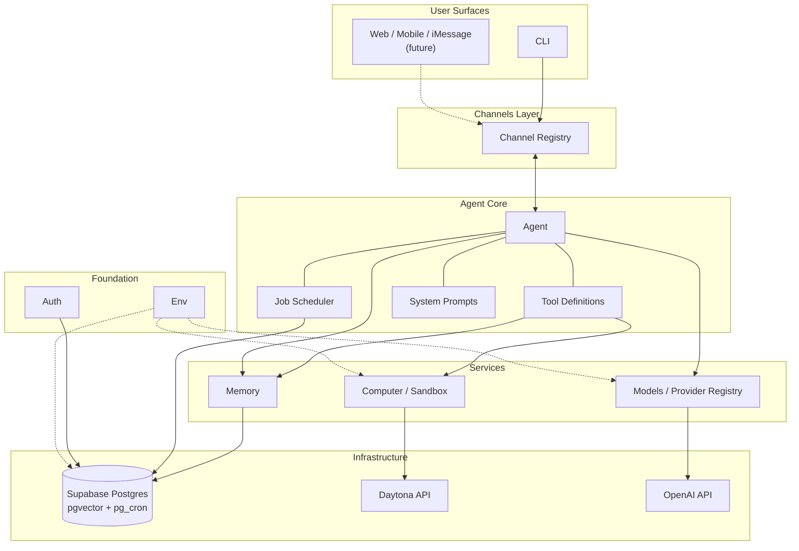
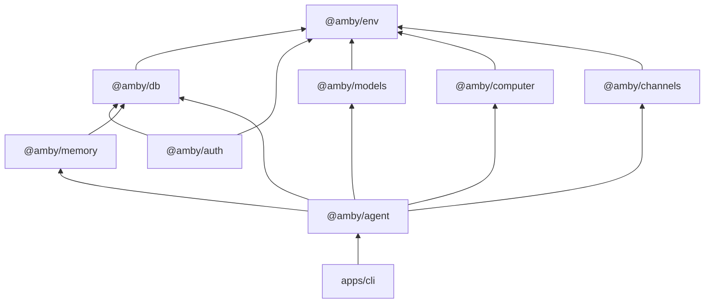
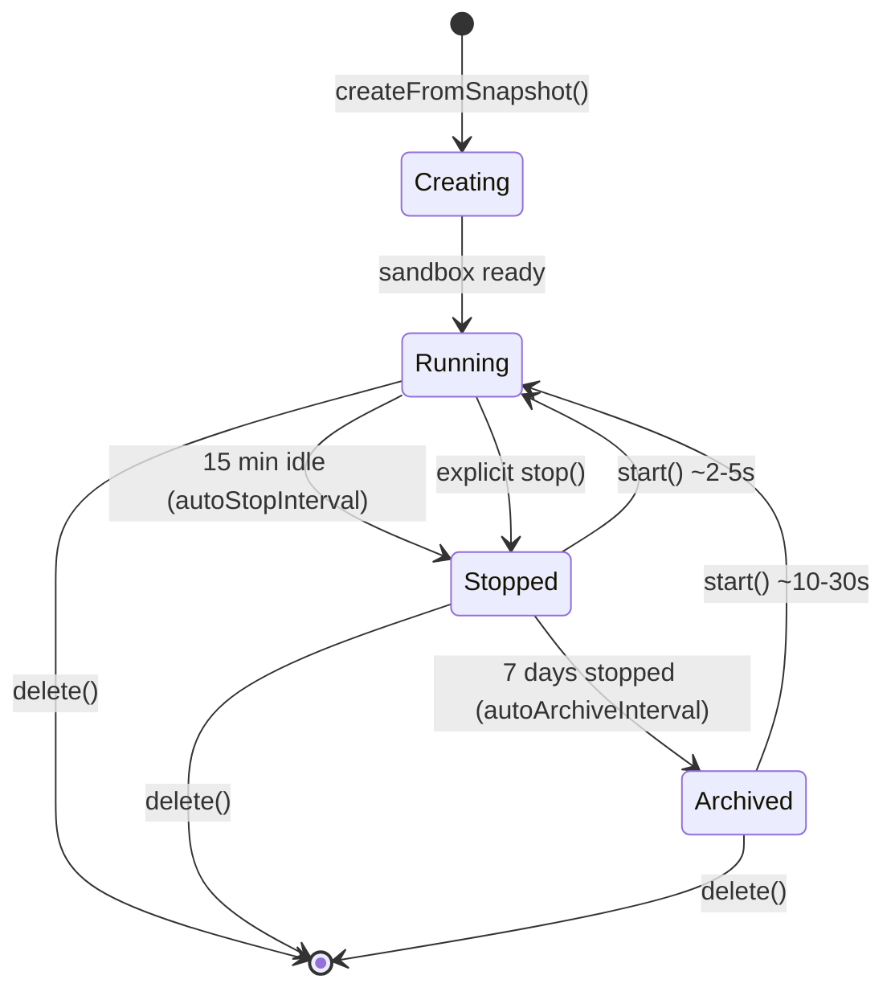
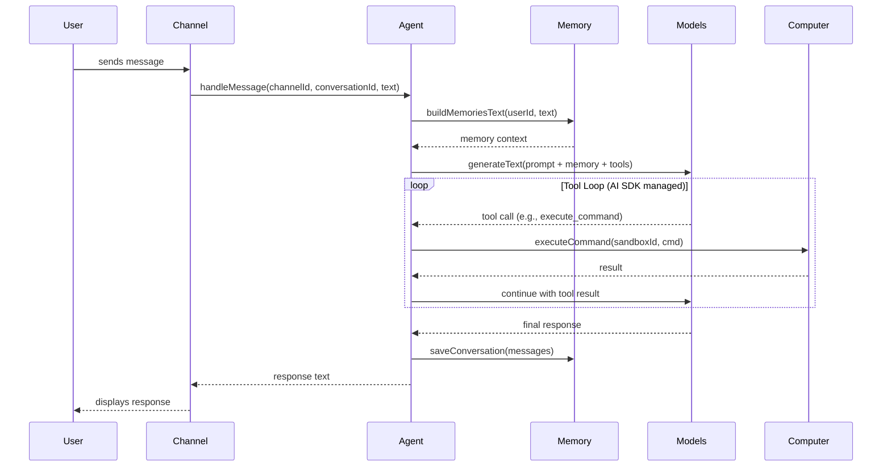
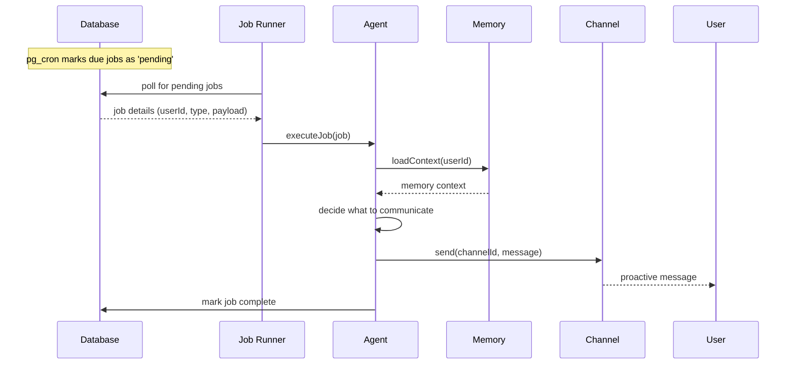

# Amby Architecture

Amby is a cloud-native ambient assistant computer. It runs as a persistent, long-lived process — the user reaches it
from anywhere (CLI today, phone/web/messaging later). This document describes the technical architecture for the MVP.

The MVP is a **text-only CLI runner** that validates the core loop: receive input, think with memory, act with tools,
respond — or proactively reach out. Voice, web, and mobile channels come later.

---

## Design Principles

1. **Modular packages, clear boundaries.** Each package owns one concern. Dependencies flow one direction. No package
   reaches into another's internals.

2. **Interfaces over implementations.** Repository patterns, provider interfaces, and channel abstractions let us swap
   backends without rewriting consumers.

3. **Vercel AI SDK as the backbone.** All model interactions — chat, tool use, agent loops — go through the AI SDK. No
   raw HTTP calls to model APIs.

4. **Channels as first-class I/O.** The agent doesn't know or care whether it's talking to a CLI, iMessage, or a web
   socket. Channels are ports, not features.

5. **Sandbox as disposable compute.** The Daytona sandbox is a tool the agent uses, not the agent itself. Sandboxes
   hibernate when idle, wake on demand, and can be destroyed without data loss.

6. **Memory as persistent intelligence.** The agent forgets nothing (unless told to). Memory is what makes Amby an
   assistant, not a chatbot.

---

## System Overview



---

## Package Map

### Dependency Graph



### Package Summary

| Package          | Purpose                                           | Key Dependencies                       |
|------------------|---------------------------------------------------|----------------------------------------|
| `@amby/env`      | Type-safe environment variables via T3 Env        | `@t3-oss/env-core`, `zod`              |
| `@amby/db`       | Drizzle ORM, schemas, migrations, Supabase client | `drizzle-orm`, `postgres`, `@amby/env` |
| `@amby/auth`     | BetterAuth configuration and user authentication  | `better-auth`, `@amby/db`, `@amby/env` |
| `@amby/models`   | AI provider registry and OpenAI Codex OAuth       | `ai`, `@ai-sdk/openai`, `@amby/env`    |
| `@amby/memory`   | Memory storage, retrieval, and LLM injection      | `@amby/db`, `ai`                       |
| `@amby/computer` | Daytona sandbox lifecycle and command execution   | `@daytonaio/sdk`, `@amby/env`          |
| `@amby/channels` | Channel interface and adapters (CLI for MVP)      | `@amby/env`                            |
| `@amby/agent`    | Core agent orchestration, tools, jobs             | `ai`, all `@amby/*` packages           |

---

## Package Details

### @amby/env

The foundation. Uses `@t3-oss/env-core` with Zod to validate and expose all environment variables at import time.
Every other package imports env vars from here — no `process.env` scattered across the codebase.

**Exports:** a single typed, validated `env` object.

**Defines variables for:**

- Database: `DATABASE_URL`, `SUPABASE_URL`, `SUPABASE_ANON_KEY`
- OpenAI: `OPENAI_API_KEY` (optional fallback when not using Codex OAuth)
- Daytona: `DAYTONA_API_KEY`, `DAYTONA_API_URL`, `DAYTONA_TARGET`
- Auth: `BETTER_AUTH_SECRET`, `BETTER_AUTH_URL`
- Cartesia: `CARTESIA_API_KEY` (future, TTS)

---

### @amby/db

Owns all database schemas (Drizzle ORM) and the database client. Single source of truth for the data model.

**Exports:** `db` (Drizzle client instance), `schema` (all table definitions), migration utilities.

**Schema modules:**

| Schema              | Purpose                                   |
|---------------------|-------------------------------------------|
| `users`             | User accounts (BetterAuth compatible)     |
| `sessions`          | Auth sessions (BetterAuth)                |
| `accounts`          | OAuth accounts and tokens (BetterAuth)    |
| `conversations`     | Conversation threads per user per channel |
| `messages`          | Individual messages within conversations  |
| `channels`          | Registered channel configurations         |
| `documents`         | Raw ingested content (memory sources)     |
| `chunks`            | Semantic chunks for vector retrieval      |
| `spaces`            | Memory namespaces / scoping containers    |
| `memoryEntries`     | Distilled facts and preferences           |
| `memorySources`     | Provenance links: memory entry ↔ document |
| `documentsToSpaces` | Many-to-many: documents ↔ spaces          |
| `jobs`              | Scheduled and recurring tasks             |
| `sandboxes`         | Sandbox state tracking per user           |

**Database:** Supabase Postgres with `pgvector` for embeddings and `pg_cron` for scheduled work.

**Migrations:** Drizzle Kit generates and runs migrations. Supabase provides the Postgres instance.

---

### @amby/auth

BetterAuth configuration for user authentication. For MVP CLI, this is foundational — the schemas exist, the config is
defined, but there is no HTTP server to serve auth routes yet.

**Exports:** `auth` (BetterAuth server instance), `authClient` (BetterAuth client for future web/mobile).

**Configuration:**

- Database adapter: Drizzle (via `@amby/db`)
- Social providers: Google, GitHub (future — not MVP)
- Plugins: added as needed (passkeys, 2FA, etc. — not MVP)

**Note:** OpenAI Codex OAuth for model access is handled by `@amby/models`, not `@amby/auth`. BetterAuth handles *user
identity*. Model provider auth is a separate concern.

---

### @amby/models

Manages AI provider connections. Handles OpenAI Codex OAuth, builds the Vercel AI SDK provider registry, and defines
interfaces for future TTS/STT providers.

**Exports:** `registry` (Vercel AI SDK provider registry), `getModel(id)` (resolve a model from the registry),
`codexAuth` (OpenAI Codex OAuth flow utilities), `TTSProvider` / `STTProvider` (interfaces, future).

#### OpenAI Codex OAuth

Implements the same PKCE-based OAuth flow used by OpenClaw:

1. Generate PKCE verifier/challenge + random state
2. Open `https://auth.openai.com/oauth/authorize` with the challenge
3. Capture callback at `http://127.0.0.1:1455/auth/callback` (or manual paste for headless)
4. Exchange authorization code at `https://auth.openai.com/oauth/token`
5. Store `{ access, refresh, expires, accountId }` locally
6. Auto-refresh expired tokens under file lock

**Provider registry:**

```
openai-codex  →  OpenAI provider using Codex OAuth tokens (default)
openai        →  OpenAI provider using API key (fallback)
```

Default model: `openai-codex/gpt-5.4`. Users authenticate once; tokens refresh automatically.

#### TTS / STT (future — MVP is text-only)

Interfaces defined now, implementations later:

- **TTS default:** Cartesia Sonic 3 (~$0.005/1000 chars, ~90ms first byte)
- **STT default:** OpenAI Whisper API ($0.006/min, lowest flat rate)
- Both are swappable via provider interface
- LiveKit for real-time voice transport when voice is added

---

### @amby/memory

The memory brain. Fully described in [MEMORY.md](./MEMORY.md).

Stores, retrieves, deduplicates, and injects memories into LLM calls.

**Exports:** `addMemory`, `addConversation` (storage), `searchMemories`, `getProfileMemories` (retrieval),
`deduplicateMemories`, `buildMemoriesText` (formatting), `injectMemoriesIntoParams`, `MemoryCache` (LLM integration),
`withMemory` (Vercel AI SDK model wrapper), `createMemoryTools` (agent tool definitions).

**Three layers:**

1. **Storage:** Documents, chunks, memory entries, spaces, provenance links.
2. **Retrieval:** Profile fetch, semantic search (pgvector), deduplication.
3. **LLM integration:** Prompt injection, per-turn cache, auto-save after response.

Depends on `@amby/db` for the repository implementation. The `MemoryRepository` interface allows swapping the storage
backend without touching memory logic.

---

### @amby/computer

Manages Daytona sandboxes as the agent's "hands." The agent can execute commands, read/write files, and run code inside
an isolated Linux environment.

**Exports:** `SandboxManager` (create, start, stop, delete sandboxes), `executeCommand(sandboxId, command)`,
`readFile` / `writeFile`, `createComputerTools()` (agent tool definitions).

#### Sandbox Lifecycle



**Per-user sandbox model:** Each user gets one sandbox, tracked in the `sandboxes` table. The sandbox is created on
first use from a custom Docker snapshot.

**Cost control:**

| State    | Resources Used      | Notes                                          |
|----------|---------------------|------------------------------------------------|
| Running  | CPU + RAM + Disk    | Full allocation, active compute                |
| Stopped  | Disk only           | CPU/RAM freed, filesystem persists, ~2-5s wake |
| Archived | None (cold storage) | Zero cost, ~10-30s wake                        |

**Wake-on-demand:** When a job, message, or tool call needs the sandbox and it is stopped, `start()` wakes it
automatically. The agent never has to worry about sandbox state — the `SandboxManager` handles it transparently.

#### Custom Snapshot

A Dockerfile defines the base sandbox image:

- Debian slim base
- Node.js, Python, common CLI tools pre-installed
- Non-root user with appropriate permissions
- Pre-configured for the agent's typical workloads

The snapshot is built once and cached by Daytona. New sandboxes launch from this snapshot in seconds.

---

### @amby/channels

Defines the I/O abstraction for how the agent communicates with users. A channel is a transport — it contains no
business logic.

**Exports:** `Channel` (interface), `ChannelRegistry` (manages active channels), `CLIChannel` (MVP implementation).

#### Channel Interface

```
Channel {
  id: string
  type: 'cli' | 'sms' | 'imessage' | 'web' | 'mobile'

  onMessage(handler): void        // register incoming message handler
  send(conversationId, message): Promise<void>  // send outgoing message
  start(): Promise<void>          // begin listening
  stop(): Promise<void>           // stop listening
}
```

**MVP — CLI Channel:**

- Uses `readline` for input, `console` for output
- Single conversation per session
- Blocking input loop with async message handling

**Future channels** (not MVP): SMS/iMessage (Twilio, Apple Business Chat), Web (WebSocket), Mobile (push + WebSocket),
Slack/Discord (bot APIs).

#### Conversations Across Channels

A user has **one agent** and **one memory space**, but can have **multiple conversations** across channels. Each
conversation maintains its own message history. The agent can reference context from one channel while responding on
another — memory is shared, conversations are separate.

```
User
├── Memory Space (shared across all channels)
├── CLI Conversation
├── iMessage Conversation (future)
└── Web Conversation (future)
```

**Proactive messages** are just the start of a regular conversation. Once the agent sends a proactive message and the
user replies, the exchange continues reactively in that same conversation thread.

---

### @amby/agent

The highest-level package. Brings everything together into a single coherent agent that any app (CLI, API server, etc.)
can instantiate.

**Exports:** `AmbyAgent` (main agent class), `createAgent(config)` (factory function).

#### How It Works

The agent is built on Vercel AI SDK primitives (`generateText` / `streamText` with multi-step tool loops). It combines:

1. **System prompt** — personality, capabilities, constraints, injected memory context
2. **Tools** — functions the agent can call to act on the world
3. **Memory integration** — automatic context injection via `withMemory` wrapper
4. **Job runner** — polls for and executes scheduled tasks in the background

#### Tools

| Tool              | Source Package   | Description                               |
|-------------------|------------------|-------------------------------------------|
| `search_memories` | `@amby/memory`   | Search stored memories by query           |
| `save_memory`     | `@amby/memory`   | Store a new memory                        |
| `execute_command` | `@amby/computer` | Run a shell command in the sandbox        |
| `read_file`       | `@amby/computer` | Read a file from the sandbox              |
| `write_file`      | `@amby/computer` | Write a file to the sandbox               |
| `schedule_job`    | `@amby/agent`    | Schedule a future task or reminder        |
| `delegate_task`   | `@amby/agent`    | Delegate a sub-task to a child workflow   |
| `send_message`    | `@amby/channels` | Proactively message the user on a channel |

Tools are defined using the Vercel AI SDK `tool()` helper with Zod input schemas. The agent decides which tools to use
based on the user's message and memory context.

#### Agent Instantiation

```
createAgent({
  userId:            string
  model:             LanguageModel           // from @amby/models registry
  db:                DrizzleClient           // from @amby/db
  memoryRepository:  MemoryRepository        // from @amby/memory
  sandboxManager:    SandboxManager          // from @amby/computer
  channelRegistry:   ChannelRegistry         // from @amby/channels
})
```

The agent is **stateless between requests** — all state lives in the database and memory system. The agent process can
restart without losing context.

---

## Core Concepts

### Reactive vs. Proactive

The agent operates in two modes:

**Reactive:** User sends a message → agent thinks → agent responds. The standard conversational loop.

**Proactive:** The agent initiates contact. A scheduled job fires, the agent decides what to say, and sends a message
through a channel. The user can reply, and the conversation continues reactively from there.

Examples of proactive behavior:

- "You have a meeting with Sarah in 30 minutes. Here's a prep summary."
- "The flight you asked me to track dropped to $280."
- "You haven't responded to Mike's email from yesterday. Want me to draft a reply?"

Both modes use the same agent core, memory, and tools. The only difference is the trigger.

---

### Reactive Message Flow



### Proactive Message Flow



---

### Jobs & Scheduling

Jobs enable proactive behavior. They are stored in Postgres and triggered by `pg_cron` (via Supabase).

#### Job Types

| Type        | Trigger                          | Example                                      |
|-------------|----------------------------------|----------------------------------------------|
| `cron`      | Recurring schedule               | "Check inbox every morning at 8am"           |
| `scheduled` | One-time at a specific time      | "Remind me to call Sarah at 3pm"             |
| `event`     | External trigger (webhook, etc.) | "Alert me when this flight drops below $300" |

#### Job Schema

```
jobs {
  id:          uuid
  userId:      string
  type:        'cron' | 'scheduled' | 'event'
  status:      'active' | 'pending' | 'running' | 'completed' | 'failed'
  schedule:    string (cron expression, nullable)
  runAt:       timestamp (for one-time jobs, nullable)
  payload:     jsonb (job-specific data)
  channelId:   string (which channel to respond on)
  lastRunAt:   timestamp
  nextRunAt:   timestamp
  createdAt:   timestamp
  updatedAt:   timestamp
}
```

#### Execution Flow

1. **pg_cron** runs a SQL function every minute that marks due jobs as `pending`
2. **Job runner** (in the agent process) polls for `pending` jobs
3. For each pending job: mark as `running` → wake sandbox if needed → execute through the agent with full memory
   context → agent decides what action to take and what to communicate → mark as `completed` (or `failed`) → update
   `nextRunAt` for cron jobs

For the CLI MVP, the job runner is a simple `setInterval` that queries for pending jobs. In production, this becomes a
worker process, but the interface stays the same.

---

### Conversation & Message Persistence

Every message — incoming and outgoing — is stored in the database. This provides:

- Full conversation history for context windows
- Audit trail for all agent actions
- Continuity across sessions and channels

**Conversation schema:**

```
conversations {
  id:          uuid
  userId:      string
  channelId:   string
  channelType: 'cli' | 'sms' | 'imessage' | 'web' | 'mobile'
  title:       string (nullable, auto-generated)
  metadata:    jsonb
  createdAt:   timestamp
  updatedAt:   timestamp
}

messages {
  id:             uuid
  conversationId: string
  role:           'user' | 'assistant' | 'system' | 'tool'
  content:        text
  toolCalls:      jsonb (nullable)
  toolResults:    jsonb (nullable)
  metadata:       jsonb
  createdAt:      timestamp
}
```

---

## Infrastructure

### Supabase

Supabase provides the Postgres database with key extensions:

- **pgvector** — vector similarity search for memory retrieval
- **pg_cron** — scheduled job triggers (marks due jobs as pending)
- **pg_net** — HTTP calls from SQL (for production webhook triggers, not used in CLI MVP)

**Local development:** `supabase init` + `supabase start` spins up a full local stack in Docker (Postgres, GoTrue,
Storage, Realtime — we primarily use Postgres).

**Production:** Supabase hosted instance.

Drizzle ORM owns all schemas and migrations. Supabase provides the infrastructure.

### Daytona

Daytona provides sandboxed compute environments via the `@daytonaio/sdk`:

- **Sandboxes** are isolated Linux environments with process, network, and filesystem isolation
- **Snapshots** are pre-built Docker images for fast sandbox creation
- **Lifecycle management** via SDK: `create()`, `start()`, `stop()`, `delete()`
- **File system** access: `uploadFile()`, `downloadFile()`, `listFiles()`
- **Process execution**: `executeCommand()`, `codeRun()`, PTY sessions
- **Regions:** US or EU
- **Default resources:** 1 vCPU, 1 GB RAM, 3 GB disk (scalable up to 4 vCPU, 8 GB RAM, 10 GB disk)

Used in both local development and production. No local Docker fallback — always Daytona.

### OpenAI

Primary model provider via Codex OAuth:

- **Auth:** PKCE OAuth flow (same as OpenClaw). Tokens stored locally for CLI, in DB for production.
- **Default model:** `openai-codex/gpt-5.4`
- **Fallback:** Standard API key auth (`openai/` prefix)

### Cloudflare Workers (Production API)

The production API runs on Cloudflare Workers with three durability primitives for async Telegram processing:

```
Telegram POST /webhook
       │
       ▼
 [Worker: verify + enqueue]  ──▶ return 200 (~5ms)
       │
       ▼
 [Queue: telegram-inbound]
       │
       ▼
 [Queue Consumer]
       │
       ├── /start, /stop, /help ──▶ handle inline (fast, stateless)
       │
       └── text message ──▶ Durable Object (by chatId)
                               │
                               ├── buffer messages, debounce via alarm (3s)
                               ├── on alarm: launch Workflow
                               └── forward interrupts to running Workflow
                               │
                               ▼
                        [Workflow: AgentExecution]
                        durable, retryable, multi-step
                             │
                             ├── step: typing indicator
                             ├── step: resolve user
                             ├── step: agent loop (LLM + tools)
                             ├── step: send response(s)
                             └── step: notify DO complete
```

| Concern | Primitive | Why |
|---|---|---|
| Webhook decoupling | **Queue** | Instant ack, built-in retry + DLQ |
| Message debouncing | **Durable Object** | Singleton per chatId, alarm API resets on new messages |
| Agent execution | **Workflow** | Durable steps survive failures, retryable with backoff |

**Key files:**

- `apps/api/src/worker.ts` — Entrypoint. Slim webhook (verify + enqueue), queue consumer, re-exports DO and Workflow classes.
- `apps/api/src/queue/consumer.ts` — Routes messages: commands handled inline, text messages sent to DO.
- `apps/api/src/durable-objects/conversation-session.ts` — One instance per Telegram chat. Buffers rapid messages, debounces with a 3s alarm, launches workflows, forwards interrupts.
- `apps/api/src/workflows/agent-execution.ts` — Durable agent execution. Each step is retryable and persisted. Handles user resolution, agent LLM loop, Telegram response splitting, and DO notification.
- `apps/api/src/queue/runtime.ts` — Shared Effect runtime factory for queue consumer and workflows.
- `apps/api/src/telegram/utils.ts` — Extracted utilities: `verifySecret`, `findOrCreateUser`, `handleCommand`, `splitTelegramMessage`.
- `apps/api/src/telegram/index.ts` — `TelegramBot` Effect service tag and layers (`TelegramBotLive`, `TelegramBotLite`).

**Error handling:** Queue retries 3x then dead-letters. Workflow steps retry with exponential backoff. On final failure, the workflow sends an error message to the user and resets the DO to idle.

**Multi-message batching:** When a user sends several messages in quick succession, the DO buffers them during the 3s debounce window. The workflow receives the batch and uses `handleBatchedMessages` to present each as a separate user turn to the LLM.

**User interrupts (Phase 4):** If a message arrives while the agent is processing, the DO forwards it to the running workflow via `sendEvent`. The workflow checks for these between LLM rounds via `waitForEvent`.

---

## Project Structure

```
amby/
├── apps/
│   ├── api/                        ← Production API (Cloudflare Workers)
│   │   ├── wrangler.toml           ← Queue, DO, Workflow bindings
│   │   └── src/
│   │       ├── worker.ts           ← Worker entrypoint (webhook + queue handler)
│   │       ├── index.ts            ← Local dev server (synchronous fallback)
│   │       ├── queue/
│   │       │   ├── consumer.ts     ← Queue batch handler
│   │       │   └── runtime.ts      ← Shared Effect runtime factory
│   │       ├── durable-objects/
│   │       │   └── conversation-session.ts  ← Per-chat debouncing + workflow coordination
│   │       ├── workflows/
│   │       │   └── agent-execution.ts       ← Durable agent execution steps
│   │       └── telegram/
│   │           ├── index.ts        ← TelegramBot service tag + layers
│   │           └── utils.ts        ← Extracted Telegram utilities
│   └── cli/                        ← MVP CLI runner
│       ├── package.json
│       ├── tsconfig.json
│       └── src/
│           └── index.ts            ← REPL + job runner entry point
├── packages/
│   ├── env/
│   │   ├── package.json
│   │   ├── tsconfig.json
│   │   └── src/
│   │       └── index.ts            ← T3 Env config, exports `env`
│   ├── db/
│   │   ├── package.json
│   │   ├── tsconfig.json
│   │   ├── drizzle.config.ts
│   │   └── src/
│   │       ├── client.ts           ← Drizzle client
│   │       ├── schema/             ← All table definitions
│   │       │   ├── index.ts
│   │       │   ├── users.ts
│   │       │   ├── sessions.ts
│   │       │   ├── accounts.ts
│   │       │   ├── conversations.ts
│   │       │   ├── messages.ts
│   │       │   ├── channels.ts
│   │       │   ├── documents.ts
│   │       │   ├── chunks.ts
│   │       │   ├── spaces.ts
│   │       │   ├── memory-entries.ts
│   │       │   ├── memory-sources.ts
│   │       │   ├── documents-to-spaces.ts
│   │       │   ├── jobs.ts
│   │       │   └── sandboxes.ts
│   │       └── index.ts
│   ├── auth/
│   │   ├── package.json
│   │   ├── tsconfig.json
│   │   └── src/
│   │       ├── server.ts           ← BetterAuth server config
│   │       ├── client.ts           ← BetterAuth client (future)
│   │       └── index.ts
│   ├── models/
│   │   ├── package.json
│   │   ├── tsconfig.json
│   │   └── src/
│   │       ├── registry.ts         ← Vercel AI SDK provider registry
│   │       ├── oauth/
│   │       │   └── openai-codex.ts ← PKCE OAuth flow + token management
│   │       ├── providers/
│   │       │   ├── tts.ts          ← TTS interface + Cartesia (future)
│   │       │   └── stt.ts          ← STT interface + Whisper (future)
│   │       └── index.ts
│   ├── memory/
│   │   ├── package.json
│   │   ├── tsconfig.json
│   │   └── src/
│   │       ├── types.ts            ← Public types
│   │       ├── repository.ts       ← MemoryRepository interface
│   │       ├── store.ts            ← addMemory
│   │       ├── search.ts           ← searchMemories
│   │       ├── conversations.ts    ← addConversation
│   │       ├── cache.ts            ← MemoryCache
│   │       ├── dedupe.ts           ← deduplicateMemories
│   │       ├── prompt-builder.ts   ← buildMemoriesText, formatMemoriesForPrompt
│   │       ├── middleware.ts       ← injectMemoriesIntoParams, transformParams
│   │       ├── vercel.ts           ← withMemory wrapper
│   │       └── index.ts
│   ├── computer/
│   │   ├── package.json
│   │   ├── tsconfig.json
│   │   └── src/
│   │       ├── sandbox.ts          ← SandboxManager (lifecycle)
│   │       ├── snapshot.ts         ← Docker snapshot configuration
│   │       ├── executor.ts         ← Command and file operations
│   │       └── index.ts
│   ├── channels/
│   │   ├── package.json
│   │   ├── tsconfig.json
│   │   └── src/
│   │       ├── types.ts            ← Channel interface
│   │       ├── registry.ts         ← ChannelRegistry
│   │       ├── adapters/
│   │       │   └── cli.ts          ← CLI adapter (MVP)
│   │       └── index.ts
│   └── agent/
│       ├── package.json
│       ├── tsconfig.json
│       └── src/
│           ├── agent.ts            ← Core AmbyAgent class
│           ├── tools/
│           │   ├── memory.ts       ← search_memories, save_memory
│           │   ├── computer.ts     ← execute_command, read_file, write_file
│           │   ├── messaging.ts    ← schedule_job, delegate_task
│           │   └── index.ts
│           ├── jobs/
│           │   ├── scheduler.ts    ← Job scheduling logic
│           │   ├── runner.ts       ← Job polling and execution
│           │   └── index.ts
│           ├── prompts/
│           │   └── system.ts       ← System prompt templates
│           └── index.ts
├── docker/
│   └── sandbox/
│       └── Dockerfile              ← Custom Daytona snapshot image
├── supabase/
│   └── config.toml                 ← Supabase local config
├── docs/
│   ├── ARCHITECTURE.md
│   ├── MARKET.md
│   ├── MEMORY.md
│   └── MISSION.md
├── package.json                    ← Workspace root (Bun)
├── turbo.json                      ← Turborepo pipeline config
├── tsconfig.base.json              ← Shared TypeScript config
└── .env.example
```

---

## CLI MVP: How It All Comes Together

The CLI app (`apps/cli`) is the thin entry point that wires all packages together:

```
1. Load environment          →  @amby/env
2. Connect to database       →  @amby/db
3. Run OpenAI Codex OAuth    →  @amby/models (if not already authenticated)
4. Create agent instance      →  @amby/agent (wires memory, models, computer, channels)
5. Register CLI channel       →  @amby/channels
6. Start job runner           →  setInterval polling for pending jobs
7. Start REPL                 →  readline loop, each input → agent.handleMessage()
```

A single CLI session looks like:

```
$ amby

🔐 Authenticating with OpenAI... (opens browser for Codex OAuth)
✓ Authenticated as user@example.com

📦 Connecting to database...
✓ Connected to Supabase (local)

🤖 Amby is ready. Type a message or Ctrl+C to exit.

> What meetings do I have tomorrow?

[Agent loads memory context]
[Agent calls tools if needed]
[Agent responds with meeting prep]

You have 3 meetings tomorrow:
1. 9:00 AM — Standup with engineering (recurring)
2. 11:00 AM — 1:1 with Sarah (she mentioned wanting to discuss the Q2 roadmap)
3. 2:00 PM — Client call with Acme Corp (prep: review the proposal you drafted last week)

Want me to prepare anything for these?
```

---

## MVP Scope

### In Scope

- CLI channel — interactive REPL for testing
- Agent core — system prompt, tool loop, message handling
- Memory — Phase 1 from MEMORY.md (store, retrieve, inject, dedupe)
- Models — OpenAI Codex OAuth + Vercel AI SDK provider registry
- Computer — Daytona sandbox create/start/stop/execute
- DB — full schema, Drizzle migrations, Supabase local
- Env — all env vars typed and validated
- Auth — BetterAuth config defined (not serving HTTP yet)
- Jobs — basic scheduling with in-process polling
- Conversation persistence — all messages stored

### Out of Scope (Future)

- Web, mobile, SMS, iMessage channels
- Voice (TTS/STT via Cartesia + Whisper, LiveKit transport)
- Tests
- Production deployment
- User dashboard / admin UI
- Advanced memory (versioning, forgetting, compression — phases 2-3 of MEMORY.md)
- Multi-user / multi-tenant
- Rate limiting, billing, usage tracking

---

## Future Roadmap

**Voice.** LiveKit for real-time audio transport. Cartesia Sonic 3 for TTS. OpenAI Whisper API for STT. Agent gets
`listen` and `speak` capabilities. Swappable providers via the TTS/STT interfaces defined in `@amby/models`.

**Web & mobile channels.** WebSocket-based real-time connection. Push notifications for proactive messages. Shared
conversation history and memory across all devices. The channel abstraction makes adding these straightforward.

**Production infra.** Supabase hosted. Proper worker processes for job execution. pg_cron + pg_net for webhook-based job
triggers. BetterAuth serving HTTP for user sign-up/login. Deployment to a long-running cloud compute environment.

**Trust features.** Clear audit trails for all agent actions. Permission-based action approval (the agent asks before
acting). Memory visibility and editing for users. Transparent sandbox activity logs. These are not optional polish —
they are core to the mission. See [MISSION.md](./MISSION.md).
