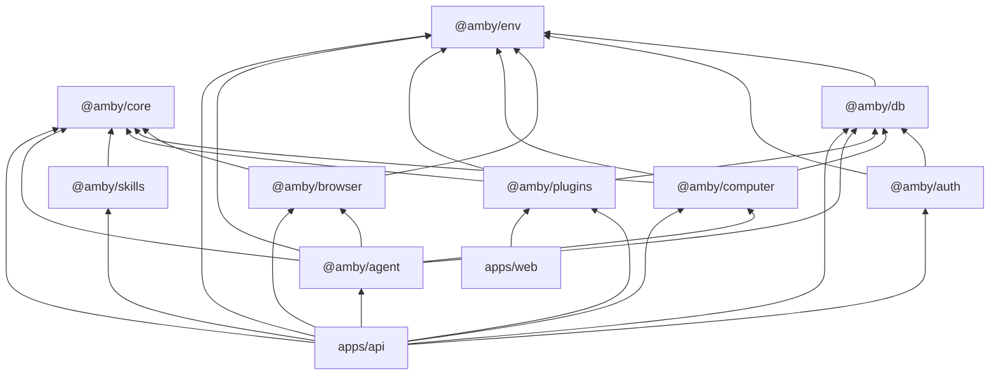

# Architecture

Amby is a cloud-native AI assistant platform. Turborepo monorepo with Bun, TypeScript, Effect.js for dependency injection, Drizzle ORM for persistence, and Cloudflare Workers for the runtime edge. The system separates conversation, execution, and infrastructure state so that one user-facing assistant can orchestrate browser automation, sandbox compute, third-party integrations, and memory — all durably.

## Package Dependency Graph

## Layer Model

| Layer | Packages | Role |
|---|---|---|
| **1. Domain kernel** | `core` | Domain models, ports (interfaces), plugin registry, policies |
| **2. Infrastructure** | `env`, `db` | Environment config, platform abstractions, persistence gateway |
| **3. Auth** | `auth` | Session management, API keys (BetterAuth) |
| **4. Capabilities** | `browser`, `computer` | Web automation (Stagehand), sandbox compute (Daytona) |
| **5. Composition** | `plugins`, `skills` | Built-in plugins (integrations, automations, browser-tools, computer-tools, memory), skill discovery |
| **6. Orchestration** | `agent` | Conversation engine, context building, execution planning, tool dispatch |
| **7. Runtime** | `apps/api`, `apps/web`, `apps/mock` | Cloudflare Workers API, Next.js marketing site, mock Telegram for dev |

**Direction rule:** layers depend only on layers above them (lower number). No upward dependencies.

## Key Invariants

- **`core` has no workspace deps** — it is the domain kernel; only peer-depends on `effect`
- **`env` and `db` have no workspace deps** (except `db` → `env`) — they are the foundation
- **`db` is the single persistence gateway** — all database access goes through `@amby/db`; no package owns its own connection
- **Effect.js service tags for DI** — packages expose services as Effect layers; apps compose them at the edge
- **Parse at the boundary** — Telegram webhooks, API responses, LLM tool output are all parsed into typed domain objects at entry
- **Compute persistence is volume-based** — Daytona sandboxes are disposable; user state lives on persistent volumes
- **Durable execution** — long-running work uses Cloudflare Workflows, Durable Objects, and Queues; not transient LLM calls
- **Plugins are the extension boundary** — integrations (Composio), browser tools, computer tools, and automations are registered via `PluginRegistry` in `@amby/plugins`

## Boundary Rules

What must **not** cross boundaries:

- Business logic must not live in route handlers, webhook processors, or UI components
- Raw external data (JSON, webhook payloads, env vars) must not pass through the system unparsed
- No package may import from `apps/` — dependency flows strictly downward
- No capability package (`browser`, `computer`) may depend on `agent`
- `core` and `env` must not depend on `db`

## Runtime Flow (Telegram)

1. Telegram webhook hits Cloudflare Worker
2. Queue decouples inbound delivery from processing
3. Durable Object buffers and debounces per-chat input
4. Workflow runs the agent durably
5. Agent responds directly or executes a specialist plan

## Deeper Docs

| Topic | File |
|---|---|
| Agent orchestration, tools, planning | [AGENT.md](AGENT.md) |
| Channel abstraction, Telegram integration | [channels/telegram.md](channels/telegram.md) |
| Browser and sandbox compute | [BROWSER_AND_COMPUTER.md](BROWSER_AND_COMPUTER.md) |
| Data model, schema, migrations | [DATA_MODEL.md](DATA_MODEL.md) |
| Memory, vector search, pgvector | [MEMORY.md](MEMORY.md) |
| Plugins and skills | [PLUGINS_AND_SKILLS.md](PLUGINS_AND_SKILLS.md) |
| Runtime flows, workflows, queues | [RUNTIME.md](RUNTIME.md) |
| Development setup and commands | [DEVELOPMENT.md](DEVELOPMENT.md) |
