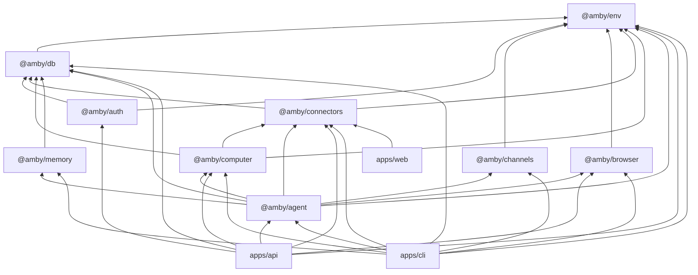
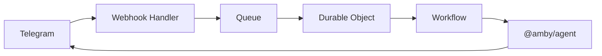

# Architecture

Amby is a cloud-native AI assistant platform. Turborepo monorepo with Bun, TypeScript, Effect.js for dependency injection, Drizzle ORM for persistence, and Cloudflare Workers for the runtime edge. The system separates conversation, execution, and infrastructure state so that one user-facing assistant can orchestrate browser automation, sandbox compute, third-party integrations, and memory — all durably.

## Package Dependency Graph

## Layer Model

| Layer | Packages | Role |
|---|---|---|
| **1. Infrastructure** | `env`, `db` | Environment config, platform abstractions, persistence gateway |
| **2. Auth** | `auth` | Session management, API keys (BetterAuth) |
| **3. Transport** | `channels` | Channel abstraction for user input/output |
| **4. Capabilities** | `browser`, `computer`, `connectors`, `memory` | Web automation (Stagehand), sandbox compute (Daytona), third-party integrations (Composio), vector memory (pgvector) |
| **5. Orchestration** | `agent` | Conversation engine, context building, execution planning, tool dispatch |
| **6. Runtime** | `apps/api`, `apps/cli`, `apps/web` | Cloudflare Workers API, local CLI, Next.js marketing site |

**Direction rule:** layers depend only on layers above them (lower number). No upward dependencies.

## Key Invariants

- **`env` and `db` have no workspace deps** — they are the foundation; `env` depends on nothing, `db` depends only on `env`
- **`db` is the single persistence gateway** — all database access goes through `@amby/db`; no package owns its own connection
- **Effect.js service tags for DI** — packages expose services as Effect layers; apps compose them at the edge
- **Parse at the boundary** — Telegram webhooks, API responses, LLM tool output are all parsed into typed domain objects at entry
- **Channels are transport, not intelligence** — `@amby/channels` moves messages in/out; reasoning lives in `@amby/agent`
- **Compute persistence is volume-based** — Daytona sandboxes are disposable; user state lives on persistent volumes
- **Durable execution** — long-running work uses Cloudflare Workflows, Durable Objects, and Queues; not transient LLM calls
- **Connectors are the integration boundary** — all third-party tool access goes through `@amby/connectors` (Composio)

## Boundary Rules

What must **not** cross boundaries:

- Business logic must not live in route handlers, webhook processors, or UI components
- Raw external data (JSON, webhook payloads, env vars) must not pass through the system unparsed
- No package may import from `apps/` — dependency flows strictly downward
- No capability package (`browser`, `computer`, `connectors`, `memory`) may depend on `agent`
- `env` and `channels` must not depend on `db`

## Runtime Flow (Telegram)

1. Telegram webhook hits Cloudflare Worker
2. Queue decouples inbound delivery from processing
3. Durable Object buffers and debounces per-chat input
4. Workflow runs the agent durably
5. Agent responds directly or executes a specialist plan

## Deeper Docs

| Topic | File |
|---|---|
| Agent orchestration, tools, planning | [AGENT.md](AGENT.md) |
| Channel abstraction, Telegram integration | [CHANNELS.md](CHANNELS.md) |
| Sandbox compute, Daytona, volumes | [COMPUTER.md](COMPUTER.md) |
| Database schema, migrations, Drizzle | [DATABASE.md](DATABASE.md) |
| Memory, vector search, pgvector | [MEMORY.md](MEMORY.md) |
| Durable execution, workflows, queues | [WORKFLOWS.md](WORKFLOWS.md) |
