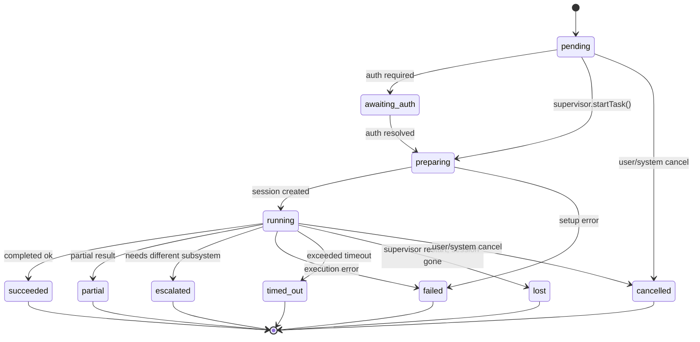
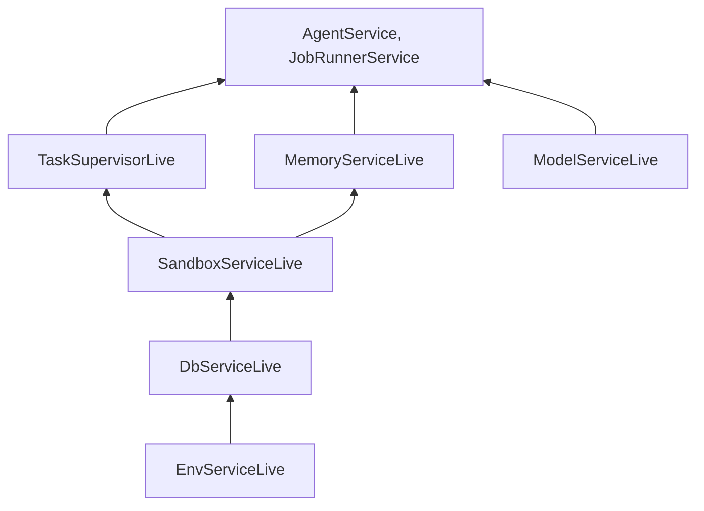

# Browser and Computer

Two execution subsystems let Amby delegate work outside the main agent loop: **browser** (short-lived web automation) and **computer** (durable sandbox execution). Both produce tasks tracked by the same `tasks` table and lifecycle.

---

## When each is used

| Subsystem | Package | Use case | Runtime | Provider |
|---|---|---|---|---|
| **Browser** | `@amby/browser` | Single-tab web reads and actions (extract data, fill forms, click) | `browser` | `stagehand` |
| **Computer** | `@amby/computer` | Long-running code execution, file manipulation, multi-step research | `sandbox` | `codex` |

Browser tasks return inline results. Sandbox tasks return immediately and are polled via `get_task`.

---

## Browser

### Provider interface

`BrowserService` (Effect service) exposes:

```
enabled: boolean
runTask(input: BrowserTaskInput, options?): Effect<BrowserTaskResult, BrowserError>
```

### Modes and side effects

| Mode | Purpose |
|---|---|
| `extract` | Read data from a page |
| `act` | Perform a single action |
| `agent` | Autonomous multi-step workflow |

Side-effect levels: `read`, `soft-write` (reversible), `hard-write` (irreversible).

### Result statuses

`completed`, `partial`, `failed`, `escalate` (needs computer/CUA).

Escalation is detected by pattern matching on keywords like "captcha", "mfa", "popup", "native dialog".

### Runtime variants

| File | Runtime | Notes |
|---|---|---|
| `shared.ts` | All | Types, interfaces, escalation detection |
| `local.ts` | Bun | Disabled stub (browser unavailable locally) |
| `workers.ts` | Cloudflare Workers | Cloudflare Browser Rendering + Stagehand |

Workers runtime uses Stagehand (AI-powered browser control) backed by an OpenAI-compatible LLM via Cloudflare AI Gateway.

### Accessed via

`browse_web` tool in the browser-tools plugin. See [PLUGINS_AND_SKILLS.md](./PLUGINS_AND_SKILLS.md).

---

## Computer

### Volume-first model

Each user gets **one durable volume** (Daytona) plus a **disposable main sandbox** mounted on it. The volume is the persistent computer — auth state and workspace data survive sandbox replacement. The sandbox is a throwaway runtime recreated on the same volume as needed.

```
1 user : 1 volume : 1 main sandbox (N sandboxes planned)
```

### DB tables

**`user_volumes`** — one per user, tracks `daytonaVolumeId`, status (`creating` | `ready` | `error` | `deleted`), `authConfig`.

**`sandboxes`** — per volume, with `role` (`main` | `secondary`), status lifecycle (`volume_creating` -> `creating` -> `running` -> `stopped` -> `archived` | `error` | `deleted`). Unique index enforces one active main sandbox per user.

### Provisioning

Volumes and sandboxes are provisioned on demand via `ensureMainSandbox`. If the volume does not exist, `kickOffSandboxProvisionIfNeeded` triggers the provisioning workflow. `SandboxService` wraps the Daytona SDK and provides `ensure`, `exec`, `readFile`, `writeFile`, `stop`.

### CodexProvider

Runs `codex exec --full-auto` inside a Daytona sandbox session.

**Workspace setup** (`prepareAndBuildCommand`):
1. Create `tasks/{taskId}/workspace/` and `artifacts/`
2. `git init` workspace (Codex requirement)
3. Write config, `AGENTS.md`, `prompt.txt`, `.env`, `run.sh`
4. Return shell command

**Result collection** (`collectResult`): reads `artifacts/result.md` and `artifacts/stderr.log`.

### Task supervision

`TaskSupervisor` (Effect service) manages the full session lifecycle:

- **startTask**: ensure sandbox, install harness, prepare workspace, create Daytona session, execute command async, update DB
- **getTask**: poll DB (up to 15s) or immediate lookup
- **Heartbeat** (every 60s): `refreshActivity()` prevents Daytona auto-stop, checks command completion, finalizes or times out tasks
- **Recovery**: on startup, reconnects running tasks or marks them `lost`

### Accessed via

`execute_in_sandbox` / `query_sandbox_task` tools in the computer-tools plugin. See [PLUGINS_AND_SKILLS.md](./PLUGINS_AND_SKILLS.md).

---

## Task lifecycle

Both browser and computer tasks share the same status model in the `tasks` table.



### Task table key columns

| Column | Type | Purpose |
|---|---|---|
| `runtime` | `in_process` / `browser` / `sandbox` | Which subsystem ran the task |
| `provider` | `internal` / `stagehand` / `codex` | Which provider executed it |
| `status` | TaskStatus | State machine position |
| `runtimeData` | jsonb | Sandbox-specific: sandboxId, sessionId, commandId, artifactRoot |
| `heartbeatAt` | timestamptz | Last heartbeat (detect stale sandbox tasks) |
| `requiresBrowser` | boolean | Sandbox tasks needing Playwright fallback |

Index: `(userId, status)` for user task queries; `(runtime, status, heartbeatAt)` for heartbeat sweeps.

---

## Sandbox filesystem layout

```
/home/agent/
  .codex/                          # Persistent Codex auth (CODEX_HOME)
  workspace/tasks/{taskId}/
    .env                           # API key + CODEX_HOME
    workspace/                     # Codex working directory (git init)
      .codex/config.toml
      AGENTS.md, prompt.txt
    artifacts/
      result.md                    # Codex output
      stderr.log                   # Captured stderr

/.amby/harnesses.json              # Installer cache manifest
```

---

## Layer composition



---

## See also

- [PLUGINS_AND_SKILLS.md](./PLUGINS_AND_SKILLS.md) — tool definitions for browser and computer
- [DATA_MODEL.md](./DATA_MODEL.md) — full schema reference including tasks, volumes, sandboxes
- [RUNTIME.md](./RUNTIME.md) — runtime environments and deployment
