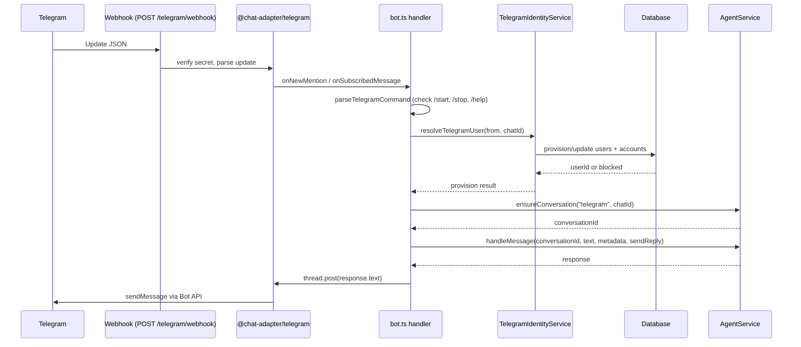
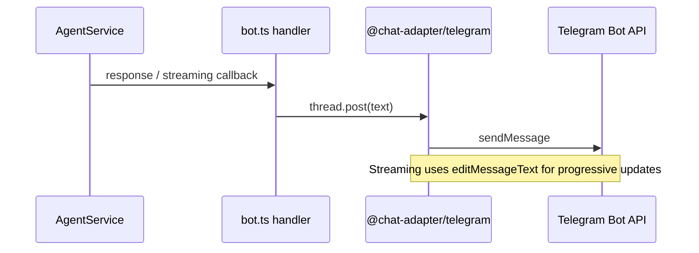

# Channels

Channels are transport adapters that connect external messaging surfaces to the Amby agent runtime. They own message ingress, egress, and delivery semantics. They do not own reasoning, memory, or execution planning.

## Platform enum

The platform type is defined in `packages/db/src/schema/conversations.ts`:

```typescript
type Platform = "telegram"
```

Only **Telegram** is implemented today. New platform values will be added when additional channels are built.

## Telegram inbound flow



## Telegram outbound flow



## Identity mapping

| Layer | Key | Example |
|---|---|---|
| Telegram user | `from.id` (numeric) | `123456789` |
| DB account | `accounts.providerId="telegram"`, `accounts.accountId=from.id` | provider lookup |
| DB user | `users.id` (UUID/text) | created on first sign-in or first bot message |
| Typed delivery target | `accounts.telegramChatId` | `"123456789"` |
| Conversation | `userId + platform + externalConversationKey` | unique index |

For Telegram, `externalConversationKey` = `String(chatId)`.

Telegram identity persistence is owned by `@amby/auth`, not `@amby/channels`.

- Browser auth flows call Better Auth endpoints under `/api/auth/telegram/*`.
- Bot traffic calls `TelegramIdentityService.provisionFromBot(...)` via `resolveTelegramUser(...)`.
- Every flow converges on the same canonical account link: `accounts(providerId="telegram", accountId=<telegram user id>)`.
- Safe unlink writes a tombstone in `telegram_identity_blocks`, so a user who intentionally unlinked Telegram is not silently reprovisioned by later bot traffic.

`packages/channels/src/telegram/utils.ts` keeps only Telegram-specific command parsing and orchestration helpers. It no longer writes auth tables directly.

## Browser auth surface

Better Auth is mounted on the API origin at `/api/auth/*`.

Telegram-specific endpoints:

| Method | Path | Purpose |
|---|---|---|
| `GET` | `/api/auth/telegram/config` | Exposes Telegram auth feature flags and bot username |
| `POST` | `/api/auth/telegram/signin` | Login Widget sign-in |
| `POST` | `/api/auth/telegram/link` | Link Telegram to the current Better Auth session |
| `POST` | `/api/auth/telegram/unlink` | Safe unlink with tombstone enforcement |
| `POST` | `/api/auth/telegram/miniapp/signin` | Mini App sign-in |
| `POST` | `/api/auth/telegram/miniapp/validate` | Mini App payload validation |

Telegram OIDC uses Better Auth's standard OAuth routes on the same API origin and still resolves to `providerId="telegram"`.

## Webhook and env vars

| Variable | Purpose |
|---|---|
| `TELEGRAM_BOT_TOKEN` | Bot API authentication |
| `TELEGRAM_BOT_USERNAME` | Used to filter commands addressed to this bot in groups |
| `TELEGRAM_WEBHOOK_SECRET` | Verifies inbound webhook requests |
| `TELEGRAM_API_BASE_URL` | Override Bot API URL (used for mock channel) |
| `TELEGRAM_LOGIN_WIDGET_ENABLED` | Enables Login Widget endpoints under `/api/auth/telegram/*` |
| `TELEGRAM_MINI_APP_ENABLED` | Enables Mini App auth endpoints |
| `TELEGRAM_OIDC_CLIENT_ID` / `TELEGRAM_OIDC_CLIENT_SECRET` | Enables Telegram OIDC through Better Auth |

The bot initializes in `apps/api/src/index.ts` via `@chat-adapter/telegram` in `"auto"` mode: polling in dev, webhook when deployed.

Bot commands (`/start`, `/stop`, `/help`) are registered via `setMyCommands` at startup.

## Mock channel (`apps/mock`)

A Next.js app (port 3100) that emulates the Telegram Bot API for local development without a real Telegram bot.

### What it provides

- Chat UI with message display and input
- Debug panel showing API request/response logs
- Configurable mock user identity (userId, chatId, name, username)
- Telegram auth panel that exercises the first-party Better Auth plugin against the API origin
- SSE-based real-time message delivery to the browser

### Mocked Bot API methods

| Method | Behavior |
|---|---|
| `sendMessage` | Stores message, emits SSE to UI |
| `editMessageText` | Emits edit SSE event |
| `deleteMessage` | Emits delete SSE event |
| `sendChatAction` | Emits typing indicator |
| `setMyCommands` | No-op (returns ok) |
| `getMe` | Returns static bot identity |

### Mock auth helpers

`apps/mock/app/api/telegram-auth/route.ts` signs realistic Login Widget payloads and Mini App `initData` using `TELEGRAM_BOT_TOKEN`, so the mock UI can exercise the real Better Auth plugin without Telegram or ngrok.

### How to use

1. Start mock app: `cd apps/mock && bun dev` (runs on port 3100)
2. Set env: `TELEGRAM_API_BASE_URL=http://localhost:3100/api/mock-bot`
3. Set auth env on the API: `BETTER_AUTH_URL=http://localhost:3001`, `TELEGRAM_BOT_TOKEN`, `TELEGRAM_BOT_USERNAME`, and any Telegram feature flags you want to test
4. Start API: `cd apps/api && bun dev`
5. Open `http://localhost:3100` to test chat delivery and browser auth flows

The mock constructs realistic `TelegramUpdate` JSON payloads (`lib/webhook-builder.ts`) and sends them to the real API webhook, so the full inbound path executes against actual bot handler code.

### Key files

- `apps/mock/app/api/mock-bot/[...path]/route.ts` -- Bot API endpoint router
- `apps/mock/app/api/telegram-auth/route.ts` -- signs mock Login Widget and Mini App payloads
- `apps/mock/components/telegram-auth-panel.tsx` -- browser auth verification surface
- `apps/mock/lib/webhook-builder.ts` -- constructs Telegram Update payloads

## Adding a new channel

To add a new channel (e.g., Slack):

1. Add the platform value to the `Platform` type in `packages/db/src/schema/conversations.ts` and `packages/core/src/domain/platform.ts`
2. Create an adapter package or use an existing chat-adapter library
3. Decide whether the channel needs first-party auth ownership. If so, add a dedicated auth-owned identity service instead of letting the channel write auth tables directly
4. Implement an inbound webhook handler that parses platform updates and calls the channel identity entrypoint + `AgentService.ensureConversation` + `AgentService.handleMessage`
5. Implement outbound delivery (send/edit/stream via platform API)
6. Provide a stable `externalConversationKey` for conversation identity (e.g., Slack channel ID)
7. Register the webhook route in `apps/api/src/index.ts`
