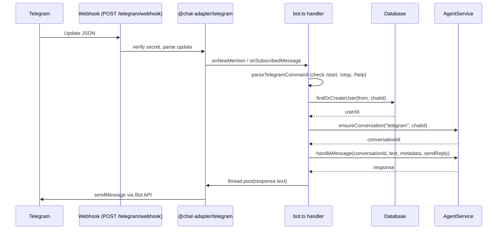
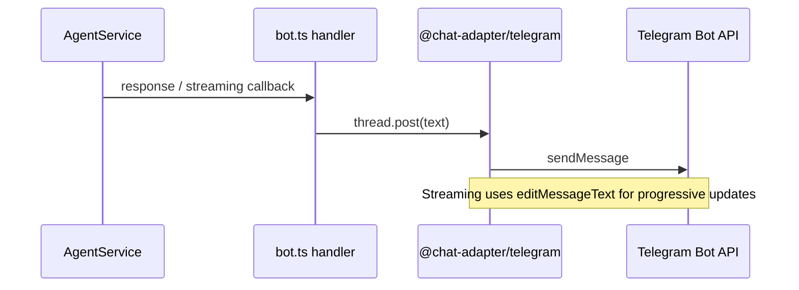

# Channels

Channels are transport adapters that connect external messaging surfaces to the Amby agent runtime. They own message ingress, egress, and delivery semantics. They do not own reasoning, memory, or execution planning.

## Platform enum

The platform type is defined in `packages/db/src/schema/conversations.ts`:

```typescript
type Platform = "telegram"
```

Only **Telegram** is implemented today. New platform values will be added when additional channels are built.

## Telegram inbound flow



## Telegram outbound flow



## Identity mapping

| Layer | Key | Example |
|---|---|---|
| Telegram user | `from.id` (numeric) | `123456789` |
| DB account | `accounts.providerId="telegram"`, `accounts.accountId=from.id` | provider lookup |
| DB user | `users.id` (UUID) | created on first message |
| Conversation | `userId + platform + externalConversationKey` | unique index |

For Telegram, `externalConversationKey` = `String(chatId)`.

The `findOrCreateUser` function in `apps/api/src/telegram/utils.ts` handles upsert logic: find existing account by `(providerId=telegram, accountId=from.id)`, or create a new user + account in a transaction.

## Webhook and env vars

| Variable | Purpose |
|---|---|
| `TELEGRAM_BOT_TOKEN` | Bot API authentication |
| `TELEGRAM_BOT_USERNAME` | Used to filter commands addressed to this bot in groups |
| `TELEGRAM_WEBHOOK_SECRET` | Verifies inbound webhook requests |
| `TELEGRAM_API_BASE_URL` | Override Bot API URL (used for mock channel) |

The local Bun bot initializes in `apps/api/src/index.ts` via `@chat-adapter/telegram` in `"auto"` mode and keeps the in-memory Chat SDK state adapter for Bun-only development.

The Cloudflare Worker path in `apps/api/src/worker.ts` uses a dedicated `ChatStateDO` Durable Object for Chat SDK subscriptions, locks, dedupe keys, and message history. The higher-level per-chat debounce/workflow state remains in the separate `ConversationSession` Durable Object.

Bot commands (`/start`, `/stop`, `/help`) are registered via `setMyCommands` at startup.

## Mock channel (`apps/mock`)

A Next.js app (port 3100) that emulates the Telegram Bot API for local development without a real Telegram bot.

### What it provides

- Chat UI with message display and input
- Debug panel showing API request/response logs
- Configurable mock user identity (userId, chatId, name, username)
- SSE-based real-time message delivery to the browser

### Mocked Bot API methods

| Method | Behavior |
|---|---|
| `sendMessage` | Stores message, emits SSE to UI |
| `editMessageText` | Emits edit SSE event |
| `deleteMessage` | Emits delete SSE event |
| `sendChatAction` | Emits typing indicator |
| `setMyCommands` | No-op (returns ok) |
| `getMe` | Returns static bot identity |

### How to use

1. Start mock app: `cd apps/mock && bun dev` (runs on port 3100)
2. Set env: `TELEGRAM_API_BASE_URL=http://localhost:3100/api/mock-bot`
3. Start API: `cd apps/api && bun dev`
4. Open `http://localhost:3100` to chat

The mock constructs realistic `TelegramUpdate` JSON payloads (`lib/webhook-builder.ts`) and sends them to the real API webhook, so the full inbound path executes against actual bot handler code.

### Key files

- `apps/mock/app/api/mock-bot/[...path]/route.ts` -- Bot API endpoint router
- `apps/mock/lib/webhook-builder.ts` -- constructs Telegram Update payloads

## Adding a new channel

To add a new channel (e.g., Slack):

1. Add the platform value to the `Platform` type in `packages/db/src/schema/conversations.ts` and `packages/core/src/domain/platform.ts`
2. Create an adapter package or use an existing chat-adapter library
3. Implement an inbound webhook handler that parses platform updates and calls `findOrCreateUser` + `AgentService.ensureConversation` + `AgentService.handleMessage`
4. Implement outbound delivery (send/edit/stream via platform API)
5. Provide a stable `externalConversationKey` for conversation identity (e.g., Slack channel ID)
6. Register the webhook route in `apps/api/src/index.ts`
