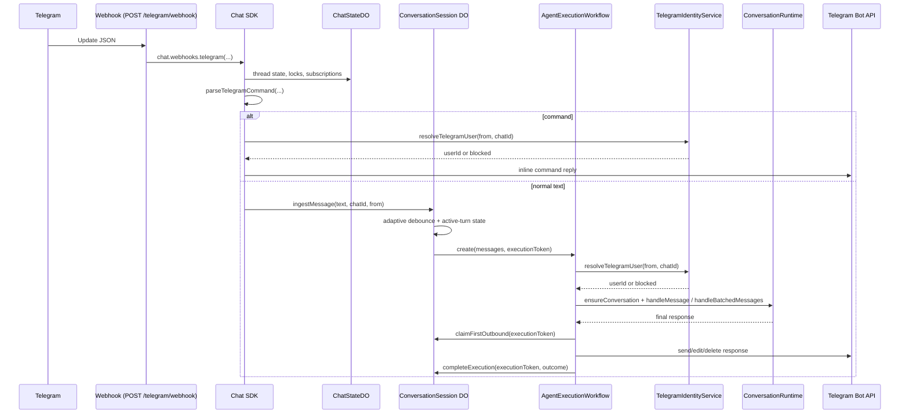
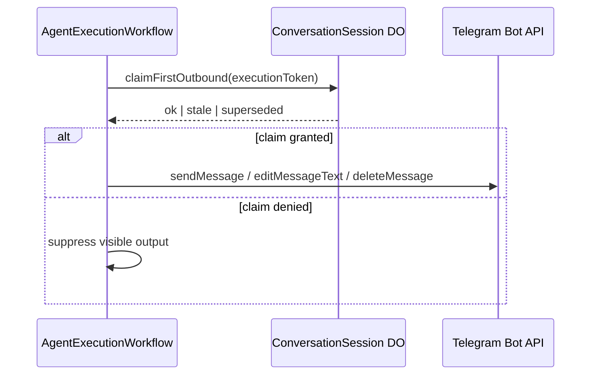

# Channels

Channel documentation lives under [`docs/channels/`](./channels/README.md).

## Implemented channels

The platform type is defined in `packages/db/src/schema/conversations.ts`:

```typescript
type Platform = "telegram"
```

Only Telegram is implemented today.

## Telegram inbound flow



Key point: normal Telegram text does not resolve identity in the Chat SDK hot path. It goes straight to `ConversationSession`, and identity resolution happens inside the workflow.

## Telegram outbound flow



## Identity mapping

| Layer | Key | Example |
|---|---|---|
| Telegram user | `from.id` | `123456789` |
| DB account | `accounts.providerId="telegram"`, `accounts.accountId=from.id` | provider lookup |
| DB user | `users.id` | durable user id |
| Typed delivery target | `accounts.telegramChatId` | `"123456789"` |
| Conversation | `userId + platform + externalConversationKey` | unique conversation |

For Telegram, `externalConversationKey = String(chatId)`.

Telegram identity persistence is owned by `@amby/auth`, not `@amby/channels`.

- browser auth flows use Better Auth endpoints under `/api/auth/telegram/*`
- bot traffic calls `TelegramIdentityService.provisionFromBot(...)` via `resolveTelegramUser(...)`
- both flows converge on the same canonical account link
- safe unlink writes a tombstone in `telegram_identity_blocks`

`packages/channels/src/telegram/utils.ts` keeps Telegram-specific parsing and orchestration helpers. It does not own auth persistence.

## Browser auth surface

Better Auth is mounted on the API origin at `/api/auth/*`.

Telegram-specific endpoints:

| Method | Path | Purpose |
|---|---|---|
| `GET` | `/api/auth/telegram/config` | Feature flags and bot username |
| `POST` | `/api/auth/telegram/signin` | Login Widget sign-in |
| `POST` | `/api/auth/telegram/link` | Link Telegram to current Better Auth session |
| `POST` | `/api/auth/telegram/unlink` | Safe unlink with tombstone enforcement |
| `POST` | `/api/auth/telegram/miniapp/signin` | Mini App sign-in |
| `POST` | `/api/auth/telegram/miniapp/validate` | Mini App payload validation |

Telegram OIDC uses Better Auth's standard OAuth routes on the same API origin.

## Webhook and env vars

| Variable | Purpose |
|---|---|
| `TELEGRAM_BOT_TOKEN` | Bot API authentication |
| `TELEGRAM_BOT_USERNAME` | Filters commands addressed to this bot in groups |
| `TELEGRAM_WEBHOOK_SECRET` | Verifies inbound webhook requests |
| `TELEGRAM_API_BASE_URL` | Overrides Bot API URL for local mock testing |
| `TELEGRAM_LOGIN_WIDGET_ENABLED` | Enables Login Widget endpoints |
| `TELEGRAM_MINI_APP_ENABLED` | Enables Mini App auth endpoints |
| `TELEGRAM_OIDC_CLIENT_ID` / `TELEGRAM_OIDC_CLIENT_SECRET` | Enables Telegram OIDC |

The production Worker initializes Telegram in webhook mode from `apps/api/src/worker.ts`. Local Bun development uses the Bun entrypoint in `apps/api/src/index.ts`.

## Mock channel (`apps/mock`)

`apps/mock` emulates the Telegram boundary for local testing.

### What it provides

- chat UI with message display and input
- debug panel with API request and response logs
- configurable mock user identity
- Telegram auth panel that exercises the Better Auth plugin
- SSE-based real-time message delivery to the browser

### Mocked Bot API methods

| Method | Behavior |
|---|---|
| `sendMessage` | Stores the message and emits SSE to the UI |
| `editMessageText` | Emits edit SSE event |
| `deleteMessage` | Emits delete SSE event |
| `sendChatAction` | Emits typing indicator |
| `setMyCommands` | No-op |
| `getMe` | Returns static bot identity |

### Mock auth helpers

`apps/mock/app/api/telegram-auth/route.ts` signs realistic Login Widget payloads and Mini App `initData` using `TELEGRAM_BOT_TOKEN`.

### How to use

1. Start the mock app: `cd apps/mock && bun dev`
2. Set `TELEGRAM_API_BASE_URL=http://localhost:3100/api/mock-bot`
3. Set API auth env such as `BETTER_AUTH_URL=http://localhost:3001`, `TELEGRAM_BOT_TOKEN`, and `TELEGRAM_BOT_USERNAME`
4. Start the API: `cd apps/api && bun dev`
5. Open `http://localhost:3100`

The mock sends realistic `TelegramUpdate` payloads to the real API webhook, so the real inbound path executes.

## Adding a new channel

1. Add the platform value to the `Platform` type in `packages/db/src/schema/conversations.ts` and `packages/core/src/domain/platform.ts`
2. Create or adopt an adapter package
3. Decide whether the channel needs auth-owned identity persistence
4. Implement inbound parsing and routing into the platform conversation runtime
5. Implement outbound send/edit behavior for the platform
6. Provide a stable `externalConversationKey`
7. Register the webhook route in `apps/api/src/worker.ts`

## Detailed channel docs

- [Telegram](./channels/telegram.md)
