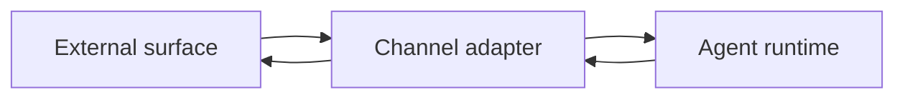
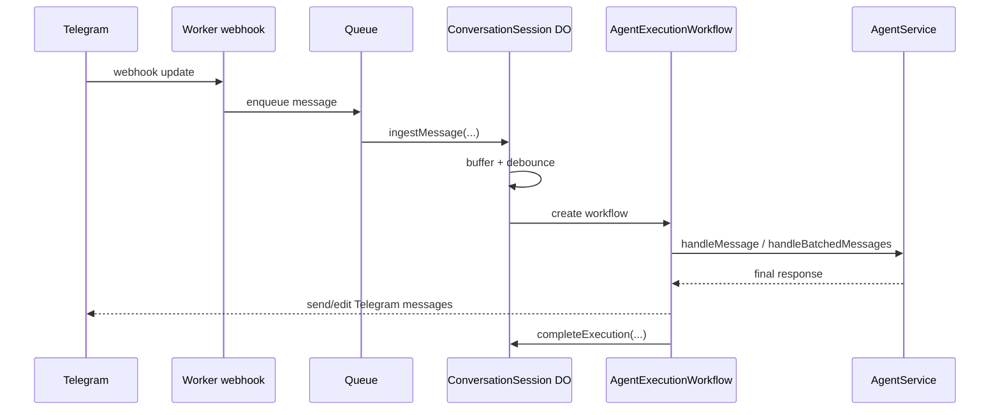

# Channels

Channels are transport adapters that connect external communication surfaces to the Amby runtime.

They do not own reasoning.
They do not own memory.
They do not own execution planning.

They own message ingress, message egress, and channel-specific delivery semantics.

## Current truth

There are two important facts right now:

1. The shared package-level channel abstraction currently defines **`cli`** and **`telegram`** as concrete channel types.
2. The deployed production path is **Telegram-first** through Cloudflare Worker + Queue + Durable Object + Workflow.

Both facts should be documented.

## Channel contract

The shared abstraction currently revolves around:
- incoming message shape,
- outgoing message shape,
- a message handler,
- optional streaming message handling,
- lifecycle start/stop hooks.

This is the right page to explain the contract in platform-neutral terms.

## Channel responsibilities

A channel is responsible for:
- identifying the conversation boundary used by that surface,
- normalizing inbound text and metadata,
- delivering outbound content,
- optionally supporting streaming responses,
- preserving delivery-specific metadata that the runtime may need later.

A channel is **not** responsible for:
- selecting tools,
- managing threads,
- deciding whether work becomes durable,
- owning user memory,
- writing business logic.

## Current channel types

| Channel type | Status | Notes |
|---|---|---|
| `telegram` | active | production path through Worker + Queue + Durable Object + Workflow |
| `cli` | supported in package contract | useful as a local/dev transport |

The broader platform enum already includes `slack` and `discord`, but those are not current channel implementations.

## Canonical Telegram inbound flow

## Telegram channel behavior

The production Telegram path currently adds three important runtime behaviors:

### 1. Debouncing
Multiple rapid inbound user messages are buffered and grouped before the workflow starts.

### 2. Interrupt forwarding
If a new user message arrives while processing is underway, the Durable Object forwards it to the active workflow.

### 3. Streaming delivery
The workflow can post and edit Telegram messages while the agent is still generating output.

Those behaviors belong in the docs because they materially affect user experience and future channel design.

## Durable Object session model

The Telegram ConversationSession Durable Object currently acts as the per-chat coordination point.

Its state machine is:
- `idle`
- `debouncing`
- `processing`

This is the right abstraction to document because it explains how Amby avoids racing or duplicating agent runs per chat.

## Conversation identity

The runtime persists conversations independently from channels, but channel input must still provide enough identity to locate or create the conversation row.

For Telegram, the external conversation key is effectively the chat identity.

The future-proof rule should be documented like this:

> Each channel must provide a stable external conversation key. The application runtime maps that key into a canonical conversation row.

## Native threading vs derived threading

The thread resolver already accepts platform-native thread context, but current Telegram and CLI flows primarily rely on derived thread routing.

That means the channel design should explicitly state:
- channels **may** provide native thread identifiers,
- the runtime **does not require** them for correctness,
- the runtime can derive thread continuity even when the channel has only a flat conversation stream.

## Recommended channel blueprint

Each new channel should follow this contract:

1. **Ingress adapter**
   - verify platform authenticity
   - normalize payload
   - derive stable external conversation key
   - enqueue or forward to runtime

2. **Session coordinator**
   - optional per-conversation debounce or serialization layer
   - required when the platform can deliver bursts or overlapping replies

3. **Execution entrypoint**
   - durable workflow or equivalent runtime wrapper
   - attaches channel delivery methods and progress behavior

4. **Outbound adapter**
   - send final response
   - optionally stream / edit partial response
   - record delivery metadata when relevant

## Near-future channel direction

This page should frame channels as a stable shell around the same runtime core.

The near-future design likely includes:
- more messaging channels,
- richer web/native app surfaces,
- push-capable surfaces for proactive messages,
- eventual native thread support for platforms that expose it.

## Open questions

1. Should the formal channel contract include a first-class native thread field now, or keep it as optional metadata until a second threaded channel exists?
2. Should all future channels use the same Queue + session-coordinator + workflow pattern, or should low-volume direct channels be allowed to skip the queue?
3. Should the CLI still be documented as a real channel page subsection, or treated as a developer harness once Telegram is the primary runtime?
