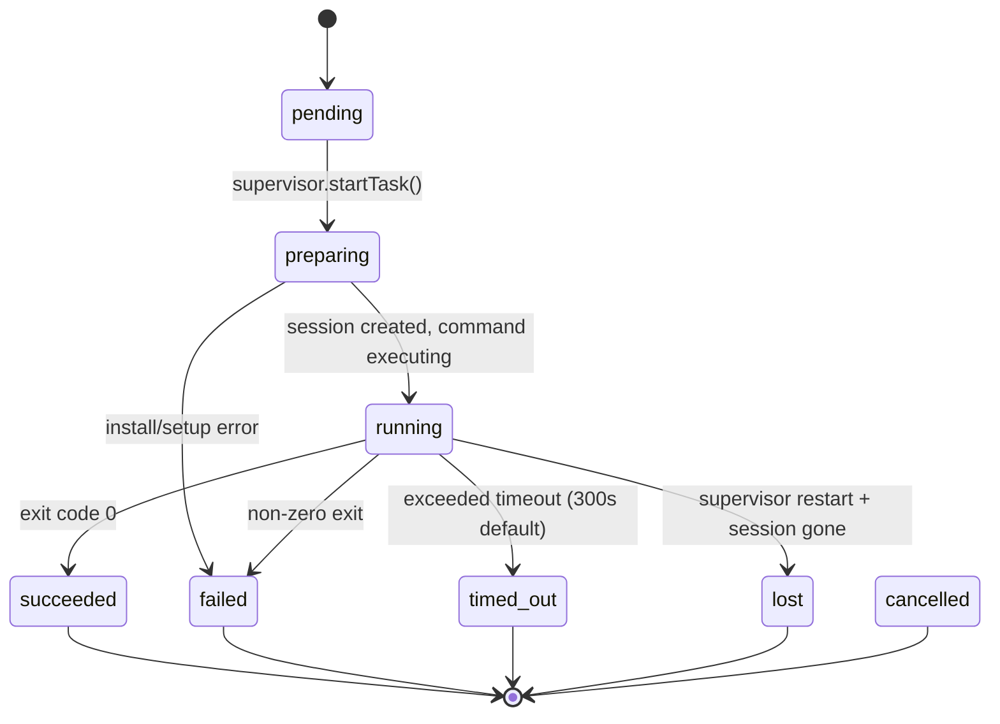

# Computer & Task Delegation

This document describes the sandbox compute layer (`@amby/computer`) and the task delegation system that lets Amby's agent spawn autonomous background workers.

---

## Overview

Amby runs a per-user Daytona sandbox for direct tool use (`execute_command`, `read_file`, `write_file`). On top of this, the **task delegation system** lets the agent spawn Codex CLI processes inside the sandbox for autonomous multi-step work like research, code generation, and data analysis.

The user interacts with one agent. Under the hood, work is split across three execution paths:

- `delegate_task target="browser"` for worker-only, headless, single-tab website work via Stagehand on Cloudflare Browser Rendering
- `delegate_task target="computer"` for Daytona CUA when a task needs the actual desktop
- `delegate_task target="sandbox"` for long-running autonomous sandbox work via Codex sessions

```
User ──> Channel ──> AgentService.handleMessage()
                          │
            LLM calls delegate_task with target
                    │            │              │
                    │            │              └── target="sandbox" + get_task
                    │            │                          │
                    │            │                ┌─────────┴──────────┐
                    │            │                │  TaskSupervisor     │
                    │            │                │  (state machine,    │
                    │            │                │   session lifecycle,│
                    │            │                │   heartbeat)        │
                    │            │                └─────────┬──────────┘
                    │            │                          │
                    │            └── target="computer"      │
                    │                    │                  │
                    │                Daytona CUA            │
                    │                                       │
                    └── target="browser"                    │
                             │                              │
               Cloudflare Browser Rendering                 │
               + Stagehand + AI Gateway                     │
                                                            │
                                       ┌────────────────────┴────────────────────┐
                                       │       Daytona Sandbox (per-user)        │
                                       │                                          │
                                       │  /home/agent/workspace/tasks/{taskId}/  │
                                       │    workspace/   (cwd)                   │
                                       │    artifacts/   (outputs)               │
                                       │    AGENTS.md                             │
                                       │    prompt.txt                            │
                                       │                                          │
                                       │  Session: task-{taskId}                  │
                                       │  $ codex exec --full-auto                │
                                       └──────────────────────────────────────────┘
```

---

## Key Decisions

| Decision | Choice | Why |
|---|---|---|
| Sandbox per task or per user? | **Per user** | Reuse existing sandbox. Each task gets its own folder. `sandboxId` in DB allows per-task sandboxes later. |
| Codex install | **HarnessInstaller** | `CodexInstaller.ensureInstalled()` runs once per sandbox lifecycle, caches result in `/.amby/harnesses.json`. |
| Sync or async? | **Mixed by target** | `delegate_task target="browser"` and `target="computer"` return inline results. `target="sandbox"` returns immediately; `get_task` polls briefly (max 15s) or returns instantly. |
| Auth | **Codex-managed auth cache** | Keep Codex credentials in `CODEX_HOME/auth.json`. Prefer ChatGPT device login for headless flows; use API keys for automation. |
| Outputs | **Sandbox filesystem** | DB stores `artifactRoot` path + small `outputSummary`. Heavy outputs stay in sandbox. |
| Provider abstraction | **Interface now, one impl** | `TaskProvider` interface with `CodexProvider`. `ClaudeCodeProvider` slots in later. |
| Prompt/env passing | **File-based** | Prompt written to `prompt.txt`, env to `.env` — avoids shell injection via `$(cat ...)`. |
| Heartbeat | **Required** | Daytona auto-stop kills processes after 15 min. `refreshActivity()` every 60s keeps sandbox alive. |
| Ordinary website automation | **Direct browser target when available** | Same-tab headless browsing prefers `delegate_task target="browser"`. When that target is unavailable (for example in local Bun runtimes), sandbox tasks can fall back to `needsBrowser: true`. |

---

## Module Layout

### `packages/computer/src/`

```
errors.ts                 # SandboxError (shared across sandbox + harness)
index.ts                  # barrel re-export
sandbox-config.ts         # lightweight re-export for provisioning workflow (avoids heavy deps)

sandbox/                  # Daytona sandbox lifecycle + agent tools
  service.ts              # SandboxService (Effect service), config constants, sandbox image
  tools.ts                # execute_command, read_file, write_file tools
  cua-tools.ts            # Computer Use Agent GUI tools (screenshot, click, type, etc.)
  index.ts

harness/                  # Task delegation: providers + supervisor
  provider.ts             # TaskProvider interface + TaskConfig + TaskResult types
  installer.ts            # HarnessInstaller interface
  codex-provider.ts       # CodexProvider implements TaskProvider
  codex-installer.ts      # CodexInstaller implements HarnessInstaller
  supervisor.ts           # TaskSupervisor (Effect service — session lifecycle, heartbeat, state)
  index.ts

browser/                  # Worker-only browser delegation
  shared.ts               # BrowserService interface + result types
  local.ts                # Disabled local/Bun runtime layer
  workers.ts              # Cloudflare Browser Rendering + Stagehand implementation
```

### `packages/agent/src/tools/`

```
delegation.ts             # delegate_task, get_task tools (browser/computer/sandbox routing)
codex-auth.ts             # Codex auth status + setup tools
```

### `packages/db/src/schema/`

```
tasks.ts                  # tasks table
```

---

## Task Lifecycle



**Statuses:**

| Status | Meaning |
|---|---|
| `pending` | Created in DB, not yet started |
| `preparing` | Sandbox ensured, harness installing, workspace setup |
| `running` | Codex executing in Daytona session |
| `succeeded` | Exit code 0, result collected |
| `failed` | Non-zero exit or execution error |
| `timed_out` | Exceeded task timeout |
| `cancelled` | User/system cancelled (future) |
| `lost` | Supervisor restarted but session/sandbox gone |
| `awaiting_auth` | Waiting for user auth (future ChatGPT account mode) |

---

## Architecture Detail

### TaskProvider Interface

Providers know how to (a) set up a workspace and build a command, and (b) parse results. The supervisor owns session lifecycle.

```typescript
interface TaskProvider {
  readonly name: string
  prepareAndBuildCommand(sandbox: Sandbox, config: TaskConfig): Promise<string>
  collectResult(sandbox: Sandbox, artifactRoot: string): Promise<TaskResult>
}
```

### CodexProvider

**Workspace setup** (`prepareAndBuildCommand`):

1. Create `tasks/{taskId}/workspace/` and `tasks/{taskId}/artifacts/`
2. `git init` in workspace (Codex requires a repo)
3. Write `.codex/config.toml` with optional Codex notify hooks and Playwright MCP when `needsBrowser: true`
4. Write `AGENTS.md` with output instructions
5. Write `prompt.txt` (prompt) and `.env` (API key + CODEX_HOME)
6. Write `run.sh` wrapper that sources `.env` with `set -a` and runs `codex exec --full-auto --output-last-message -o ../artifacts/result.md "$prompt" 2>../artifacts/stderr.log`
7. Return command: `cd {taskDir} && sh run.sh`

**Result collection** (`collectResult`):
- Reads `artifacts/result.md` for output
- Reads `artifacts/stderr.log` for diagnostics
- Returns `{ output, summary }` (summary is first 500 chars)

### CodexInstaller

1. Check `/.amby/harnesses.json` manifest (fast path)
2. Check `codex --version` (runtime check)
3. If missing: `npm install -g @openai/codex`
4. Write manifest for future fast-path

### TaskSupervisor (Effect Service)

**Dependencies:** `SandboxService`, `DbService`, `EnvService`

**`startTask()`:**
1. Resolve auth (OAuth token or API key)
2. Ensure sandbox via `SandboxService.ensure(userId)`
3. Ensure Codex installed via `CodexInstaller`
4. Insert task record (status: `preparing`)
5. Prepare workspace + build command via `CodexProvider`
6. Create Daytona session (`task-{taskId}`)
7. Execute command async (`runAsync: true`)
8. Update DB (status: `running`, session/command IDs, timestamps)
9. Register in active tasks map for heartbeat tracking
10. Return `{ taskId, status: "running" }`

**`getTask(taskId, waitSeconds?)`:**
- If `waitSeconds` > 0: poll DB every 2s up to `min(waitSeconds, 15)` seconds
- Otherwise: immediate DB lookup
- Returns task record or null

**Heartbeat loop** (every 60s for all active tasks):
1. `sandbox.refreshActivity()` — prevents Daytona auto-stop
2. `getSessionCommand()` — check if command completed
3. Update `heartbeatAt` in DB
4. If completed → `finalizeTask()` (collect result, update DB, delete session)
5. If timed out → `timeoutTask()` (kill session, update DB)

**Recovery on startup:**
- Query DB for `status: "running"` tasks
- Try to reconnect to sandbox + session
- If reachable → re-register in active map
- If gone → mark as `lost`

---

## Agent Tools

### `delegate_task`

Routes a task to browser, computer, or sandbox execution.

```
Input:  { task: string, target: "browser" | "computer" | "sandbox", context?: string, startUrl?: string, needsBrowser?: boolean }
Output:
  - browser: { target: "browser", success: boolean, summary: string, finalUrl?: string, title?: string }
  - computer: { target: "computer", summary: string, toolsUsed?: string[] }
  - sandbox: { target: "sandbox", taskId: string, status: "running", summary: string }
```

Target selection:

- `browser`: same-tab headless website work through Stagehand on Cloudflare Browser Rendering
- `computer`: Daytona CUA for screen-dependent flows, native dialogs, uploads/downloads, CAPTCHA, MFA, popups, or multi-tab handling
- `sandbox`: long-running autonomous background Codex work

`needsBrowser` applies only to `target="sandbox"` and is meant as a fallback when direct browser delegation is unavailable in the current runtime.

### `get_task`

Checks task status. Optionally waits briefly (max 15s) for completion.

```
Input:  { taskId: string, waitSeconds?: number }
Output: { taskId, status, outputSummary, error, exitCode, startedAt, completedAt }
```

`get_task`, `probe_task`, and `get_task_artifacts` apply only to `delegate_task target="sandbox"` tasks.

---

## DB Schema: `tasks`

| Column | Type | Purpose |
|---|---|---|
| `id` | uuid | Primary key |
| `userId` | text | FK to users |
| `provider` | text | `"codex"` or `"claude_code"` |
| `authMode` | text | `"api_key"` or `"chatgpt_account"` |
| `status` | text | State machine status |
| `prompt` | text | Task prompt |
| `needsBrowser` | text | `"true"` / `"false"` for sandbox tasks that need Playwright browser automation |
| `sandboxId` | text | Daytona sandbox ID |
| `sessionId` | text | Daytona session ID |
| `commandId` | text | Daytona command ID |
| `artifactRoot` | text | Path to artifacts in sandbox |
| `outputSummary` | text | Short summary (< 2KB) for quick display |
| `error` | text | Error message if failed |
| `exitCode` | integer | Process exit code |
| `startedAt` | timestamptz | When execution began |
| `heartbeatAt` | timestamptz | Last heartbeat (detect stale tasks) |
| `completedAt` | timestamptz | When task finished |
| `metadata` | jsonb | Extensible metadata |

**Index:** `(userId, status)` for efficient user task queries.

**What is NOT stored:** MCP config (lives in `.codex/config.toml`), logs (in `artifacts/stderr.log`), full result (in `artifacts/result.md`).

---

## Auth Flow

Codex auth now follows the official Codex CLI model instead of a custom OAuth implementation:

- **ChatGPT login**: Start `codex login --device-auth` inside the sandbox and relay the verification URL + one-time code to the user. Codex writes the resulting session to `CODEX_HOME/auth.json`.
- **API key**: Write the official API-key auth cache shape to `CODEX_HOME/auth.json` and record only non-secret metadata in the DB.
- **Persistence**: Store auth state and pending device-login metadata in `sandboxes.auth_config`, while the actual credentials stay in the sandbox filesystem.
- **Fallback**: If device auth is unavailable, import a trusted `~/.codex/auth.json` from another machine rather than implementing a custom OAuth callback flow.

---

## Browser Delegation

Single-tab browser work now runs outside the sandbox task system.

- `@amby/browser` provides a `BrowserService` with `runTask({ task, startUrl? })`
- Worker runtimes back that service with Cloudflare Browser Rendering and Stagehand
- Stagehand uses an OpenAI-compatible AI Gateway endpoint, with `google/gemini-3-flash-preview` as the default model unless overridden
- Local Bun runtimes expose a disabled browser service, so `delegate_task target="browser"` is unavailable there
- In those runtimes, sandbox tasks can still opt into Playwright by using `delegate_task target="sandbox"` with `needsBrowser: true`

This keeps ordinary website automation fast and direct when the browser target exists, while preserving a sandbox fallback in runtimes that do not expose it.

---

## Layer Composition

`TaskSupervisorLive` depends on `SandboxService`, `DbService`, and `EnvService`. It must be composed **above** `SandboxServiceLive`:

```
AgentService, JobRunnerService
  │
  ├── MemoryServiceLive
  ├── TaskSupervisorLive    ← needs SandboxService
  ├── ModelServiceLive
  │
  └── SandboxServiceLive    ← provided below TaskSupervisorLive
      │
      └── DbServiceLive
          │
          └── EnvServiceLive
```

---

## Sandbox Filesystem Layout

```
/home/agent/
  .codex/                          # Persistent Codex auth (CODEX_HOME, shared across tasks)
  workspace/
    tasks/
      {taskId}/
        .env                       # CODEX_API_KEY + CODEX_HOME (file-based, avoids shell injection)
        workspace/                 # Codex working directory
          .codex/config.toml       # Per-task Codex config (notify hook when enabled)
          AGENTS.md                # Task instructions + output requirements
          prompt.txt               # Task prompt (file-based, avoids shell injection)
          .git/                    # Codex requires a git repo
        artifacts/                 # Task outputs
          result.md                # Codex final output (-o flag)
          stderr.log               # Captured stderr
          ...                      # Any files the agent creates

/.amby/
  harnesses.json                   # Installer cache manifest (survives sandbox stop/start)
```

---

## Future

### v1.5
- `cancel_task` tool
- Streaming progress via `getSessionCommandLogs`
- `list_task_artifacts` tool
- ChatGPT account auth flow (`awaiting_auth` + device code handoff)

### v2
- `ClaudeCodeProvider` (Claude Code CLI or Agent SDK)
- Provider registry with selection logic
- Per-task sandbox option
- Task chaining (output of one feeds into another)
- Artifact download to local machine
