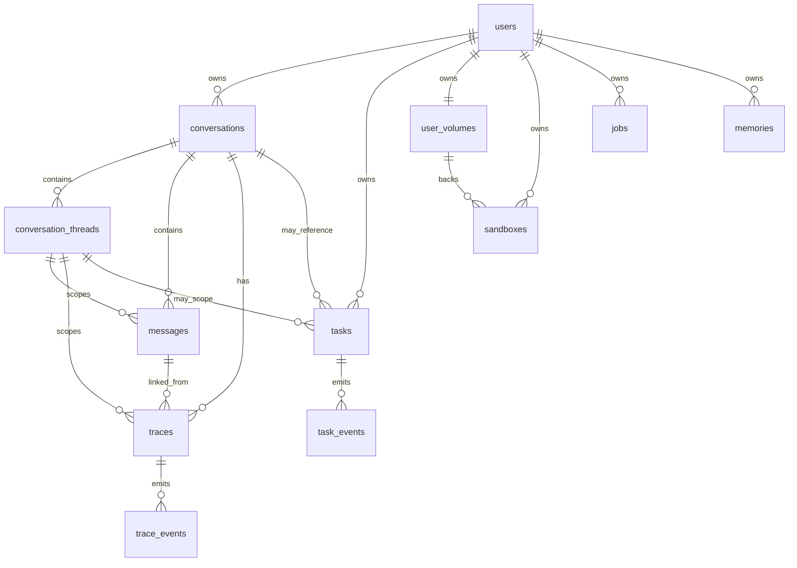
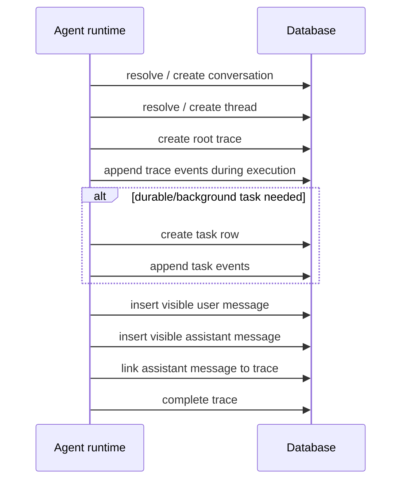

# Database

The database is the source of truth for Amby's runtime state.

The current design is best understood as five separate state planes:
1. **Conversation plane** - conversations, threads, messages
2. **Execution plane** - traces, trace events
3. **Durable work plane** - tasks, task events, jobs
4. **Compute plane** - user volumes, sandboxes
5. **User context plane** - users, memories, connector/auth-related rows

That framing is much better than documenting the schema as one flat list of unrelated tables.

## Design rule

> Visible transcript, execution traces, durable tasks, and compute state are stored separately on purpose.

That is one of the most important facts in the current architecture.

## Canonical entity diagram

## State plane 1: conversation plane

### `conversations`
The top-level container for a user's interaction on a given platform and external conversation identity.

Use it to answer:
- which channel/platform does this exchange belong to?
- what is the stable conversation row for this external chat/session?

### `conversation_threads`
Internal topic-routing layer within a conversation.

Use it to answer:
- what topic thread is active?
- was this a continued thread, a switched thread, or a new derived thread?
- what synopsis/keywords represent this topic?

### `messages`
User-visible transcript only.

This table should be described with zero ambiguity:

> `messages` stores only visible user/assistant text and metadata. It is not the place where execution events live.

That point matters because older documentation blurred this boundary.

## State plane 2: execution plane

### `traces`
Execution tree for agent and specialist runs.

This is the run-level ledger.

Important fields to explain:
- `parentTraceId`
- `rootTraceId`
- `taskId`
- `specialist`
- `runnerKind`
- `mode`
- `status`
- timing fields
- metadata

### `trace_events`
Ordered append-only event stream for a trace.

This is where tool calls, tool results, delegation boundaries, and errors are recorded.

The page should say this directly:

> A root trace represents the conversation run. Child traces represent delegated specialist execution.

## State plane 3: durable work plane

### `tasks`
Durable execution record for work that is not just an in-memory tool step.

This table is now much richer than older docs imply.

It captures:
- execution runtime and provider,
- task hierarchy (`parentTaskId`, `rootTaskId`),
- specialist and runner identity,
- request/input payload,
- output/artifacts,
- confirmation state,
- callback wiring,
- progress tracking,
- terminal status,
- notification bookkeeping.

### `task_events`
Append-only durable event log for task lifecycle and progress.

This is the correct place for task progress, heartbeats, reconciliation, completion, timeout, and notification events.

### `jobs`
Scheduled or recurring future work.

This table is currently simpler than `tasks` and should be documented as a separate scheduling primitive rather than conflated with background execution.

## State plane 4: compute plane

### `user_volumes`
Persistent per-user compute storage.

This is now the true persistence anchor for the user's computer environment.

Important fields:
- `daytonaVolumeId`
- `status`
- `authConfig`

### `sandboxes`
User sandbox runtime records.

This table represents disposable compute instances that mount onto the persistent volume.

Important fields:
- `volumeId`
- `role`
- `status`
- `snapshot`
- activity timestamps

The page should say this explicitly:

> A volume is persistent identity. A sandbox is replaceable execution runtime.

## State plane 5: user context plane

### `memories`
Persisted user memory facts and embeddings.

The current schema is materially simpler than some older docs. Do not describe the old document/chunk/spaces model as if it is the current canonical schema unless another memory page is explicitly marked conceptual.

### User and connector rows
The schema index also exports user/auth-related tables and connector-related tables. The database page should mention them as supporting identity and integration state, but keep the main focus on the core runtime tables above.

## Canonical table summary

| Table | Purpose |
|---|---|
| `conversations` | platform-scoped conversation container |
| `conversation_threads` | internal thread/topic routing layer |
| `messages` | visible transcript only |
| `traces` | execution span tree |
| `trace_events` | append-only trace event log |
| `tasks` | durable specialist/background work record |
| `task_events` | append-only task lifecycle/progress log |
| `jobs` | scheduled future work |
| `user_volumes` | persistent per-user compute storage |
| `sandboxes` | disposable mounted runtimes |
| `memories` | user memory facts + embeddings |

## Relationship notes to include

- one conversation can contain many internal threads,
- one thread can contain many visible messages,
- one conversation run creates one root trace,
- one root trace can have many child traces,
- one durable task can emit many task events,
- one user owns one primary volume,
- one volume can back one or more sandboxes over time,
- one user can accumulate many tasks, jobs, conversations, and memories.

## Sequence diagram: transcript vs execution persistence

## Clear documentation corrections

These corrections should be made explicitly in the page:

- `messages` is **not** the execution log.
- `traces` and `trace_events` are the execution log for agent runs.
- `tasks` and `task_events` are the durable execution log for longer-lived work.
- `user_volumes` and `sandboxes` are now first-class compute state tables and should not be treated as incidental infra metadata.
- older memory-table descriptions should not be presented as the current canonical schema unless clearly marked as future or conceptual.

## Near-future schema direction

The current schema already supports:
- deeper specialist nesting,
- better audit tooling,
- more than one sandbox per user,
- richer operator reconciliation,
- better user-facing status surfaces for long-running execution.

That should be documented as intentional extensibility, not as an unplanned side effect.

## Open questions

1. Should `jobs` eventually become a specialized task subtype instead of remaining a separate table?
2. Should task and trace relationships become stricter with explicit foreign keys for `traceId`, `parentTraceId`, and `rootTraceId` once migration complexity is acceptable?
3. Should memory stay as a single `memories` table in the canonical runtime docs, while any richer ingestion model is moved to a separate conceptual page?
