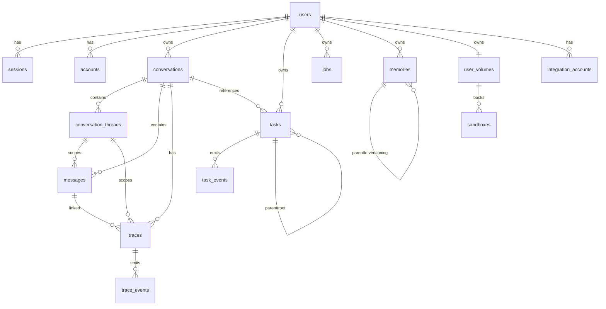

# Data Model

Amby persists all runtime state in PostgreSQL via [Drizzle ORM](https://orm.drizzle.team/).

- **Schema source:** `packages/db/src/schema/` (one file per domain)
- **Relations:** `packages/db/drizzle/relations.ts`
- **Migrations:** `packages/db/drizzle/` (SQL migration files)
- **Access layer:** `DbService` (Effect service tag) with two implementations:
  - `DbServiceLive` -- Bun/Node, reads `DATABASE_URL` from `EnvService`
  - `makeDbServiceFromHyperdrive` -- Cloudflare Workers, connection pool max 5

All database access goes through `DbService.query()`, which wraps Drizzle calls in `Effect.tryPromise` and maps failures to `DbError`.

## Entity relationship diagram



## Entity groups

### Users and auth

| Table | Purpose | Key constraints |
|---|---|---|
| `users` | Identity root. PK is `text` (external ID). | `email` unique, `phone_number` unique |
| `sessions` | Auth sessions with token + expiry. | `token` unique, cascade on user delete |
| `accounts` | OAuth provider links (Google, etc). | unique on `(providerId, accountId)` |
| `verifications` | Email/phone verification codes. | TTL via `expiresAt` |

### Conversations

| Table | Purpose | Key constraints |
|---|---|---|
| `conversations` | Platform-scoped container. One per user + platform + external key. | unique on `(userId, platform, externalConversationKey)` |
| `conversation_threads` | Internal routing layer (topic threads). Source: `native`, `reply_chain`, `derived`, `manual`. | Exactly one `isDefault=true` per conversation (partial unique index). Unique `externalThreadKey` per conversation when non-null. |
| `messages` | User-visible transcript only. Role: `user` or `assistant`. | **Not** the execution log. Indexed by `(conversationId, createdAt)`. |

Platform types: `telegram`.

### Execution traces

| Table | Purpose | Key constraints |
|---|---|---|
| `traces` | OTel-style execution spans. Tracks specialist, runner kind, execution mode. | Self-referencing via `parentTraceId`/`rootTraceId`. Optional FK to `threadId`, `messageId`, `taskId`. |
| `trace_events` | Append-only event log per trace, ordered by `seq`. | Indexed on `(traceId, seq)`. Cascade on trace delete. |

Trace event kinds: `context_built`, `model_request`, `model_response`, `tool_call`, `tool_result`, `delegation_start`, `delegation_end`, `error`.

Specialist kinds: `conversation`, `planner`, `research`, `builder`, `integration`, `computer`, `browser`, `memory`, `settings`, `validator`.

### Tasks

| Table | Purpose | Key constraints |
|---|---|---|
| `tasks` | Durable background work units. Runtime + provider + hierarchical nesting. | Self-ref FKs: `parentTaskId`, `rootTaskId`. Indexed on `(status, heartbeatAt)` for reaper queries. |
| `task_events` | Append-only lifecycle log. Idempotent via `(taskId, eventId)` unique index. | Source: `server`, `runtime`, `backend`, `maintenance`. |

Task event kinds: `task.created`, `task.started`, `task.progress`, `task.heartbeat`, `task.completed`, `task.partial`, `task.escalated`, `task.failed`, `task.timed_out`, `task.lost`, `task.notification_sent`, `backend.notify`, `maintenance.probe`.

#### Task status state machine

```
pending --> awaiting_auth --> preparing --> running
                                             |
                              +--------------+--------------+
                              |       |       |      |      |
                          succeeded partial escalated failed cancelled
                                                      |
                                                  timed_out / lost
```

Terminal states: `succeeded`, `partial`, `escalated`, `failed`, `cancelled`, `timed_out`, `lost`.

Runtime: `in_process`, `browser`, `sandbox`. Provider: `internal`, `stagehand`, `codex`.

### Jobs

| Table | Purpose | Key constraints |
|---|---|---|
| `jobs` | Scheduled/recurring work (cron, one-shot, event-triggered). | Indexed on `(status, nextRunAt)` for scheduler polling. |

### Memories

| Table | Purpose | Key constraints |
|---|---|---|
| `memories` | User memory facts with pgvector embeddings (1536 dimensions). | Category: `static`, `dynamic`, `inference`. Versioned via `parentId` self-reference. Indexed on `(userId, isActive)`. |

### Compute

| Table | Purpose | Key constraints |
|---|---|---|
| `user_volumes` | Persistent per-user Daytona storage. One per user. | `userId` unique, `daytonaVolumeId` unique. |
| `sandboxes` | Disposable compute instances mounted on a volume. | Partial unique index: one `main` role per user (where not deleted). Volume FK is `restrict` on delete. |

Volume is persistent identity. Sandbox is replaceable execution runtime.

### Integrations

| Table | Purpose | Key constraints |
|---|---|---|
| `integration_accounts` | Tracks external integration accounts, pending OAuth flows, and preferred-account flags. | Unique on `(userId, provider, externalAccountId)`. Pending auth data stored in `metadataJson`. `isPreferred` flag replaces separate preferences table. |

## Append-only event log pattern

Two tables follow the same append-only pattern for auditability and state reconstruction:

| Event table | Parent | Ordering | Idempotency |
|---|---|---|---|
| `trace_events` | `traces` | `seq` (integer, required) | None (seq is monotonic) |
| `task_events` | `tasks` | `seq` (optional) + `occurredAt` | `(taskId, eventId)` unique index |

Events are never updated or deleted in normal operation. State is reconstructed by replaying events in order. This enables debugging, auditing, and crash recovery.

## Key indexes

Notable indexes beyond standard FK indexes:

- `conversations_platform_key_idx` -- unique composite for conversation identity
- `threads_default_unique_idx` -- partial unique ensuring one default thread per conversation
- `sandboxes_user_main_idx` -- partial unique ensuring one active main sandbox per user
- `tasks_status_heartbeat_idx` -- reaper query for stale running tasks
- `tasks_runtime_status_heartbeat_idx` -- runtime-specific reaper queries
- `task_events_task_event_id_idx` -- idempotent event insertion
- `memories_user_active_idx` -- active memory retrieval

## Related docs

- `docs/RUNTIME.md` -- task lifecycle and execution flow
- `docs/AGENT.md` -- trace model and specialist execution
- `packages/db/src/schema/` -- canonical schema source
- `packages/db/src/service.ts` -- DbService implementation
