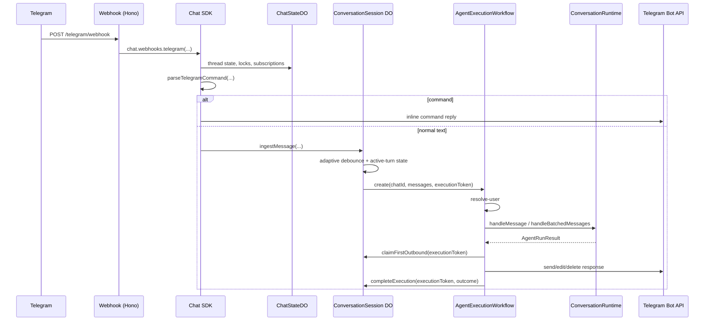
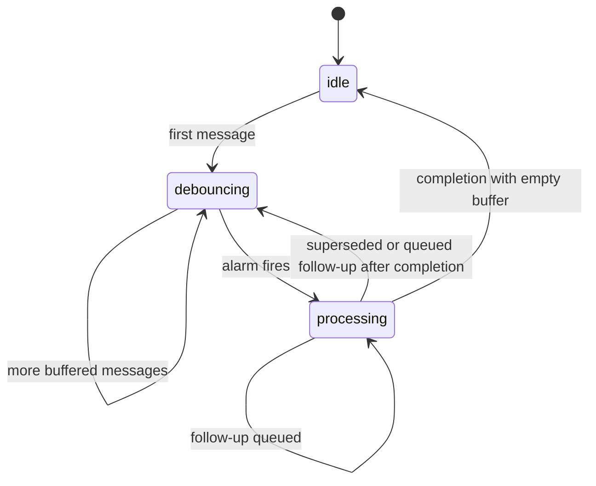
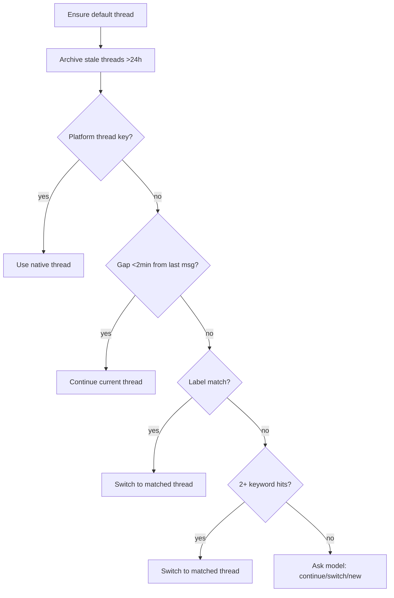
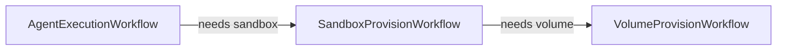

# Runtime

How a Telegram message becomes an agent response in the production Worker runtime.

## System overview

Telegram ingress is direct webhook to Chat SDK to Durable Objects to workflow. There is no queue hop on the production path.

## Durable Object: ConversationSession

One instance per Telegram chat. It owns the per-chat turn state for normal text messages:

- pending buffered messages
- adaptive debounce timing
- the current unsaved in-flight turn
- the active execution token
- cached `userId` and `conversationId`
- first-outbound claim state
- pre-first-outbound supersession state

State machine:

### Debounce policy

- first buffered message: `deadline = now + 800ms`
- each additional buffered message: `deadline = min(bufferStartedAt + 1500ms, now + 400ms)`
- rerun after a completed processing turn with pending follow-up: `deadline = now + 250ms`

### Follow-up handling

`ConversationSession` keeps the active unsaved turn in `inFlightMessages` until the workflow completes.

During `processing`:

- if first outbound has already been claimed, every follow-up queues for the next turn
- otherwise, only narrow correction prefixes supersede the active run:
  - `wait`
  - `actually`
  - `sorry`
  - `i meant`
  - `ignore that`
  - `correction`
  - `to clarify`
  - `instead`
- ambiguous follow-ups queue without superseding

When a superseded run completes, the DO rebuilds the next turn as:

`inFlightMessages + buffered follow-ups`

### First outbound claim

The workflow must call `claimFirstOutbound(executionToken)` before the first visible Telegram send path:

- relink-required reply
- progress/tool reply
- first streaming draft post
- first non-stream final text post
- pre-output error reply

This is the atomic gate that prevents stale output from superseded or stale executions.

## AgentExecutionWorkflow

Cloudflare Workflow with two meaningful phases:

| Step | What it does |
|------|--------------|
| `typing` | Send Telegram typing indicator |
| `resolve-user` | Resolve Telegram identity to an Amby user; retries are allowed here |
| `agent-loop` | Run `ConversationRuntime`; no workflow retries because this step may produce visible Telegram output |
| `complete` | Notify `ConversationSession` with `completeExecution(executionToken, outcome)` |

### Delivery rules

- first visible send must claim first outbound from the DO
- once first outbound is claimed, later follow-ups queue by DO rule instead of superseding
- stale or superseded runs suppress visible output
- if a run errors after visible output already exists, the workflow logs and completes but does not append a generic apology
- long Telegram responses are split to stay inside Telegram limits

## Thread routing

`resolveThread()` runs a 4-stage pipeline:

Config constants:

- `GAP_CONTINUE_MS` = 2 min
- `DORMANT_MS` = 1 hour
- `STALE_ARCHIVE_MS` = 24 hours
- `OPEN_THREADS_CAP` = 10

## Context assembly

`prepareConversationContext()` builds the prompt from:

- user memory
- active thread history
- sibling thread summaries
- dormant-thread synopsis when needed
- thread artifact recap
- current date and time in the user timezone

Output: system prompt, message history, and shared context string for sub-agents.

## Agent turn loop

The conversation agent is a `ToolLoopAgent`:

- max steps: 8
- max tool calls per run: 32
- tools:
  - `search_memories`
  - `send_message`
  - `execute_plan`
  - `query_execution`
- after `execute_plan` or `query_execution`, tools are disabled for the rest of the turn

When streaming is enabled, text deltas are buffered in the workflow and flushed to Telegram through the delivery controller.

## Execution planner

`execute_plan` routes to specialists in one of four modes:

| Mode | When | Behavior |
|------|------|----------|
| `direct` | No specialist needed | Conversation agent answers directly |
| `sequential` | Ordered specialist work | Tasks run one after another |
| `parallel` | Independent read-heavy work | Tasks run concurrently |
| `background` | User asks for long-running autonomous work | Handed off to sandbox |

Routing is heuristic-first and falls back to the model planner when needed.

## Persistence touchpoints

| When | What is written |
|------|-----------------|
| Thread resolution | Thread created or updated, stale threads archived |
| User message persisted | `messages` row with role `user` |
| Assistant response persisted | `messages` row with role `assistant` when non-empty |
| Root trace created | `execution_traces` row with router decision |
| Model step | trace events for request and response |
| Tool call/result | batched trace events |
| Task created or updated | `tasks` row and `task_events` |
| Run complete | trace marked completed or failed |
| Synopsis generated | thread synopsis and keywords |

## Hierarchy

- conversation = platform boundary
- thread = internal routing group
- run = one coordinator model pass
- task = durable work unit handled by a specialist runner

## Key runtime invariants

- one active workflow per Telegram chat
- `ConversationSession` owns both pending buffered input and the active unsaved turn
- the workflow may not send visible output before `claimFirstOutbound`
- only narrow pre-first-outbound correction follow-ups may supersede the active run
- stale `completeExecution` calls are ignored by execution token
- user messages are persisted after agent completion, not optimistically on webhook ingress
- only `resolve-user` uses workflow retries
- Chat SDK transport state and conversation execution state live in separate Durable Objects

## Infrastructure workflows

Two additional Cloudflare Workflows handle compute provisioning:

| Workflow | Responsibility |
|----------|----------------|
| `SandboxProvisionWorkflow` | Ensure the user has a valid main sandbox |
| `VolumeProvisionWorkflow` | Ensure the per-user persistent volume exists |

Stale or invalid sandboxes and unusable volumes are replaced automatically.
