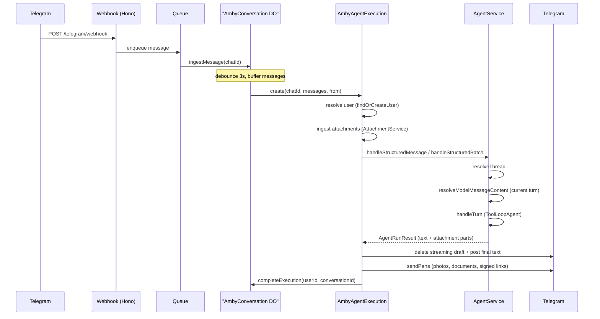
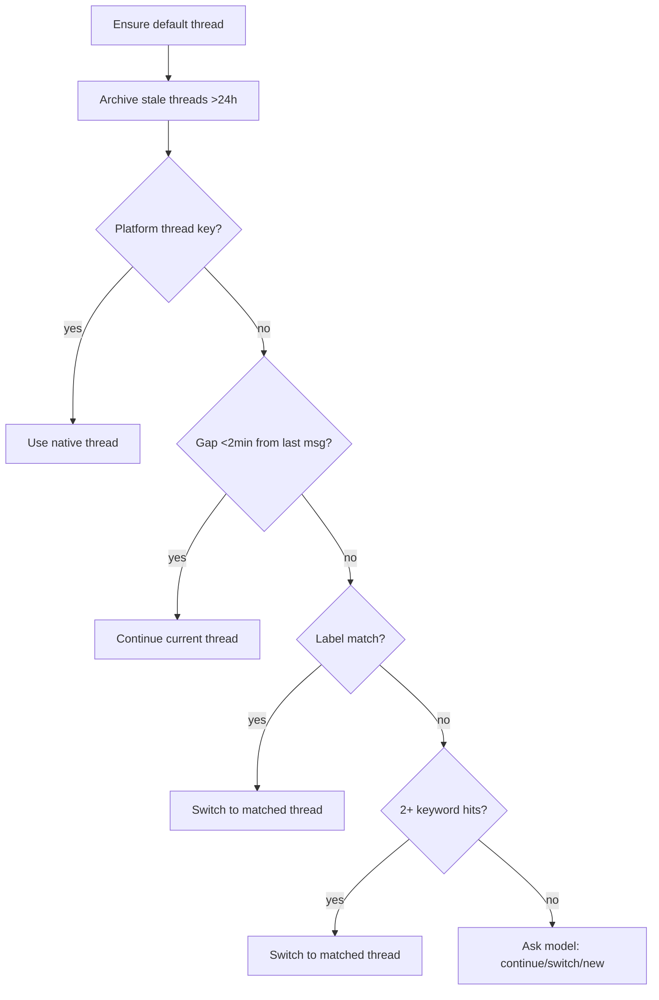
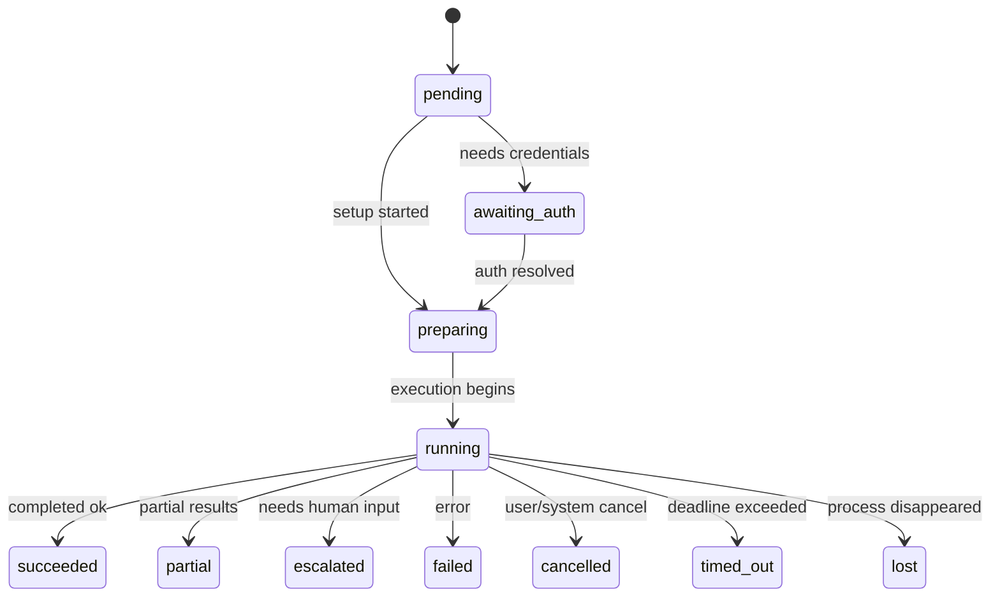
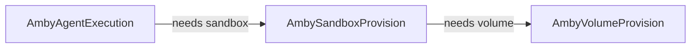

# Runtime

How a user message becomes an agent response.

## System overview

## Durable Object: AmbyConversation

One instance per Telegram chat. Provides:

- **Message buffering** -- collects rapid-fire messages into a batch
- **Debounce** -- 3s idle timer (1s when resuming after a completed run)
- **Single-flight execution** -- only one active workflow per chat
- **Interrupt forwarding** -- messages arriving during execution are sent as workflow events

States: `idle` -> `debouncing` -> `processing` -> `idle`

## AmbyAgentExecution

Cloudflare Workflow with durable steps and retry:

| Step | What it does |
|------|-------------|
| `resolve-user` | Map Telegram identity to DB user via `findOrCreateUser` |
| `agent-loop` | Ingest attachments, run ConversationRuntime with structured messages, stream reply, deliver final parts (retries: 3, backoff: exponential, timeout: 5 min) |
| `complete` | Notify DO that execution finished |

The `agent-loop` step handles attachment ingest (`AttachmentService.ingestBufferedMessages`), calls `handleStructuredMessage` / `handleStructuredBatch` on the agent, and sends final reply parts through `ReplySender`.

Streaming: posts first chunk, then edits every 500ms. The streaming preview is capped at 4090 characters. On finalization, the streaming draft is deleted and the final response is posted fresh (which splits at Telegram's 4096-character limit when needed). Attachment parts are sent after the text reply via `sendParts`.

## Thread routing

`resolveThread()` runs a 4-stage pipeline:

Config constants:

- `GAP_CONTINUE_MS` = 2 min (auto-continue threshold)
- `DORMANT_MS` = 1 hour (triggers synopsis on resume)
- `STALE_ARCHIVE_MS` = 24 hours (auto-archive)
- `OPEN_THREADS_CAP` = 10

## Context assembly

`prepareConversationContext()` builds the prompt from:

- **User memory** -- static + dynamic profile via MemoryService, deduplicated
- **Thread history** -- 20-message tail for the active thread
- **Other thread summaries** -- synopses from sibling threads
- **Resumed thread synopsis** -- included when thread was dormant
- **Thread artifacts** -- recent file/artifact recap
- **Current date/time** -- formatted in user timezone

Output: system prompt + message history array + shared context string for sub-agents.

## Agent turn loop

The conversation agent is a `ToolLoopAgent` (Vercel AI SDK):

- **Max steps:** 8 (`CONVERSATION_MAX_STEPS`)
- **Max tool calls per run:** 32
- **Tools available:**
  - `search_memories` -- recall from long-term memory
  - `send_message` -- incremental reply to user
  - `execute_plan` -- delegate to specialist execution (one per turn)
  - `query_execution` -- inspect running/completed tasks
- **Step gate:** after `execute_plan` or `query_execution` fires, all tools are disabled (forces the agent to synthesize)

Streaming: when enabled, text deltas are forwarded to the workflow for live Telegram edits.

## Execution planner

`execute_plan` triggers `buildExecutionPlan()` which routes to specialists:

| Mode | When | Behavior |
|------|------|----------|
| `direct` | No specialist needed | Conversation agent answers directly |
| `sequential` | Single specialist or ordered chain | Tasks run one after another |
| `parallel` | Independent read-heavy tasks (e.g. multiple URLs) | Tasks run concurrently |
| `background` | User requests long-running autonomous work | Handed off to sandbox, returns immediately |

Routing is heuristic-first (regex pattern matching on request text). Falls back to model planner when the heuristic produces 3+ tasks or the user explicitly asks for planning.

**Specialists:** conversation, planner, research, builder, integration, computer, browser, memory, settings, validator

Each specialist has a defined `runnerKind` (in_process, browser, background_handoff), tool groups, model selection, and step budget.

## Task lifecycle

Runtimes: `in_process` | `browser` | `sandbox`
Providers: `internal` | `stagehand` | `codex`

## Persistence touchpoints

| When | What is written |
|------|----------------|
| Thread resolution | Thread created/updated, stale threads archived with synopsis |
| User message received | `messages` row (role=user, with threadId + metadata) |
| Assistant response | `messages` row (role=assistant) if non-empty |
| Root trace created | `execution_traces` row with config, router decision |
| Each model step | Trace events: `model_request`, `model_response` |
| Tool calls/results | Trace events: `tool_call`, `tool_result` (flushed in batch) |
| Task created | `tasks` row (status=pending) |
| Task completed | `tasks` row updated, `task_events` appended |
| Run complete | Trace marked completed/failed with execution mode + status |
| Synopsis | Thread synopsis + keywords written on dormant switch or archive |

## Hierarchy

- **Conversation** = platform boundary (one per Telegram chat per user)
- **Thread** = internal routing group (sources: derived, native, reply_chain, manual)
- **Run** = one LLM coordination pass (one ToolLoopAgent invocation)
- **Task** = durable work unit dispatched to a specialist runner

## Key runtime invariants

- One active workflow per chat (enforced by DO)
- Thread routing runs before every agent turn
- Context is rebuilt fresh each turn (no stale prompt caching)
- `execute_plan` can fire at most once per conversation turn
- After execution boundary tools fire, all tools are disabled for remaining steps
- Messages are persisted only after the agent completes (not optimistically)
- Workflow step retries use exponential backoff (max 3 retries, 5 min timeout)
- DO caches resolved userId and conversationId across runs

## Infrastructure workflows

Two additional Cloudflare Workflows handle compute provisioning:

| Workflow | Responsibility |
|----------|---------------|
| `AmbySandboxProvision` | Ensure user has a valid main sandbox on correct volume |
| `AmbyVolumeProvision` | Ensure per-user persistent volume exists and is ready |

Stale/invalid sandboxes and unusable volumes are replaced automatically.
