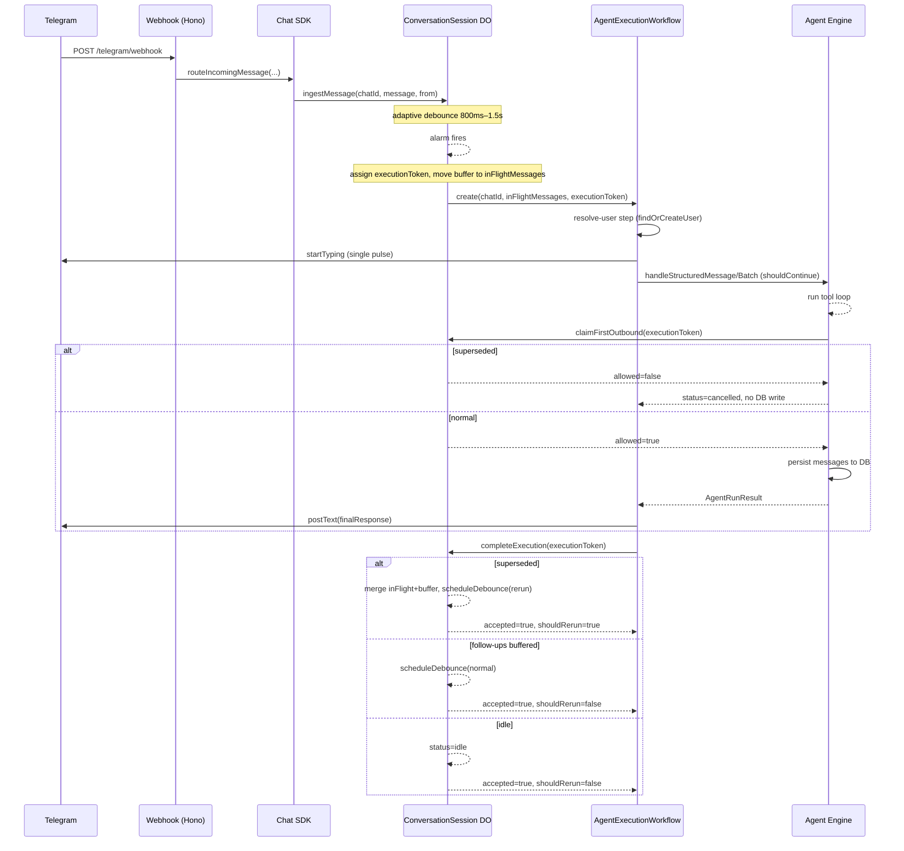
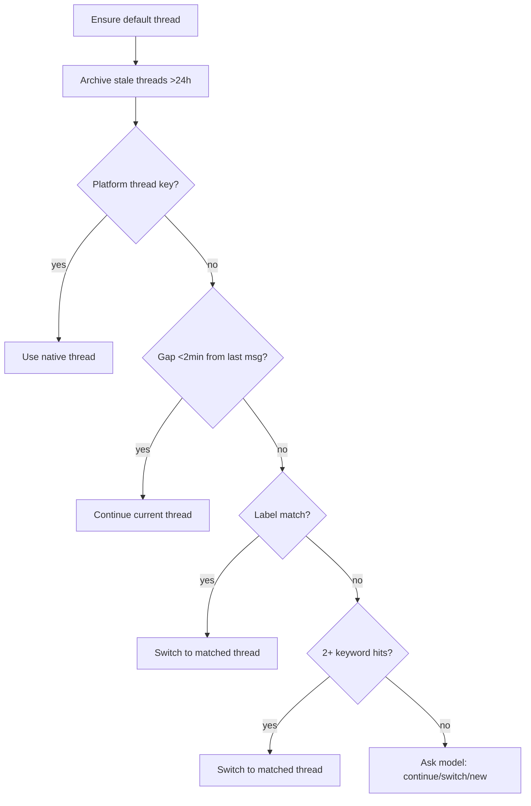
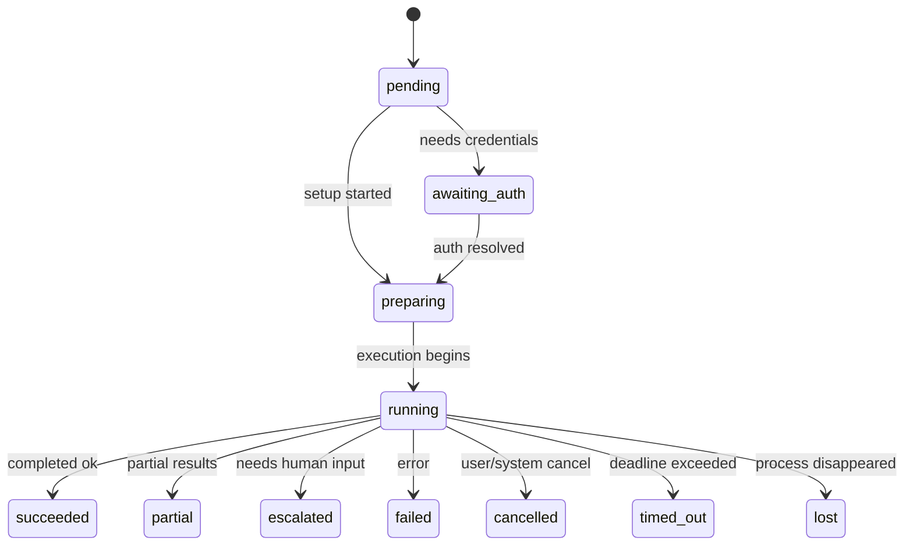

# Runtime

How a user message becomes an agent response.

## System overview

## Durable Object: ConversationSession

One instance per Telegram chat. Provides:

- **Message buffering** -- collects rapid-fire messages into a batch
- **Adaptive debounce** -- 800ms base, +400ms per additional message, 1500ms cap, 250ms rerun debounce
- **Single-flight execution** -- only one active workflow per chat; assigns an execution token on start
- **Mid-run buffering** -- messages arriving during execution are buffered for the next turn or trigger supersession

States: `idle` -> `debouncing` -> `processing` -> `idle`

Ingress: `worker.ts` -> `chat-sdk.ts` -> DO via direct webhook (no queue).

## AgentExecutionWorkflow

Cloudflare Workflow with durable steps and retry:

| Step | What it does |
|------|-------------|
| `resolve-user` | Map Telegram identity to DB user via `findOrCreateUser` (identity resolution happens here, not pre-DO) |
| `agent-loop` | Ingest attachments, run ConversationRuntime with structured messages, deliver final response (retries: 3, backoff: exponential, timeout: 5 min) |
| `complete` | Notify DO that execution finished via `completeExecution(executionToken)` |

The DO assigns an **execution token** when starting a workflow. The workflow must call `claimFirstOutbound(executionToken)` before any visible send or DB persistence. This prevents stale output from a superseded run and stale history from leaking into subsequent turns.

The `agent-loop` step sends a single typing pulse, ingests attachments (`AttachmentService.ingestBufferedMessages`), calls `handleStructuredMessage` / `handleStructuredBatch` on the agent (passing `ensureOutbound` as a callback), and sends the final text + attachment parts through `ReplySender`.

**Supersession:** when a user sends a correction (prefix-matched: "wait", "actually", "sorry", "i meant", "ignore that", "correction", "to clarify", "instead") before the first outbound is claimed, the current run is superseded. On completion, in-flight messages and the buffer are merged for a rerun with a 250ms debounce.

**Persistence checkpoint:** the engine calls `shouldContinue` before persisting messages. If denied (superseded), a `cancelled` `AgentRunResult` is returned with no DB writes.

**Delivery:** a single typing indicator is sent at workflow start. The final response is posted via `postText` (split at Telegram's 4096-character limit when needed). Attachment parts are sent after the text reply via `sendParts`. After first outbound is claimed, delivery errors are caught and logged but not rethrown (prevents step retries from duplicating visible output).

## Thread routing

`resolveThread()` runs a 4-stage pipeline:

Config constants:

- `GAP_CONTINUE_MS` = 2 min (auto-continue threshold)
- `DORMANT_MS` = 1 hour (triggers synopsis on resume)
- `STALE_ARCHIVE_MS` = 24 hours (auto-archive)
- `OPEN_THREADS_CAP` = 10

## Context assembly

`prepareConversationContext()` builds the prompt from:

- **User memory** -- static + dynamic profile via MemoryService, deduplicated
- **Thread history** -- 20-message tail for the active thread
- **Other thread summaries** -- synopses from sibling threads
- **Resumed thread synopsis** -- included when thread was dormant
- **Thread artifacts** -- recent file/artifact recap
- **Current date/time** -- formatted in user timezone

Output: system prompt + message history array + shared context string for sub-agents.

## Agent turn loop

The conversation agent is a `ToolLoopAgent` (Vercel AI SDK):

- **Max steps:** 8 (`CONVERSATION_MAX_STEPS`)
- **Max tool calls per run:** 32
- **Tools available:**
  - `search_memories` -- recall from long-term memory
  - `send_message` -- incremental reply to user
  - `execute_plan` -- delegate to specialist execution (one per turn)
  - `query_execution` -- inspect running/completed tasks
- **Step gate:** after `execute_plan` or `query_execution` fires, all tools are disabled (forces the agent to synthesize)

The engine calls `shouldContinue` before persisting; if the callback returns false (superseded), it returns a `cancelled` result without DB writes.

## Execution planner

`execute_plan` triggers `buildExecutionPlan()` which routes to specialists:

| Mode | When | Behavior |
|------|------|----------|
| `direct` | No specialist needed | Conversation agent answers directly |
| `sequential` | Single specialist or ordered chain | Tasks run one after another |
| `parallel` | Independent read-heavy tasks (e.g. multiple URLs) | Tasks run concurrently |
| `background` | User requests long-running autonomous work | Handed off to sandbox, returns immediately |

Routing is heuristic-first (regex pattern matching on request text). Falls back to model planner when the heuristic produces 3+ tasks or the user explicitly asks for planning.

**Specialists:** conversation, planner, research, builder, integration, computer, browser, memory, settings, validator

Each specialist has a defined `runnerKind` (in_process, browser, background_handoff), tool groups, model selection, and step budget.

## Task lifecycle

Runtimes: `in_process` | `browser` | `sandbox`
Providers: `internal` | `stagehand` | `codex`

## Persistence touchpoints

| When | What is written |
|------|----------------|
| Thread resolution | Thread created/updated, stale threads archived with synopsis |
| User message received | `messages` row (role=user, with threadId + metadata) |
| Assistant response | `messages` row (role=assistant) if non-empty |
| Root trace created | `execution_traces` row with config, router decision |
| Each model step | Trace events: `model_request`, `model_response` |
| Tool calls/results | Trace events: `tool_call`, `tool_result` (flushed in batch) |
| Task created | `tasks` row (status=pending) |
| Task completed | `tasks` row updated, `task_events` appended |
| Run complete | Trace marked completed/failed with execution mode + status |
| Synopsis | Thread synopsis + keywords written on dormant switch or archive |

## Hierarchy

- **Conversation** = platform boundary (one per Telegram chat per user)
- **Thread** = internal routing group (sources: derived, native, reply_chain, manual)
- **Run** = one LLM coordination pass (one ToolLoopAgent invocation)
- **Task** = durable work unit dispatched to a specialist runner

## Workflow outcomes

A workflow run ends as one of: `completed`, `failed`, `cancelled` (superseded by a correction before first outbound was claimed).

## Key runtime invariants

- One active workflow per chat (enforced by DO with execution token)
- Workflow must `claimFirstOutbound` before any visible send or DB persistence
- `shouldContinue` is checked before persisting messages; superseded runs write nothing
- Thread routing runs before every agent turn
- Context is rebuilt fresh each turn (no stale prompt caching)
- `execute_plan` can fire at most once per conversation turn
- After execution boundary tools fire, all tools are disabled for remaining steps
- Messages are persisted only after the agent completes (not optimistically)
- Workflow step retries use exponential backoff (max 3 retries, 5 min timeout)
- DO caches resolved userId and conversationId across runs

## Infrastructure workflows

Two additional Cloudflare Workflows handle compute provisioning:

| Workflow | Responsibility |
|----------|---------------|
| `SandboxProvisionWorkflow` | Ensure user has a valid main sandbox on correct volume |
| `VolumeProvisionWorkflow` | Ensure per-user persistent volume exists and is ready |

Stale/invalid sandboxes and unusable volumes are replaced automatically.
