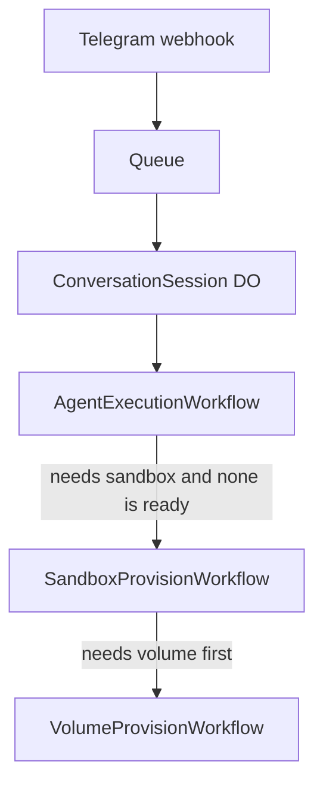
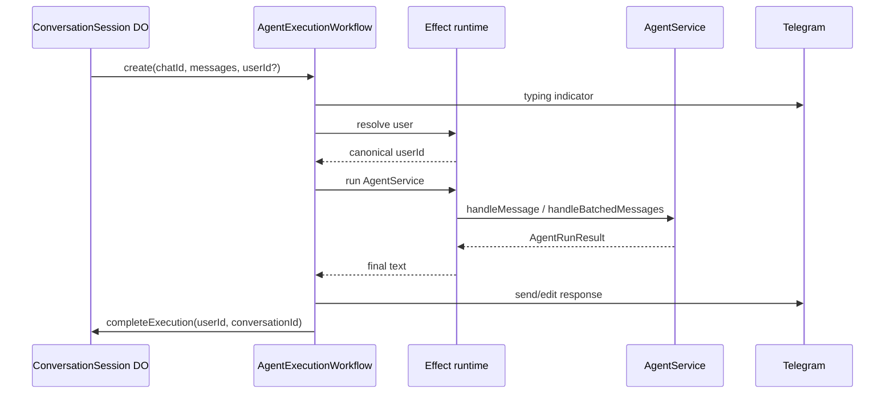
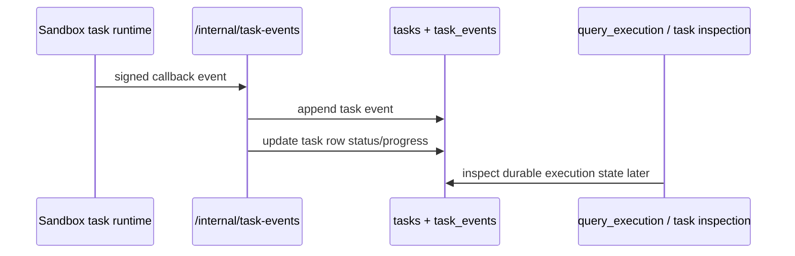

# Workflows

Workflows are the durable orchestration layer of Amby's production runtime.

They exist to make message handling, compute provisioning, and long-running coordination reliable under retries, failures, and process restarts.

This page should document **application workflows**, not product aspirations.

## Current workflow set

The production code currently exposes three workflow classes:
- `AgentExecutionWorkflow`
- `SandboxProvisionWorkflow`
- `VolumeProvisionWorkflow`

That should be the top-level frame of the page.

## Workflow roles

| Workflow | Responsibility |
|---|---|
| `AgentExecutionWorkflow` | durable agent execution for one buffered user request batch |
| `SandboxProvisionWorkflow` | ensure the user has a valid main sandbox on the correct volume |
| `VolumeProvisionWorkflow` | ensure the user volume exists and becomes ready |

## Canonical production flow

## 1. AgentExecutionWorkflow

This workflow is the durable application wrapper around one user-facing agent run.

### Responsibilities
- send typing indicators,
- resolve the user identity,
- ensure or create the conversation,
- invoke the agent runtime,
- stream Telegram output when supported,
- notify the Durable Object when execution completes.

### Important current behavior

- batched inbound messages are passed to `handleBatchedMessages`,
- single inbound messages use `handleMessage`,
- workflow steps retry with backoff,
- the workflow can stream partial text by posting/editing Telegram messages,
- workflow completion resets the per-chat session coordinator.

### Canonical sequence

## 2. SandboxProvisionWorkflow

This workflow creates or repairs the user's main sandbox.

The key architectural truth is:

> Sandbox provisioning is no longer just "create a sandbox." It is "ensure the correct volume exists, then ensure a valid main sandbox is mounted on it."

### Responsibilities
- ensure a DB-backed volume record exists,
- trigger `VolumeProvisionWorkflow` when the volume is not ready,
- adopt a valid sandbox if one already exists,
- replace stale or invalid sandboxes,
- poll until the sandbox reaches a started state,
- ensure required mounted-home directories exist,
- persist main sandbox state in the DB.

### Current important behavior

- stale or invalid sandboxes are deleted and recreated,
- wrong-volume sandboxes are replaced,
- error-state sandboxes are replaced,
- mounted home layout is ensured after startup,
- the snapshot version is persisted with the sandbox row.

## 3. VolumeProvisionWorkflow

This workflow ensures the persistent per-user volume exists and becomes usable.

### Responsibilities
- create or recover a healthy volume,
- poll until the volume reaches `ready`,
- persist the volume row state,
- notify the parent sandbox workflow once ready.

### Current important behavior

- unusable volumes are replaced,
- the parent sandbox workflow is notified via an explicit workflow event,
- volume readiness is treated as a prerequisite for sandbox correctness.

## Durable Object coordination

The workflows page should also explain that workflows are not launched directly from the webhook path. A per-chat Durable Object sits in front of agent execution.

That object currently provides:
- message buffering,
- debounce timing,
- single active workflow tracking per chat,
- interrupt forwarding during in-flight execution.

That is not incidental. It is part of the runtime design.

## Internal task callback flow

The Worker also exposes an internal task events endpoint used by sandbox task execution.

That belongs here because it is part of workflow-adjacent orchestration even though it is not itself a Cloudflare Workflow.

## Why this layer exists

This page should say this plainly:

- queues decouple webhooks from execution,
- Durable Objects serialize per-conversation activity,
- workflows make expensive runs durable and retryable,
- provisioning workflows isolate infra setup from user-facing agent logic.

That is the correct reason for this stack.

## Near-future workflow direction

These are the right near-future statements:

- more channel-specific entry workflows can reuse the same agent core,
- infra workflows can grow to include recovery, cleanup, and migration tasks,
- user-visible reminders and scheduled actions may eventually route through the same durable workflow boundary as inbound conversation runs.

## Open questions

1. Should proactive scheduled work execute through `AgentExecutionWorkflow`, or through a separate workflow dedicated to non-conversational triggers?
2. Should sandbox and volume provisioning remain separate workflows long term, or collapse into one user-compute workflow once the contract stabilizes?
3. Should the Durable Object remain Telegram-specific, or be generalized into a channel-agnostic conversation session coordinator?
