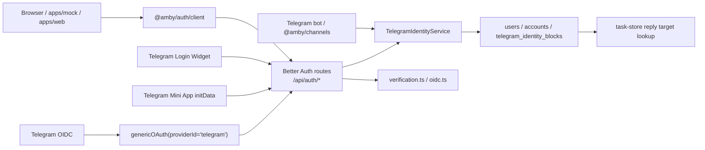
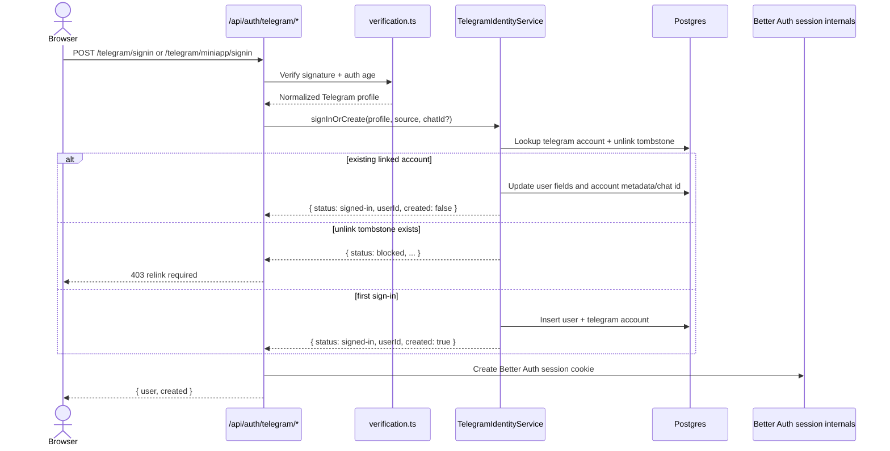
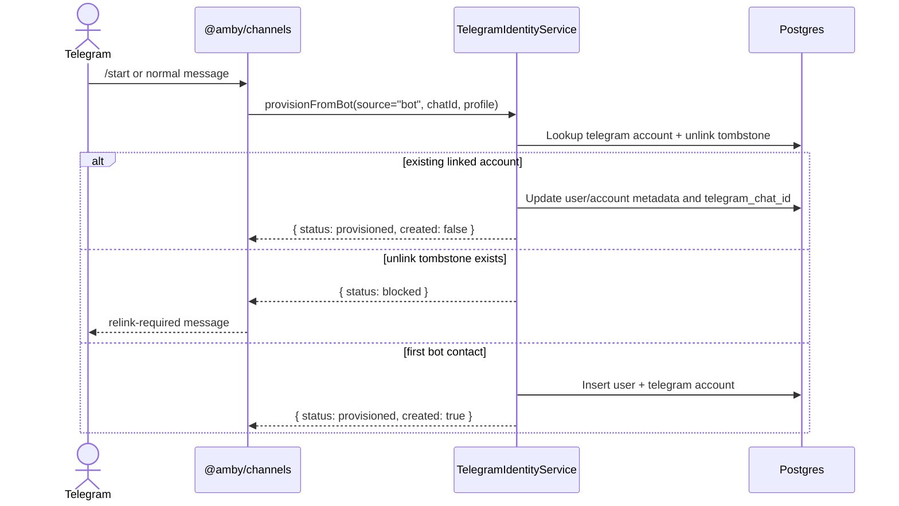
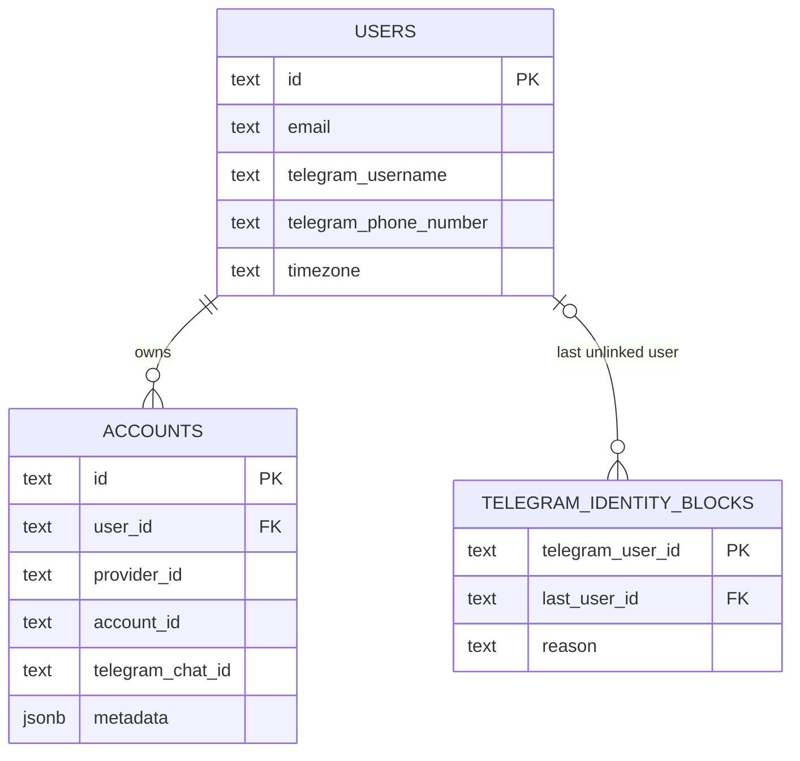

# Telegram Auth

Telegram auth is owned by `@amby/auth`. Browser sign-in, Mini App sign-in, Telegram OIDC, and bot-first provisioning all converge on the same Better Auth account model and the same identity service.

## Core invariants

- The canonical Telegram identity lives in `accounts` with `provider_id = "telegram"` and `account_id = <telegram user id>`.
- The latest delivery target lives in `accounts.telegram_chat_id`. It is not derived from `accounts.metadata`.
- Intentional unlinks are recorded in `telegram_identity_blocks`. A block means bot traffic and unauthenticated browser sign-in must not recreate the link.
- Only authenticated `linkTelegram()` clears a block for a previously unlinked Telegram identity.
- Browser code should import `createAmbyAuthClient` from `@amby/auth/client`, not the package root, so client bundles do not pull in server-only auth modules.

## Runtime map

## Main pieces

| Area | Files | Responsibility |
| --- | --- | --- |
| Auth composition | `packages/auth/src/create-auth.ts` | Builds Better Auth with the first-party Telegram plugin and optional Telegram OIDC config. |
| Server endpoints | `packages/auth/src/telegram/plugin.ts` | Exposes `/telegram/config`, `/telegram/signin`, `/telegram/link`, `/telegram/unlink`, `/telegram/miniapp/signin`, and `/telegram/miniapp/validate`. |
| Identity ownership | `packages/auth/src/telegram/identity-service.ts` | Owns Telegram account lookup, create/link/unlink rules, tombstones, and chat-id updates. |
| Policy | `packages/auth/src/telegram/identity-policy.ts` | Encodes unlink safety, relink blocking, and linking conflict rules. |
| Verification | `packages/auth/src/telegram/verification.ts` | Verifies Login Widget HMACs and Mini App `initData`, and normalizes profiles. |
| OIDC | `packages/auth/src/telegram/oidc.ts` | Verifies Telegram `id_token` signatures and gates OIDC through the same unlink-aware identity policy. |
| Browser client | `packages/auth/src/client.ts` | Adds Telegram client helpers and widget bootstrap on top of Better Auth client APIs. |
| API mounting | `apps/api/src/index.ts`, `apps/api/src/worker.ts` | Mounts Better Auth on `/api/auth/*` with trusted-origin CORS. |
| Bot caller | `packages/channels/src/telegram/utils.ts` | Uses `TelegramIdentityService.provisionFromBot()` instead of writing auth rows directly. |
| Storage | `packages/db/src/schema/users.ts`, `packages/db/src/schema/telegram-auth.ts` | Defines typed Telegram fields and unlink tombstones. |

## Browser sign-in flow

The Login Widget and Mini App flows are explicit sign-in surfaces. They may create a new user, sign into an existing linked user, or reject the request if the Telegram identity was intentionally unlinked.

Notes:

- `linkTelegram()` requires an existing Better Auth session and never creates a second user.
- `unlinkTelegram()` is only allowed when the user has another auth method; otherwise unlink is rejected.
- `getTelegramConfig()` reports which Telegram surfaces are enabled from env.

## Bot provisioning flow

Bot traffic is not allowed to silently relink a Telegram identity that the user intentionally removed from the app.

## OIDC flow

Telegram OIDC is wired through Better Auth `genericOAuth`, but Amby still applies the unlink policy before Better Auth is allowed to create or relink the provider account.

- `createTelegramOidcConfig()` loads Telegram discovery and JWKS, verifies the `id_token`, and maps claims to Better Auth user fields.
- `getUserInfo()` calls `telegramIdentity.getSignInState(profile.id)`.
- If that state is `blocked`, `getUserInfo()` returns `null`, which prevents the generic OAuth callback from recreating the Telegram account after unlink.
- If OIDC is enabled, the provider id is still `telegram`, so all Telegram flows share one canonical `accounts` row shape.

## Data model

Important fields:

- `users.telegram_username` and `users.telegram_phone_number` are typed mirrors of Telegram identity data.
- `accounts.telegram_chat_id` is the current outbound reply target for Telegram delivery.
- `accounts.metadata` still stores non-canonical Telegram context such as names, premium flag, photo URL, and the last source.
- Migration `0012_dear_big_bertha.sql` backfills `accounts.telegram_chat_id` from legacy `metadata.chatId` so existing users continue receiving Telegram replies after deploy.

## API and config invariants

- Better Auth is mounted on the API origin at `/api/auth/*` in both the Node runtime and the Cloudflare Worker runtime.
- `BETTER_AUTH_URL` must be the API origin root, not the web origin. Better Auth appends `/api/auth` itself.
- Trusted origins are derived from `APP_URL`, `API_URL`, and `BETTER_AUTH_URL`, with extra localhost origins allowed in non-production.
- Telegram Login Widget requires `TELEGRAM_BOT_TOKEN`, `TELEGRAM_BOT_USERNAME`, and `TELEGRAM_LOGIN_WIDGET_ENABLED=true`.
- Telegram Mini App sign-in requires `TELEGRAM_MINI_APP_ENABLED=true`.
- Telegram OIDC requires `TELEGRAM_OIDC_CLIENT_SECRET` and either `TELEGRAM_OIDC_CLIENT_ID` or a bot-token-derived fallback client id.

## Caller guidance

- Use `TelegramIdentityService.provisionFromBot()` for bot traffic.
- Use `createAmbyAuthClient()` from `@amby/auth/client` for browser flows.
- Use `accounts.telegram_chat_id` when resolving Telegram delivery targets.
- Treat `TELEGRAM_RELINK_REQUIRED_MESSAGE` as a product rule, not just a transport error string.
