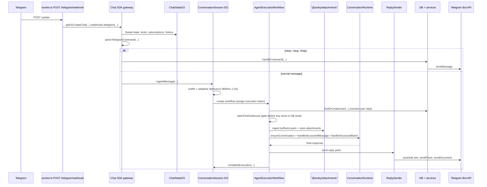
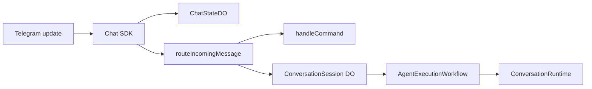
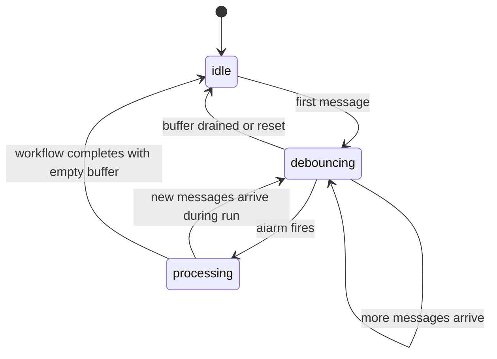

# Telegram Channel

This document explains the Telegram channel end to end: where messages enter, how commands and normal text diverge, which runtime owns each piece of state, and how replies get back to the user.

For the generalized attachment model, storage, sandbox, and delivery path, see [../chat/attachments.md](../chat/attachments.md).

## Scope

This doc covers:

- the production Cloudflare Worker path
- the local Bun dev path
- command handling
- normal message handling, including attachment-bearing messages
- Telegram-specific state ownership
- local mock testing

It does not explain the full agent internals in depth. For that, see [../AGENT.md](../AGENT.md) and [../RUNTIME.md](../RUNTIME.md).

## Mental model

Telegram logic is a transport boundary. It is responsible for:

- accepting Telegram updates
- verifying and parsing them through `@chat-adapter/telegram`
- deciding whether a message is a simple command or a normal user message
- converting supported Telegram media into structured buffered message parts
- mapping Telegram identity to an Amby user and conversation
- delivering replies back through the Telegram Bot API

Telegram logic is not responsible for:

- long-term memory
- execution planning
- browser or sandbox work
- application business logic outside the channel boundary

## Entry points

| Runtime | File | When it is used | Core difference |
|---|---|---|---|
| Cloudflare Worker | `apps/api/src/worker.ts` | production-style runtime and `wrangler dev` | uses `ChatStateDO`, `ConversationSession`, and `AgentExecutionWorkflow` |
| Bun | `apps/api/src/index.ts` | local Bun-only development | uses `createAmbyBot()` and in-memory Chat SDK state |

## Production Worker flow

## Step by step

### 1. Webhook entry

`apps/api/src/worker.ts` exposes `POST /telegram/webhook`.

That route does three things:

1. creates or reuses the Worker Chat SDK singleton via `getOrCreateChat(...)`
2. injects the Worker-only Chat SDK state adapter backed by `ChatStateDO`
3. hands the raw request to `chat.webhooks.telegram(...)`

At this point the raw HTTP request leaves Hono and enters the Chat SDK plus `@chat-adapter/telegram`.

### 2. Chat SDK bootstrap

`packages/channels/src/telegram/chat-sdk.ts` creates a singleton `Chat` instance in webhook mode.

Important responsibilities here:

- configure the Telegram adapter with bot token, API base URL, and webhook secret
- keep Chat SDK thread/subscription state in the injected `StateAdapter`
- subscribe to new mentions
- ignore messages authored by the bot itself
- route accepted messages into `routeIncomingMessage(...)`

The Worker path uses a dedicated `ChatStateDO` through `createCloudflareChatState(...)`.

### 3. Chat SDK state ownership

`ChatStateDO` is not the business workflow state. It only stores Chat SDK transport state.

`ChatStateDO` owns:

- thread subscriptions
- thread locks
- small cached values and dedupe keys
- Chat SDK list/history storage

`ConversationSession` owns:

- the per-chat message buffer
- debounce timing
- active workflow id
- cached `userId` and `conversationId`

Keeping them separate matters because they solve different problems.

### 4. Command vs normal message split

`routeIncomingMessage(...)` extracts:

- `from`
- `chatId`
- structured buffered message parts
- `message_id`
- `date`

Then it runs `parseTelegramCommand(text, env.TELEGRAM_BOT_USERNAME)`.

#### Command path

Supported commands live in `packages/channels/src/telegram/utils.ts`:

- `/start`
- `/stop`
- `/help`

`handleCommand(...)` does the following:

1. resolves or creates the Amby user with `findOrCreateUser(...)`
2. uses `TelegramSender` to reply through the Telegram Bot API
3. on `/start`, ensures the Telegram conversation exists and may kick off sandbox provisioning
4. on `/start <payload>`, treats the payload as an integration callback helper and sends a follow-up status message
5. on `/stop` and `/help`, sends simple inline replies

Commands do not go through the buffering Durable Object or the agent workflow.

#### Normal message path

If the message is not a command and can be normalized into a `BufferedInboundMessage`, `routeIncomingMessage(...)` forwards it to `ConversationSession.ingestMessage(...)` using one Durable Object instance per Telegram chat id. Identity resolution (`findOrCreateUser`) no longer happens before routing to the DO -- it is handled by the workflow's `resolve-user` step.

For v1 this includes:

- plain text
- photos
- PDFs
- small text-like documents such as `.txt`, `.md`, `.csv`, and `.json`

Unsupported files are still buffered as attachment descriptors so the workflow can store them and stage them for sandbox fallback.

### 5. Per-chat buffering and debounce

`apps/api/src/durable-objects/conversation-session.ts` is the control point for normal user messages.

It buffers incoming messages and uses alarms to debounce bursts of input before starting agent work.

Key behavior:

- first message starts an 800ms base debounce window
- each additional message extends the debounce by 400ms, up to a 1500ms cap
- Telegram media groups are merged into one buffered turn when they share a `media_group_id`
- messages arriving during processing are buffered (no event forwarding to the workflow); they feed the next turn or trigger supersession
- when the workflow completes with buffered follow-up messages, a 250ms rerun debounce is used

#### Execution token and `claimFirstOutbound`

The DO assigns an execution token when starting a workflow. The workflow must call `claimFirstOutbound` before performing any visible send or DB persistence. This gate prevents stale output from a superseded run and stale history from leaking into subsequent turns.

#### Supersession

When a user sends a correction before the first outbound is claimed, the current run is superseded. Correction messages are prefix-matched against: "wait", "actually", "sorry", "i meant", "ignore that", "correction", "to clarify", "instead". On completion of the superseded run, in-flight messages and the buffer are merged for a rerun. The `shouldContinue` persistence checkpoint prevents the superseded run from writing to the DB.

### 6. Durable workflow execution

When the debounce alarm fires, `ConversationSession` starts `AgentExecutionWorkflow`.

`apps/api/src/workflows/agent-execution.ts` then:

1. sends a single typing pulse (no recurring interval)
2. resolves the user with `findOrCreateUser(...)` (the `resolve-user` step -- identity resolution happens here, not pre-DO)
3. calls `claimFirstOutbound` to acquire the execution gate before any visible send or DB write
4. ingests buffered attachment descriptors into private storage after user resolution
5. builds compact routing text plus current-turn structured parts
6. calls `ConversationRuntime` through the agent runtime
7. delivers the final text response via `postText` (split across messages if > 4096 chars) and any attachment parts via `sendParts`
8. sends remaining reply parts through `ReplySender`, using native Telegram photo/document delivery when possible
9. falls back to signed Amby download links for unsupported outbound files
10. tells `ConversationSession` that execution finished

The workflow is where Telegram delivery, attachment ingest, and agent execution meet.

## Identity and persistence

Telegram identity is translated into Amby entities in a stable way.

| Layer | Key | Meaning |
|---|---|---|
| Telegram user | `from.id` | Telegram account id |
| Amby account | `providerId="telegram"` + `accountId=String(from.id)` | external account link |
| Amby user | `users.id` | durable user id |
| Conversation | `platform="telegram"` + `externalConversationKey=String(chatId)` | one conversation per Telegram chat |

`findOrCreateUser(...)`:

- updates account metadata on every message
- creates the user and account transactionally if needed
- infers a best-effort timezone from Telegram `language_code`

## Outbound message rules

Telegram replies leave the system through `@chat-adapter/telegram`.

There are two main outbound styles:

- command replies via `TelegramSender`
- workflow replies via `ReplySender`

Long final text responses are split with `splitTelegramMessage(...)` to fit Telegram's 4096-character message limit. Images go through `sendPhoto`, documents go through `sendDocument`, and unsupported outbound files fall back to signed attachment URLs.

A single typing indicator is sent at workflow start. The final response is delivered via `postText`, which splits at Telegram's 4096-character limit when needed. Attachment parts are sent after the text reply via `sendParts`.

Each attachment part in `sendParts` is error-isolated: if delivery fails for one part (including the signed-URL fallback), the remaining parts still attempt delivery.

## Local Bun path

Local Bun dev keeps the Telegram flow simpler.

Differences from the Worker path:

- uses `createAmbyBot()` in `packages/channels/src/telegram/bot.ts`
- keeps Chat SDK state in memory with `createMemoryState()`
- does not use `ChatStateDO`
- does not use `ConversationSession`
- does not use `AgentExecutionWorkflow`

This path is for local development convenience, not for production durability.

## Local mock testing

`apps/mock` emulates the Telegram boundary for local testing.

It does two useful things:

- constructs realistic `TelegramUpdate` payloads
- captures outbound Bot API calls so you can inspect replies in a browser UI

Use it when you want to test Telegram behavior without a real Telegram chat.

## Key files

| File | Role |
|---|---|
| `apps/api/src/worker.ts` | Worker webhook entrypoint |
| `packages/channels/src/telegram/chat-sdk.ts` | shared Worker Chat SDK bootstrap and routing |
| `apps/api/src/chat-state/cloudflare-chat-state.ts` | Worker-facing Chat SDK state adapter |
| `apps/api/src/durable-objects/chat-state.ts` | durable Chat SDK state storage |
| `apps/api/src/durable-objects/conversation-session.ts` | per-chat buffer and debounce controller |
| `apps/api/src/workflows/agent-execution.ts` | durable agent execution and Telegram streaming |
| `packages/channels/src/telegram/utils.ts` | command parsing, user lookup, conversation creation |
| `packages/channels/src/telegram/sender.ts` | Telegram send/typing service |
| `apps/api/src/index.ts` | local Bun entrypoint |
| `packages/channels/src/telegram/bot.ts` | Bun-only Telegram bot path |

## Related docs

- [../ARCHITECTURE.md](../ARCHITECTURE.md)
- [../RUNTIME.md](../RUNTIME.md)
- [../AGENT.md](../AGENT.md)
