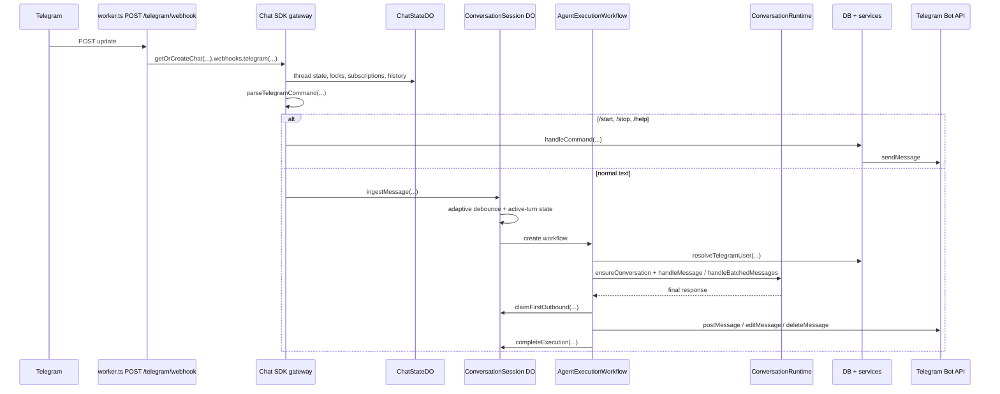
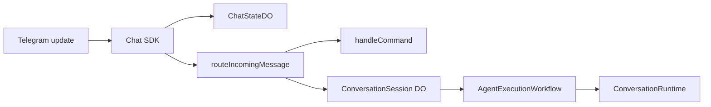
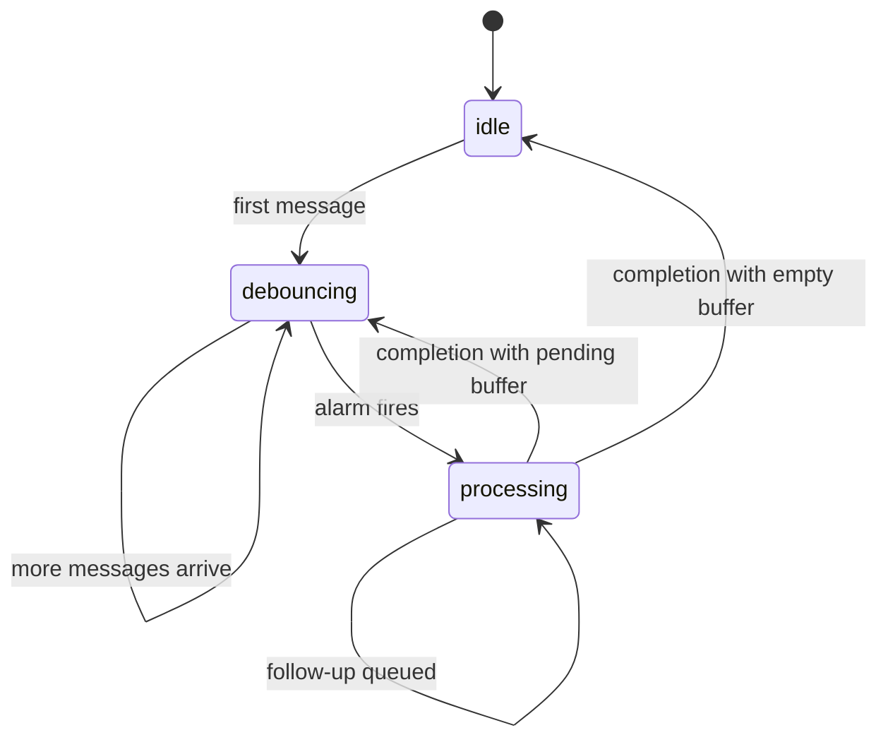
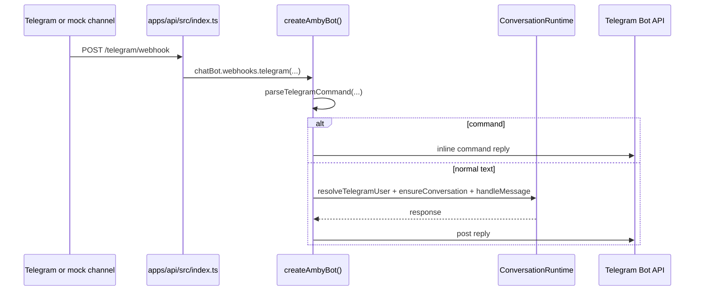

# Telegram Channel

This document explains the Telegram channel end to end: where messages enter, how commands and normal text diverge, which runtime owns each piece of state, and how replies get back to the user.

## Scope

This doc covers:

- the production Cloudflare Worker path
- the local Bun path
- command handling
- normal message handling
- Telegram-specific state ownership
- local mock testing

## Mental model

Telegram is a transport boundary. It is responsible for:

- accepting Telegram updates
- verifying and parsing them through `@chat-adapter/telegram`
- deciding whether a message is a simple command or normal user text
- mapping Telegram identity to an Amby user
- delivering replies back through the Telegram Bot API

Telegram is not responsible for:

- long-term memory
- execution planning
- browser or sandbox work
- business logic outside the channel boundary

## Entry points

| Runtime | File | When it is used | Core difference |
|---|---|---|---|
| Cloudflare Worker | `apps/api/src/worker.ts` | production and `wrangler dev` | uses `ChatStateDO`, `ConversationSession`, and `AgentExecutionWorkflow` |
| Bun | `apps/api/src/index.ts` | local Bun-only development | uses `createAmbyBot()` and in-memory Chat SDK state |

## Production Worker flow

## Step by step

### 1. Webhook entry

`apps/api/src/worker.ts` exposes `POST /telegram/webhook`.

That route:

1. creates or reuses the Worker Chat SDK singleton via `getOrCreateChat(...)`
2. injects the Worker-only Chat SDK state adapter backed by `ChatStateDO`
3. hands the raw request to `chat.webhooks.telegram(...)`

At that point the raw HTTP request leaves Hono and enters the Chat SDK plus `@chat-adapter/telegram`.

### 2. Chat SDK bootstrap

`packages/channels/src/telegram/chat-sdk.ts` creates a singleton `Chat` instance in webhook mode.

Responsibilities:

- configure the Telegram adapter with bot token, API base URL, and webhook secret
- keep Chat SDK thread and subscription state in the injected `StateAdapter`
- subscribe to new mentions
- ignore messages authored by the bot itself
- route accepted messages into `routeIncomingMessage(...)`

The Worker path uses `ChatStateDO` through `createCloudflareChatState(...)`.

### 3. Chat SDK state ownership

`ChatStateDO` stores Chat SDK transport state, not business workflow state.

`ChatStateDO` owns:

- thread subscriptions
- thread locks
- small cached values and dedupe keys
- Chat SDK list and history storage

`ConversationSession` owns:

- the per-chat message buffer
- adaptive debounce timing
- the active unsaved turn
- the active workflow id and execution token
- cached `userId` and `conversationId`
- first-outbound claim state
- supersession state

Keeping them separate matters because they solve different problems.

### 4. Command vs normal text split

`routeIncomingMessage(...)` extracts:

- `from`
- `chatId`
- `text`
- `message_id`
- `date`

Then it runs `parseTelegramCommand(text, env.TELEGRAM_BOT_USERNAME)`.

#### Command path

Supported commands live in `packages/channels/src/telegram/utils.ts`:

- `/start`
- `/stop`
- `/help`

`handleCommand(...)` resolves or creates the Amby user, replies through the Telegram Bot API, and may kick off sandbox provisioning. Commands do not go through `ConversationSession` or `AgentExecutionWorkflow`.

#### Normal text path

If the message is not a command and has text, `routeIncomingMessage(...)` forwards it straight to `ConversationSession.ingestMessage(...)`.

Important invariant: the Chat SDK does not resolve Telegram identity for normal text before the DO hop. Identity resolution happens once, inside the workflow.

### 5. Per-chat buffering, debounce, and supersession

`apps/api/src/durable-objects/conversation-session.ts` is the control point for normal text.

It buffers incoming messages and uses alarms to debounce bursts of input before starting agent work.

Debounce policy:

- first buffered message: `now + 800ms`
- each additional buffered message: `min(bufferStartedAt + 1500ms, now + 400ms)`
- rerun after completion with queued follow-up: `now + 250ms`

While processing:

- the DO preserves the unsaved active turn in `inFlightMessages`
- if first outbound has already been claimed, every follow-up queues for the next turn
- before first outbound, only narrow correction prefixes may supersede:
  - `wait`
  - `actually`
  - `sorry`
  - `i meant`
  - `ignore that`
  - `correction`
  - `to clarify`
  - `instead`
- ambiguous follow-ups queue without superseding

When a superseded execution completes, the next turn is rebuilt from:

`inFlightMessages + buffered follow-ups`

### 6. Durable workflow execution

When the debounce alarm fires, `ConversationSession` starts `AgentExecutionWorkflow`.

`apps/api/src/workflows/agent-execution.ts` then:

1. sends a typing indicator
2. resolves the user with `resolveTelegramUser(...)`
3. builds the input from the buffered message texts
4. calls `ConversationRuntime`
5. streams interim output by posting once and then editing every 500ms
6. splits long final messages to stay within Telegram limits
7. calls `completeExecution(executionToken, outcome)`

The workflow step that may produce visible Telegram output does not use workflow retries.

### 7. Atomic first-outbound claim

The workflow must call `claimFirstOutbound(executionToken)` before the first visible Telegram send path:

- relink-required reply
- tool or progress reply
- first streaming draft post
- first final text post when no draft exists
- error reply before any visible output exists

If the claim is denied because the execution is stale or superseded, the workflow suppresses visible output and completes silently.

## Identity and persistence

Telegram identity is translated into Amby entities in a stable way.

| Layer | Key | Meaning |
|---|---|---|
| Telegram user | `from.id` | Telegram account id |
| Amby account | `providerId="telegram"` + `accountId=String(from.id)` | external account link |
| Amby user | `users.id` | durable user id |
| Conversation | `platform="telegram"` + `externalConversationKey=String(chatId)` | one conversation per Telegram chat |

`resolveTelegramUser(...)`:

- updates account metadata on every message
- creates the user and account transactionally if needed
- returns a blocked status when a Telegram identity tombstone should prevent reprovisioning

## Outbound message rules

Telegram replies leave the system through `@chat-adapter/telegram`.

Outbound styles:

- command replies via `TelegramSender`
- workflow replies via `createTelegramAdapter(...).postMessage(...)`
- streamed workflow edits via `editMessage(...)`

Long final responses are split with `splitTelegramMessage(...)` to fit Telegram limits.

## Local Bun path

Local Bun development keeps the Telegram flow simpler.

Differences from the Worker path:

- uses `createAmbyBot()` in `packages/channels/src/telegram/bot.ts`
- keeps Chat SDK state in memory with `createMemoryState()`
- does not use `ChatStateDO`
- does not use `ConversationSession`
- does not use `AgentExecutionWorkflow`

This path is for local development convenience, not production durability.

## Local mock testing

`apps/mock` emulates the Telegram boundary for local testing.

It:

- constructs realistic `TelegramUpdate` payloads
- captures outbound Bot API calls so you can inspect replies in a browser UI

## Key files

| File | Role |
|---|---|
| `apps/api/src/worker.ts` | Worker webhook entrypoint |
| `packages/channels/src/telegram/chat-sdk.ts` | Worker Chat SDK bootstrap and routing |
| `apps/api/src/chat-state/cloudflare-chat-state.ts` | Worker-facing Chat SDK state adapter |
| `apps/api/src/durable-objects/chat-state.ts` | durable Chat SDK state storage |
| `apps/api/src/durable-objects/conversation-session.ts` | per-chat buffer, execution token, and supersession controller |
| `apps/api/src/workflows/agent-execution.ts` | durable agent execution and Telegram streaming |
| `apps/api/src/workflows/telegram-delivery.ts` | first-outbound claim and visible-delivery gating |
| `packages/channels/src/telegram/utils.ts` | command parsing and Telegram identity helpers |
| `packages/channels/src/telegram/sender.ts` | Telegram send and typing service |
| `apps/api/src/index.ts` | local Bun entrypoint |
| `packages/channels/src/telegram/bot.ts` | Bun-only Telegram bot path |

## Related docs

- [../ARCHITECTURE.md](../ARCHITECTURE.md)
- [../RUNTIME.md](../RUNTIME.md)
- [../AGENT.md](../AGENT.md)
