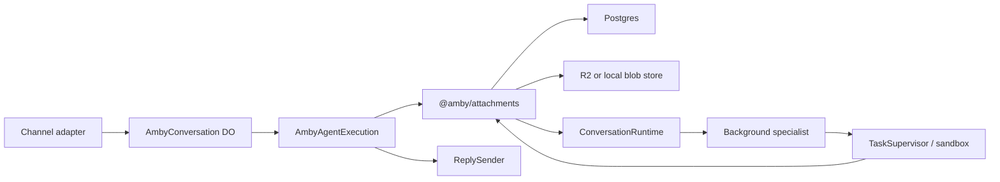
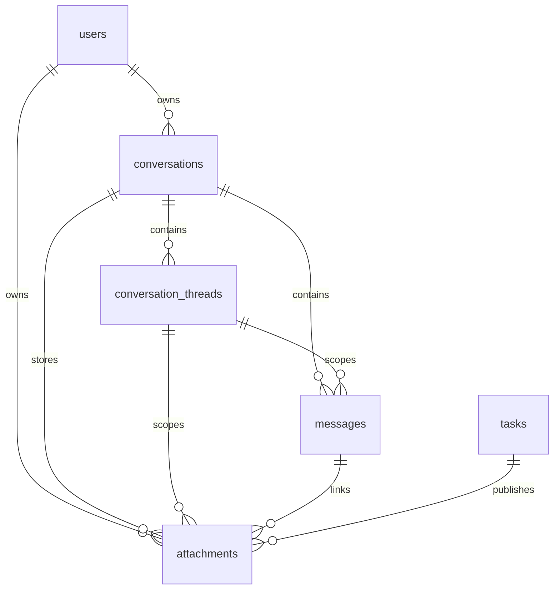
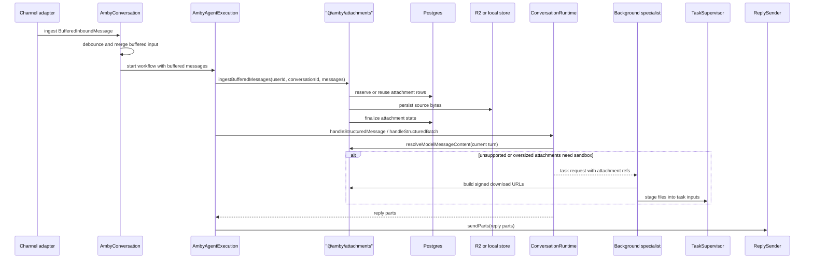
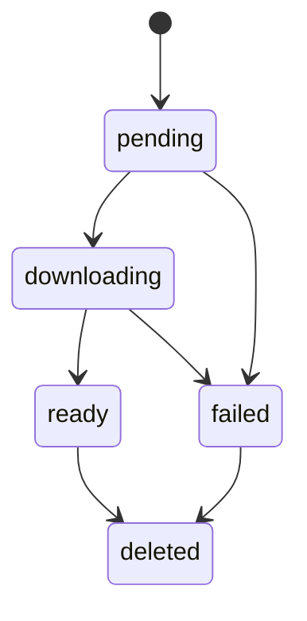
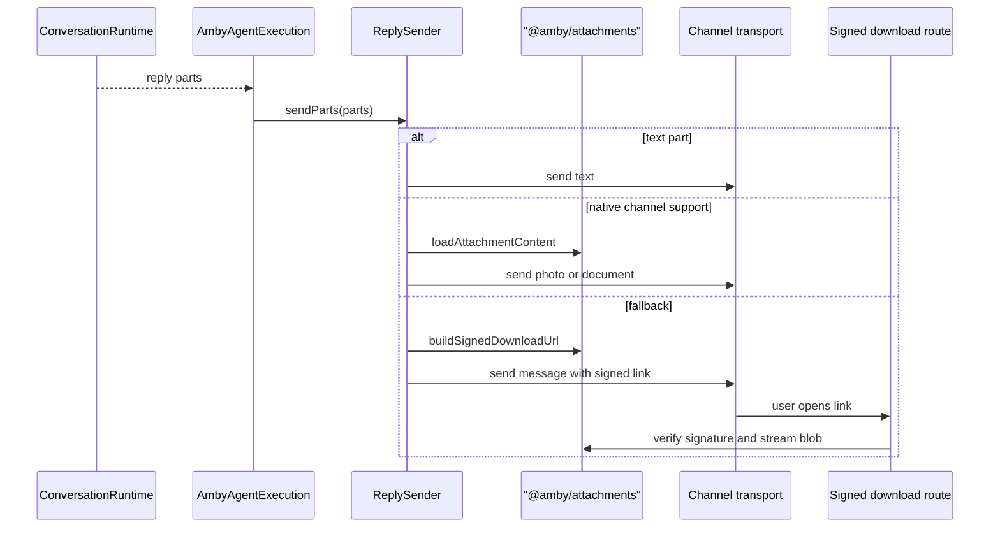

# Chat Attachments

This document explains the attachment system end to end: how files enter the chat stack, how they are buffered and stored, how they become model input or sandbox input, and how they are returned to the user.

The current implementation is Telegram-first at the channel boundary, but the attachment model itself is chat-level and channel-neutral.

## Scope

This document covers:

- the canonical attachment model
- attachment ownership and boundaries
- inbound buffering and workflow-time ingest
- storage layout and dedupe
- the `attachments` table and message part linkage
- current-turn direct model handling
- sandbox fallback and staging
- task artifact publication
- outbound attachment delivery

It does not attempt to document every Telegram webhook detail. Transport-specific behavior belongs in [../channels/telegram.md](../channels/telegram.md).

## Why This Is a Chat-Level System

Attachments are not scoped only to one Telegram message or one Telegram chat.

They can be linked across:

- a user
- a conversation
- a thread
- a user-visible message
- a background task
- a generated artifact

That is why the durable model lives in `@amby/attachments` and in the `attachments` table, not inside Telegram-specific code.

## System Ownership

The attachment pipeline is split across a few clear boundaries.



Responsibilities:

- channel adapters:
  - parse raw transport payloads
  - build `BufferedInboundMessage`
  - preserve transport-specific source metadata
- `AmbyConversation`:
  - debounce bursts of input
  - merge media groups when the channel provides them
  - hand buffered messages to the workflow
- `AmbyAgentExecution`:
  - resolve the user and conversation
  - call attachment ingest at workflow time
  - pass structured current-turn input to the agent
  - send final reply parts through the channel sender
- `@amby/attachments`:
  - classify attachments
  - enforce limits and quotas
  - reserve rows with dedupe keys
  - store and load bytes
  - generate and verify signed URLs
  - turn attachment refs into model parts
  - publish task artifacts back into canonical attachment refs
- `TaskSupervisor`:
  - stage attachment bytes into sandbox input directories
  - expose task artifact files for publication

## Core Types

The canonical types live in `@amby/core`.

Important types:

- `ConversationMessagePart = TextPart | AttachmentPart`
- `BufferedInboundMessage`
- `AttachmentRef`
- `ReplySender`
- `AttachmentStore`

Key rule:

- `messages.content` stays compact and human-readable
- `messages.partsJson` stores lightweight ordered refs, not file payloads

## Entity Model



The `attachments` table stores canonical metadata:

- ownership:
  - `userId`
  - `conversationId`
  - `threadId`
  - `messageId`
  - `taskId`
- classification:
  - `direction`
  - `source`
  - `kind`
  - `mediaType`
- lifecycle:
  - `status`
  - `dedupeKey`
  - `deletedAt`
  - timestamps
- storage:
  - `r2Key`
  - `sha256`
- source and derived metadata:
  - `sourceRef`
  - `metadata`

## End-to-End Flow



## Inbound Boundary

Channel adapters are responsible for converting raw transport payloads into `BufferedInboundMessage`.

That boundary must stay lightweight:

- text is preserved as text parts
- attachments are represented as descriptors with source metadata
- compact `textSummary` is synthesized when needed
- file bytes are not downloaded in the webhook or Durable Object layer

The current implementation uses Telegram-specific source metadata, but the buffered message shape is intended to stay reusable for future channels.

## Workflow-Time Ingest

Attachment bytes are downloaded and stored only after user and conversation resolution.

That happens inside `AmbyAgentExecution` by calling:

```ts
AttachmentService.ingestBufferedMessages(...)
```

This timing is intentional:

- storage keys are user-scoped
- quota checks are user-scoped
- retries happen inside durable workflow execution
- channel adapters stay transport-focused instead of owning storage

Per attachment, ingest does this:

1. classify by MIME type, filename, and declared size
2. compute a dedupe key
3. reserve or reuse an attachment row
4. reject over-limit or over-quota input based on declared size (when available)
5. download source bytes from the transport when needed
6. enforce the per-file size limit and per-user quota again using the actual downloaded byte count (Telegram may omit `file_size` metadata, so pre-download checks can be skipped — the post-download check is the authoritative enforcement)
7. write bytes to blob storage
8. hash and finalize the row
9. return an `AttachmentRef` for message parts

## Dedupe and Lifecycle

The ingest path is idempotent through `dedupeKey`.

The current Telegram implementation uses:

```text
telegram:{chatId}:{sourceMessageId}:{fileUniqueId || fileId}
```

The durable lifecycle is:



Meanings:

- `pending`: row reserved, source bytes not yet fetched
- `downloading`: workflow is fetching or persisting bytes
- `ready`: stored and available for model use or delivery
- `failed`: ingest did not complete
- `deleted`: reserved for cleanup and retention workflows

## Storage Layout

Source bytes are stored under:

```text
users/{userId}/attachments/{attachmentId}/{variant}/{safeFilename}
```

Current variants:

- `source`: original inbound or published bytes
- `derived`: reserved for future sidecars such as extracted text

Backends:

- production: private R2 bucket bound as `ATTACHMENTS_BUCKET`
- local Bun dev: `.tmp/attachments`

## Message Persistence

There are two separate persistence concerns:

- transcript readability and routing
- structured attachment linkage

Rules:

- `messages.content` contains caption text or a compact synthetic summary
- `messages.partsJson` contains ordered text parts and attachment refs
- transcripts, OCR, or extracted file payloads do not belong in `messages.content`
- large derived content does not belong inline in `messages.partsJson`

This keeps conversation history cheap to load while preserving canonical attachment linkage.

## Classification and Limits

The policy boundary lives in:

- `packages/attachments/src/classification.ts`
- `packages/attachments/src/config.ts`

Current v1 direct model allowlist:

- `image/*`
- `application/pdf`
- UTF-8 text-like documents such as `text/plain`, `text/markdown`, `text/csv`, and `application/json`

Current limits:

- upload reject limit: `20 MB`
- direct binary limit for images and PDFs: `10 MB`
- direct text limit: `2 MB`
- user quota: `1 GiB`
- signed download TTL: `15 minutes`

Everything else is stored but treated as sandbox-first in v1.

`DIRECT_MODEL_FILE_MEDIA_TYPES` in `config.ts` exists as an extension point for future media types that should be sent directly to the model from the final fallback branch of `classifyAttachment`. It is currently empty — images, PDFs, and text-like types are all handled by earlier dedicated branches.

## Model Input Resolution

Only the current user turn is rehydrated into model parts.

`AttachmentService.resolveModelMessageContent(...)` applies these rules:

- text parts stay text
- small text-like attachments that are within the direct text size limit are decoded to UTF-8 and inlined as text (both `directText` and `directModel` must be true — a text file that exceeds `ATTACHMENT_DIRECT_TEXT_LIMIT_BYTES` falls through to the sandbox path)
- ready images within the direct binary limit become image model parts
- ready PDFs within the direct binary limit become file model parts
- unsupported, oversized, or unavailable files become short textual availability notes

Historical thread replay remains text-summary-first in v1.

## Sandbox Fallback

Unsupported or oversized attachments still become canonical attachments. They are not dropped.

When a background specialist needs them:

1. the request metadata carries current attachment refs (only `ready` attachments are included — failed or pending attachments are filtered out at the engine level)
2. the background runner asks `AttachmentService` for signed download URLs
3. `TaskSupervisor` stages those files into `tasks/{taskId}/inputs/`
4. Codex receives instructions that point at the staged files

This keeps sandbox staging explicit and copy-only. Uploaded files are never auto-executed just because they were attached.

## Task Artifact Publication

Task artifacts also flow back through the same attachment boundary.

When sandbox work finishes:

1. the task event handler reads deliverable artifact files
2. `AttachmentService.publishTaskArtifacts(...)` uploads them into canonical storage
3. the service creates `attachments` rows linked to `taskId`
4. user-facing artifact refs become attachment-backed refs instead of sandbox filesystem paths

This is what makes generated images and documents reusable outside the sandbox runtime.

## Outbound Delivery

Replies are also part-based.



The sender implementation is channel-specific, but it works from channel-neutral reply parts.

Each attachment part's delivery is error-isolated: if one attachment fails to send (including the signed-URL fallback), the remaining parts still attempt delivery. Errors are logged but do not abort the loop.

## Current Channel-Specific Reality

Today, the implemented ingest transport is Telegram.

Telegram-specific behavior still lives in [../channels/telegram.md](../channels/telegram.md), including:

- `photo` and `document` parsing
- caption handling
- `media_group_id` merge behavior
- Telegram `getFile` download flow
- `sendPhoto` and `sendDocument` delivery

This split is intentional:

- `docs/chat/attachments.md` explains the durable attachment model
- `docs/channels/telegram.md` explains how Telegram plugs into that model

## Backward Compatibility

`AmbyConversation` migrates legacy buffer entries on hydrate. Existing Durable Objects that stored the pre-attachment `{ text, messageId, date }` shape are transparently converted to the new `BufferedInboundMessage` format the first time they load.

`ReplyDraftHandle` carries optional `chunkIds` for multi-chunk Telegram messages. The streaming preview is capped at 4090 characters to avoid Telegram `editMessageText` failures. On finalization, the streaming draft is always deleted and the final response is posted fresh, which handles splitting naturally.

## Current Non-Goals

This design deliberately postpones:

- direct video prompts
- audio and voice transcription UX
- rich Office document parsing
- multimodal replay of historical turns
- full retention cleanup workflows beyond the current state model

## Code Map

Primary implementation files:

- `packages/attachments/src/service.ts`
- `packages/attachments/src/classification.ts`
- `packages/channels/src/telegram/utils.ts`
- `packages/channels/src/telegram/sender.ts`
- `apps/api/src/durable-objects/conversation-session.ts`
- `apps/api/src/workflows/agent-execution.ts`
- `apps/api/src/handlers/task-events.ts`
- `packages/agent/src/conversation/engine.ts`
- `packages/agent/src/execution/runners/background.ts`
