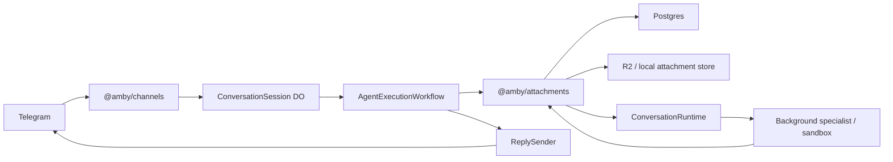
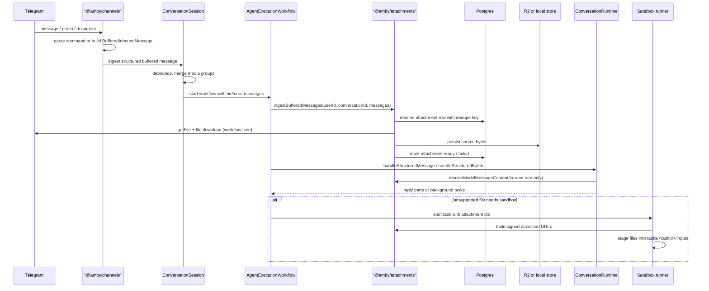
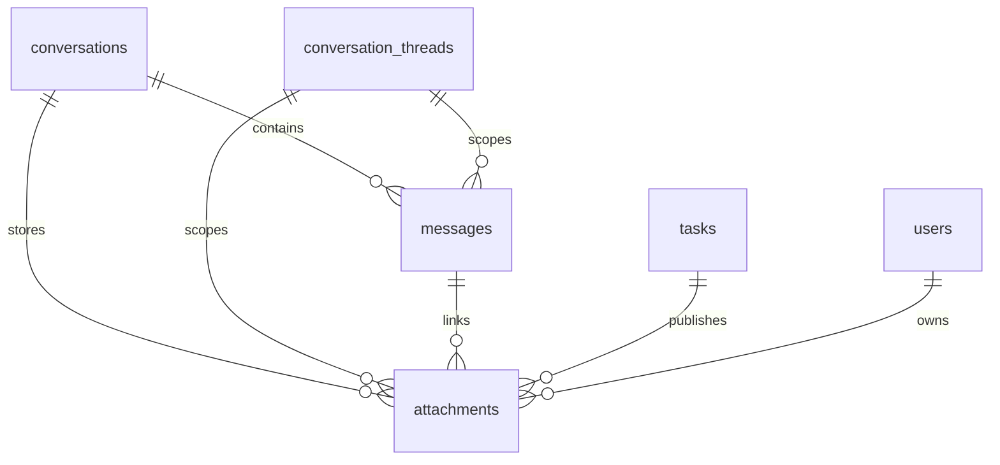
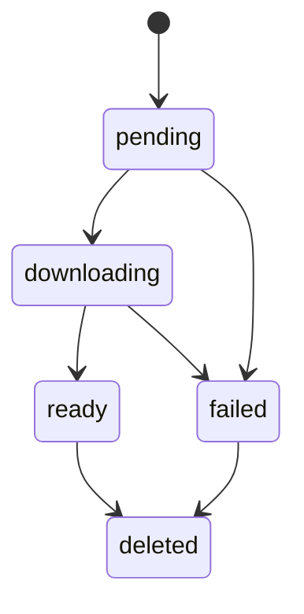
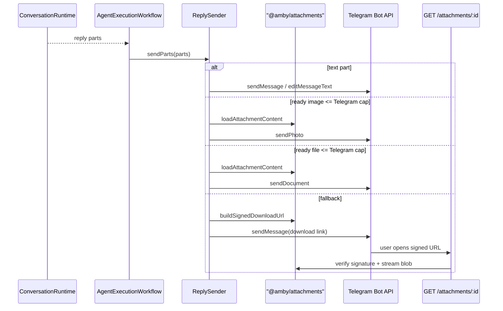

# Telegram Attachments

This document explains the Telegram attachment pipeline end to end: how inbound files are parsed, buffered, deduplicated, stored, classified for direct model use or sandbox fallback, and returned to the user.

It covers the v1 implementation that is currently checked into the repo.

## Scope

Included in v1:

- inbound Telegram photos/images
- inbound PDFs
- inbound small UTF-8 text-like documents such as `.txt`, `.md`, `.csv`, and `.json`
- canonical attachment metadata in Postgres
- private object storage in R2 in production and local disk in Bun dev
- signed download URLs served by the API worker
- current-turn multimodal model input
- sandbox staging for unsupported or oversized files
- outbound Telegram image/document delivery
- task artifact publication through the attachment boundary

Explicitly out of scope in v1:

- direct video input
- audio or voice transcription UX
- Office document parsing as a first-class direct model path
- multimodal replay of historical thread messages

## Mental Model

The attachment pipeline is a dedicated boundary owned by `@amby/attachments`.

That package is responsible for:

- attachment classification and limits
- deduplicated metadata persistence
- blob storage reads and writes
- signed download URL generation and verification
- current-turn model-part resolution
- task artifact publication

It is not responsible for:

- parsing raw Telegram updates
- buffering chat bursts
- thread routing
- planning execution
- Telegram Bot API transport details

## Main Components



## End-to-End Inbound Flow



## Boundary Parsing and Buffering

`@amby/channels` converts Telegram updates into `BufferedInboundMessage`.

Important rules:

- plain text becomes a text part
- photos become image attachment parts
- Telegram documents become attachment parts with filename, MIME type, size, and source metadata
- captions become text parts and also become the `textSummary` when present
- attachment-only messages synthesize a compact summary such as `User sent 1 image and 1 PDF.`
- media groups with the same `media_group_id` are merged inside `ConversationSession`

The Durable Object stores only buffered structured descriptors. It does not download file bytes.

## Attachment Ingest

`AgentExecutionWorkflow` calls `AttachmentService.ingestBufferedMessages(...)` after the user and conversation are resolved.

This timing matters because storage and quotas are user-scoped. The webhook and Durable Object layers do not know enough to write canonical object keys.

Per attachment, ingest does this:

1. classify the attachment from MIME type, filename, and declared size
2. compute a deterministic dedupe key
3. reserve or reuse an `attachments` row
4. reject over-quota or over-limit files
5. download bytes from Telegram
6. persist bytes to blob storage
7. hash and finalize the row as `ready`
8. return a lightweight attachment ref for message parts

The current dedupe key format is:

```text
telegram:{chatId}:{sourceMessageId}:{fileUniqueId || fileId}
```

## Storage Layout

Source bytes are stored under:

```text
users/{userId}/attachments/{attachmentId}/{variant}/{safeFilename}
```

`variant` is:

- `source` for the original inbound or published file
- `derived` for sidecars such as extracted text in future slices

Production uses a private R2 bucket bound as `ATTACHMENTS_BUCKET`. Local Bun development uses `.tmp/attachments`.

## Data Model



Two persistence rules are critical:

- `messages.content` stays compact and human-readable for routing and transcript readability
- `messages.partsJson` stores ordered text parts and attachment refs, not file payloads

The `attachments` table stores canonical metadata:

- ownership: `userId`, `conversationId`, `threadId`, `messageId`, `taskId`
- classification: `direction`, `source`, `kind`, `mediaType`
- lifecycle: `status`, `dedupeKey`, timestamps, `deletedAt`
- blob pointers: `r2Key`, `sha256`
- source metadata: `sourceRef`
- lightweight derived info: `metadata`

## Attachment State Machine



State meanings:

- `pending`: row reserved but bytes not yet downloaded
- `downloading`: workflow is fetching or persisting bytes
- `ready`: bytes stored and available for model use, signed download, or delivery
- `failed`: ingest could not complete or violated limits
- `deleted`: reserved for retention cleanup workflows

## Classification and Limits

The policy boundary lives in `packages/attachments/src/classification.ts` and `packages/attachments/src/config.ts`.

Current limits:

- upload reject limit: `20 MB`
- direct model binary limit for images and PDFs: `10 MB`
- direct text limit for text-like documents: `2 MB`
- user attachment quota: `1 GiB` of ready bytes
- signed download TTL: `15 minutes`

Current direct model allowlist:

- `image/*`
- `application/pdf`
- UTF-8 text-like files such as `text/plain`, `text/markdown`, `text/csv`, and `application/json`

Everything else is stored but treated as sandbox-first in v1.

## Model Input Resolution

Only the current user turn is rehydrated into multimodal model parts.

`AttachmentService.resolveModelMessageContent(...)` applies these rules:

- text parts remain text parts
- text-like attachments are decoded to UTF-8 and inlined as text
- ready images become `image` model parts
- ready PDFs become `file` model parts
- unsupported or unavailable files become short text notes that tell the agent the file exists but is only available through sandbox fallback

Historical thread replay stays text-summary-first in v1. The system does not reload old attachment bytes into every request.

## Sandbox Fallback

Unsupported or oversized files are still canonical attachments. They are not discarded.

When a background specialist needs them:

1. the request metadata carries current attachment refs
2. the background runner asks `AttachmentService` for signed URLs
3. the computer supervisor downloads them into `tasks/{taskId}/inputs/`
4. Codex receives instructions pointing at the staged files

This keeps sandbox staging copy-only. Uploaded files are never auto-executed just because they were attached.

## Task Artifact Publication

When sandbox work finishes, `apps/api/src/handlers/task-events.ts` reads the produced artifact files and sends them back through `AttachmentService.publishTaskArtifacts(...)`.

That step:

- uploads artifact bytes into canonical blob storage
- creates `attachments` rows linked to `taskId`
- returns attachment-backed artifact refs

This is the point where user-visible task output stops exposing sandbox filesystem paths.

## Outbound Delivery



Outbound behavior in v1:

- text parts stream or send as normal Telegram messages
- image attachments send through `sendPhoto`
- non-image deliverable files send through `sendDocument`
- files that cannot be loaded or exceed the send cap fall back to a signed Amby download URL

The download route resolves by attachment id, not raw bucket key.

## Security and Operational Rules

- the blob store is private
- signed URLs are short-lived and HMAC-protected
- file access is routed through `GET /attachments/:id`
- storage keys are sanitized and user-scoped
- oversized files are marked failed instead of partially ingested
- binaries and archives are treated as untrusted data

## Current Non-Goals

This design deliberately postpones:

- historical multimodal replay
- direct video prompts
- audio or voice transcription UX
- rich Office document parsing
- automatic retention cleanup beyond the status model and storage hooks already in place

## Code Map

Primary implementation files:

- `packages/attachments/src/service.ts`
- `packages/attachments/src/classification.ts`
- `packages/channels/src/telegram/utils.ts`
- `packages/channels/src/telegram/sender.ts`
- `apps/api/src/durable-objects/conversation-session.ts`
- `apps/api/src/workflows/agent-execution.ts`
- `apps/api/src/handlers/task-events.ts`
- `packages/agent/src/conversation/engine.ts`
- `packages/agent/src/execution/runners/background.ts`
